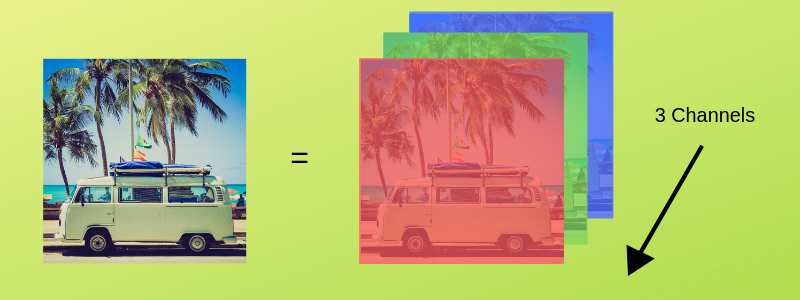
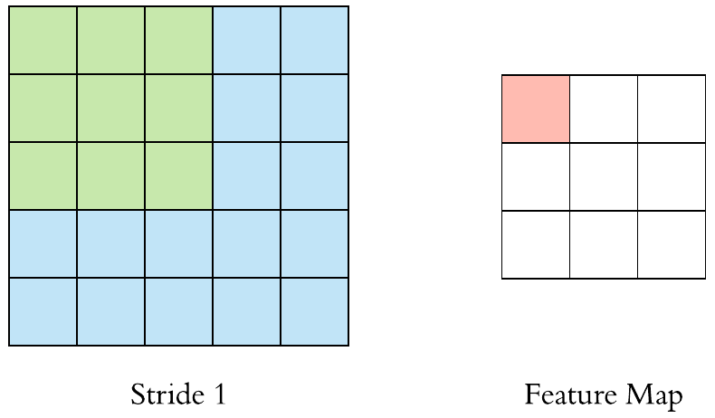
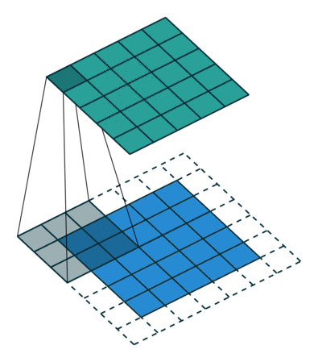
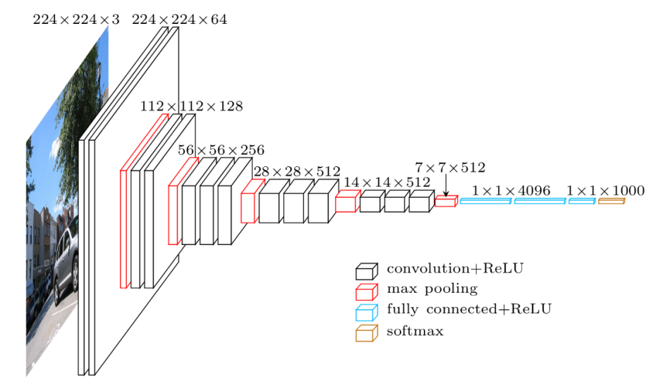

# CNN

### Convolutional Neural Network
- CNN is used with **Computer Vision** | **Face Recognition** | **Image Classification**

### Why should we Use CNN ?
- Suppose we are working with **MNIST** Dataset, Each Image is 28 x 28 x 1 Channel ( 0 or 1 ), This Size is Manageable.
- What if Image Size is 1000 x 1000 which means ( 102 Neurons in Input Layer )
- Here comes CNN ( Simply CNN Extract the Feature of Image and Convert into Lower Dimension without loosing Characteristics )

e.g.
- Initial Size of Image is 224 x 224 x 3 ( If you Proceed without Convolution : **1,00,352** number of Neurons in Input Layer )
- But by using CNN : Input Tensor Dimension is reduced to 1 x 1 x 1000 ( i.e. You need only **1000** Neurons in First Layer )

### Few Definitions you should know before Understanding CNN

### A. Image Representation
- We Understand Image by its **Height** and **Width** ( 2D Matrix ) but due to **Color**, we use **Tensors** ( 3 Dimensions )
- Images are encoded in **Color Channels**, Image Data is represented into each **Color Intensity**.
- Information contained into a Image is the Intensity of each Channel Color 

### B. Edge Detection
- Image has Vertical and Horizontal Edges which combines to form an Image.
- Convolution Operation is used with some Filters for Detecting Edges.
- e.g. Image Dimension is 6 x 6 and Filter choice is 3 x 3 we get 4 x 4 Image

### C. Stride and Padding ( Hyperparameters )
- Steps we move in Convolution ( By Default is One )
- Size of Output is **Smaller** than Input
- to Maintain the Dimension of Output as an Input, we use **Padding**
- **Padding** : Adding Zeros to Input Matrix Symmetrically from all the Sides.

<table align=center>
  <tr><th>Stride</th><th>Padding</th></tr>
  <tr><td></td><td></td></tr>
</table>

### Layers in CNN

### 1. Input Layer : Image Data ( 3D Matrix )
- Reshape Data into a **Single Column**

### 2. Convolution Layer
- Feature Extractor Layer ( Feature of Image is Extracted in this Layer )
- Slide **Filter** over the Image by a **Stride** until we go through the Whole Image.
- Output will be Input for Next Layer.
- Convolution Layer also contains **ReLu** Activation to make all **Negative Value** to **Zero**.

### 3. Pooling Layer
- **Pooling** Reduce the **Spatial Volume** ( Dimensionality Reduction ) of Input Image after **Convolution**.  
- Decreases **Computation Power** to Process Data. 
- **Max Pooling** : Returns **Maximum** Value from the portion of the **Image**.
- **Average Pooling** : Returns **Average** Value from the portion of the **Image**.

### 4. Fully Connected Layer
- Involves **Weights**, **Biases** and **Neurons**.
- **Connects** Neurons in One Layer to Neurons in another Layer.
- **Classify** Images between Different Category by Training.

### 5. Activation Function : Softmax | Logistic + Dropout
- **Logistic** : **Binary** Classification
- **Softmax**  : **Multiclass** Classification
- When all Features are Connected to Full Connected Layer it can cause **Overfitting**.
- To Prevent from **Overfitting** few Neurons are **Dropped** Randomly from the **Neural Network**.

### 6. Output Layer
- The **Label** of the Image in form of **One Hot Encoded**.

[CNN](https://towardsdatascience.com/covolutional-neural-network-cb0883dd6529)
