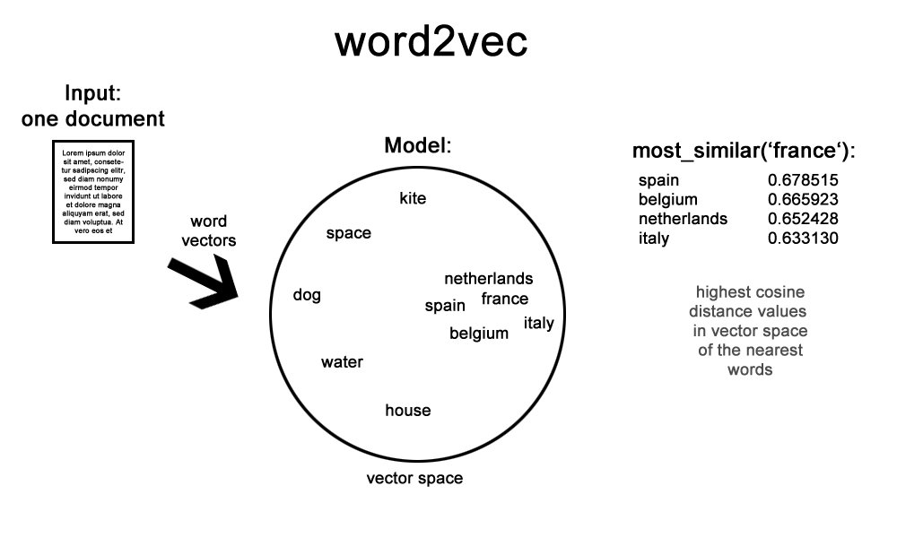
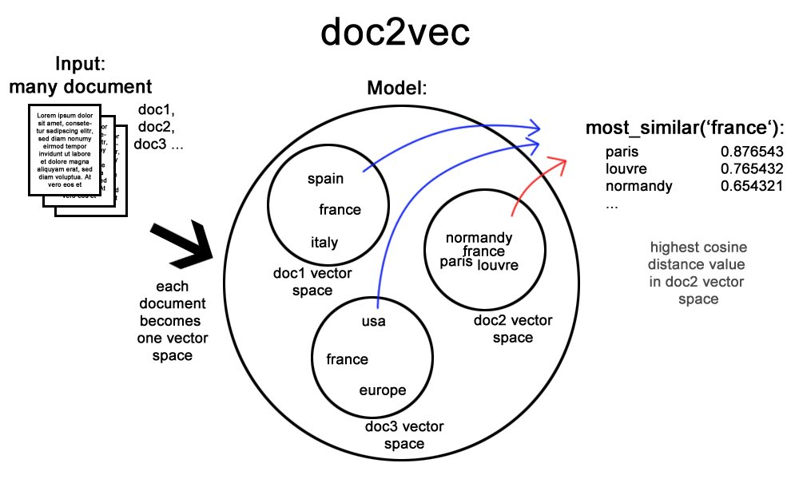

<p align='right'><a align="right" href="https://github.com/iamkirankumaryadav/Library/blob/main/Interview.md">Back to Questions</a></p>

<h1 align="center"> Natural Language Processing</h1>

<table align="center">
  <tr>
    <td><a href="#nltk">NLTK</a> </td>
    <td><a href="#stem">Stemming</a></td>
    <td><a href="#bag">Bag of Words</a></td>
    <td><a href="#ner">Name Entity Recognition</a></td>
  </tr>
  <tr>
    <td><a href="#mine">Text Analysis | Text Mining</a> </td>
    <td><a href="#lemma">Lemmatization</a></td>
    <td><a href="#vector">Vectorization</a></td>
    <td><a href="#cloud">Word Cloud</a></td>
  </tr>
  <tr>
    <td><a href="#app">Real World Application</a> </td>
    <td><a href="#norm">Text Normalization</a></td>
    <td><a href="#tfidf">TF-IDF</a></td>
    <td><a href="#word2vec"> Word2vec </a></td>
  </tr>
  <tr>
    <td><a href="#token">Tokenization</a> </td>
    <td><a href="#stop">Stop Word</a></td>
    <td><a href="#ngram">N Grams</a></td>
    <td><a href="#doc2vec"> Doc2vec </a></td>
  </tr>
  <tr>
    <td><a href="#pos">Part of Speech</a></td>
    <td><a href="#vector">Vectorization</a></td>
    <td><a href="#corpus">Corpus</a></td>
  </tr>
</table>

## **Natural Language Processing (NLP)**
- A field of AI that deals with the interaction between computers and humans using human language.
- Ability of computer to read, understand, learn, analyze, translate, generate and communicate using **human language**.
- **Natural Language Understanding (NLU)** and **Natural Language Generation (NLG)** are both subfields of **NLP**
- NLP can revolutionise how we interact with computers and machines and unlock a new era of human-computer collaboration.  

**Why is NLP Important?**
- NLP allows users to interact with computers more naturally and intuitively, using everyday language instead of complex codes.
- NLP helps computers process and make sense of massive textual data available worldwide, opening doors to discoveries and insights. 
- NLP can automate many tasks that previously required human interventions and collaboration.

**What Does NLP Do?**
- Analyzing the meaning and intent behind written words, considering factors like grammar, context, and sentiment.
- Creating human-readable text formats like QA, codes, emails, news articles, chatbot responses, or even creative content using NLG.
- Converting text from one language to another language while preserving the original meaning, tone and context.
- Converting spoken language into text, enabling voice-activated applications, speech-to-text with translation.
- Extracting the key points from a lengthy paragraph and summarizing it into a shorter, more manageable and readable format.

**How Does NLP Work?**
* **Machine Learning:** Training algorithms on vast amounts of text data to identify patterns and relationships within language.
* **Linguistics:** Leveraging the knowledge of language structure and grammar to understand how words and sentences function.
* **Statistical Methods:** Analyzing the statistical properties of language to identify patterns and extract meaning.

**Applications of NLP**
* **Search Engines:** Search for the information on web browsers using natural human language (Google, Bing, Duck Duck Go).
* **Virtual Assistants:** Powering assistants like Siri, Google, and Alexa to understand user requests and respond helpfully. 
* **Social Media Analysis:** Extracting insights from social media conversations to understand public opinion and trends.
* **Machine Translation:** Breaking down language barriers by enabling seamless and dynamic communication across cultures. 
* **Customer Service Chatbots:** Providing 24/7 customer support through chatbots that can answer questions and resolve issues.

<h3 name="corpus">Corpus</h3>

- A large collection of real-world text data used to train and test NLP models.
- Corpora shows how those words are used in sentences, paragraphs, and documents.
- Corpus linguistics, collections of spoken and written texts are compiled and analyzed.
- Think of a book with 100 pages, each page is a document and the whole book is a corpus.

**It helps us to find:**
- How does the meaning of a word change depending on the context (formal, casual, slang, sarcastic, professional)?
- How do different people (e.g., Doctors, Teenagers | Formal, Informal, Casual, Slang) use language differently?
- Corpora can be specific (subject/domain oriented) or generic (common/public) depending on the research goal.

**Types of corpora:**
1. **Newsgroups corpora:** Collections of words from newsgroup posts, newspapers, novels, tweets, poetry, etc.
2. **Web corpora:** Collections of text scraped from the web (Wikipedia, Encyclopedia, Medium, Articles)
3. **Social media corpora:** Collections of comments from social media platforms (Instagram, Threads, and Facebook)
4. **Speech corpora:** Collections of written text, transcriptions of spoken languages, multilingual, podcast, etc.

### **Vocabulary/Bag of words**
- Vocabulary: All the words that human knows (read, write, listen) or that are used in everyday life.
- Corpus is made from the # of unique words similar to a dictionary of words in your training dataset.
- As humans, we understand only the words that are part of our vocabulary.
- NLP models will only know words that fall within the bag of words or vocabulary.

```python
import nltk
from nltk.tokenize import word_tokenize

# Tokenize the text
text = "This is an example of building a vocabulary for NLP tasks"
words = word_tokenize(text)

# Create a vocabulary
vocab = set(words)
print(vocab)
``` 

```output
# Output:
{'tasks', 'of', 'a', 'example', 'for'. '.', 'building', 'NLP', 'vocabulary', 'This', 'an', 'is'}
```

<h3 name="nltk"> NLTK ( Natural Language Toolkit ) </h3>

- An open-source toolkit or library for Python to make NLP processes/tasks.
- NLTK provides a comprehensive set of tools for various NLP tasks.
- **Tokenization:** Breaking down text into fundamental units like words and characters.
- **POS Tagging:** Assigning grammatical parts of speech labels (Noun, Verb, Adjective) to each word.
- **Stemming and Lemmatization:** Reducing words to their base, root, or stem form.
- **Named Entity Relationship (NER):** Identifying and classifying named entities like people, organizations, and locations.
- **Text Classification:** Categorizing text data based on its context.
 
<h3 name="mine">Text Mining | Text Analysis</h3>

- Analyze and understand text data (Expression, context, action, grammar, sentiments)  
- Derive meaningful information from natural language text and speech.

### Text mining process:
1. Collecting text data from the desired source (documents, articles, posts, reviews, blogs, articles)
2. Cleaning and preprocessing (Remove irrelevant, duplicates, punctuation, formatting, and stop words)
3. Analysis techniques (Summarization, categorization, clustering, information extraction, tokenization)
4. Result Interpretation (Text analysis, classification, NER, sentiment analysis)

### **Types of text data** 
- Web, blogs, logs, articles, feeds, comments, reviews, emails, and notes.
- Social media: Messages, hashtags, references, comments, etc.
- Operations: Logs and trails.
- Emails: Formal, informal, business, casual, request, application (Spam or Ham)
- Voice transcriptions and subtitles.

### **Process**
1. Humans talk to machines.
2. Machine capture human audio.
3. Convert audio to text.
4. Process text data. 
5. Convert processed text to audio.
6. Machine reply to human.

<h3 name="app">Applications : NLP in real life</h3>

1. Google Translate (Speech to text + text to speech)
2. Email spam filter (Search for texts related to spam email)
3. Google search and Gmail auto-complete (Prediction of **next words** and **suggestions**) 
4. Word processor | Grammer check | Autocorrect in Microsoft and Google productivity Apps.
5. Grammerly | Grammer correction and spelling correction in Gmail and Outlook.
6. IVR | Interactive voice response in call centres.
7. Voice assistant: Google Assistant, Apple Siri, Microsoft Cortana and Amazon Alexa.
8. Chatbots (Career websites, application form filling)
9. Customer feedback sentiment analysis (😊🙂😔😡)
10. Document summarization: Read articles and newspapers (Blind people)
11. Text classification (News categorization, email classification)
13. Part of speech tagging (**Part of speech** of the corresponding word)

<h3 name="token">Tokenization</h3>

- The process of breaking down or converting text into smaller units called tokens for analysis.
- Splitting sentences into words, punctuations, characters, or even sequences of characters.
- The computer works better with smaller chunks, is easier to understand, and identifies keywords.

```python
import nltk

word = "Hi, my name is Kirankumar"
tokens = nltk.word_tokenize(word)
print(tokens)
```

```output
# Output:
["Hi", ",", "my", "name", "is", "Kirankumar"]
```

<h3 name="stem">Stemming</h3>

- Stemming reduces a word to its stem/root/base forms. Stemming is a rule-based approach.
- Stemming removes common suffixes and prefixes from the word ('ing', 'es', 's', 'ed', 'y')
- For example, the words 'playing', 'played', 'plays', and 'players' would all be stemmed down to 'play'.
- Stemming can be helpful for tasks like information retrieval, as it allows the model to map with different suffixes.
- Reduces data size (saves storage space, improves processing speed, reduces computation time)
- Sometimes stemming results in non-standard words like 'comput' from 'computing' or 'computer'.
- **Stemming is applied on tokens**

```python
stem(token) 
```

### Types of Stemmers
1. **Porter Stemmer**: Oldest with very low accuracy: 'fairly' as 'fairli'
2. **Snowball Stemmer**: Better than Porter and Lancaster: 'fairly' as 'fair'
3. **Lancaster Stemmer**: Fastest with least accuracy

```python
import nltk
from nltk.stem import PorterStemmer

# Create stemmer object:
stemmer = PorterStemmer()

words = ['run', 'runner', 'ran', 'runs', 'easily', 'fairly']
stemmed_words = [stemmer.stem(words) for word in words]
print(stemmed_words)
```
```
# Output:
['run', 'runner', 'ran', 'run', 'easili', 'fairli']
```

<h3 name="lemma">Lemmatization</h3>

- Lemmatization uses vocabulary and morphological analysis to return the base or dictionary form of a word.
- **Morphological Analysis:** A method for understanding complex problems by breaking them down into their basic elements. 
- Transform words to the actual dictionary form. It's more accurate than stemming but might require a larger dictionary.
- Lemmatization returns standard and accurate words like 'run' for 'running' and 'better' from 'best'.

### WordNet Lemmatizer
- Database for English (Most popular **Lemmatizer**)
- Nouns, Verbs, Adjectives and Adverbs are grouped into cognitive synonym sets.  
- e.g. {'consulted', 'consultation', 'consulting', 'consultant'} as 'consult'

Stemming | Lemmatization
:--- | :---
**Speed** | **Accuracy**
Simply strip the end of the word to stem | **Converts** the word to its **meaningful** dictionary form.

### **Text Preprocessing:**
- Transforming raw text data into a format that computers can understand the meaning and context to analyze.
- Cleaning and preparing the text: Removing irrelevant information, fixing errors, fixing spelling mistakes, converting to lowercase.
- Breaking down the text: Tokenization, etc.
- Understand the meaning: Stemming, lemmatization, Part-of-Speech tagging, etc.
- Extracting information: Sentiment analysis, information retrieval, etc.

### **Noise Removal:**
- Removing characters or pieces of text that can interfere with text analysis.
- Remove punctuation, special characters, numbers, formatting, source code, header, etc.

<h3 name="norm">Text Normalization</h3>

- Transforming text into its standard consistent format to make it easier for computers to understand.
- e.g. 'gooood' and 'gud' as 'good'.
- Case conversion: Putting all in the same case (Either uppercase or lowercase) depending on the situation.
- Punctuation Removal: Unnecessary punctuations are not relevant for analysis.
- Abbreviations and Acronym Expansion: Clarifies the meaning of the text for computer processing (OMG, ASAP, OOO)
- Spelling Correction: Fixing typos and grammatical errors to ensure consistency and error-free.
- Stop Words Removal: Remove common words that don't carry any meaning on their own (a, an, the, is, of)
- Mapping of near identical words such as 'stopwords', 'stop-words' and 'stop words' to just 'stopwords'
- Important when **noisy**, **misspelled**, **slang** and **out of vocabulory** (OOV) words are used. 
- **Out of vocabulary (OOV)** : **Social media** comments, **blog** comments and **text messages** (New Genz slang wors)

<h3 name="stop">Stop Word</h3>

- Common words with little meaning are filtered out before processing text.
- Stop words are filler words like 'a', 'an', 'in', 'on', 'and', 'the', 'or', etc.
- Stopwords are ignored and removed so that the model can focus on important words instead.
- Search engines only search based on keywords, they are programmed to ignore stop words.
- These words don't provide much meaning on their own, so filtering them out can improve the efficiency of NLP tasks.

**How to remove stopwords using NLTK?**

1. Tokenize and compare with the list of predefined stopwords and drop those words. 

```python
Token for Token in the text if not in Stopwords.words() 
```

<h3 name="pos">Parts-of-Speech (POS) Tagging</h3>

- The process of assigning/tagging a part of speech label (such as noun, verb, adjective) to each word in a sentence.
- The computer understands the role of each word, similar to how humans learn about parts of speech.
- POS tagging can be helpful for tasks like sentiment analysis and machine translation.

**Sentence:** The quick brown fox jumps over the lazy dog.

**POS Tags:**
- The (determiner)
- quick (adjective)
- brown (adjective)
- fox (noun)
- jumps (verb)
- over (preposition)
- the (determiner)
- lazy (adjective)
- dog (noun)

### **Word Embedding**
- Allows the computers to understand the meaning, context and relationships between words.
- Represents words as vectors in a high-dimensional space.
- Position in the vector space encodes semantic relationships.
- Words with similar meanings are positioned closer together in space.

<h3 name="vector">Vectorization</h3>

- Converting textual data or tokens to numerical vectors that an algorithm and ML model can understand and process.
- Convert tokens to a vector space representation to perform various tasks such as classification, summarization, etc.

```python
from sklearn.feature_extraction.text import CountVectorizer

# Define text data:
text_data = ['This is a positive sentence', 'This is a negative sentence']

# Create an instance of the CountVectorizer:
vectorizer = CountVectorizer()

# Fit the vectorizer on the text data:
vectorizer.fit(text_data)

# Transform the text data into numerical vectors:
vectors = vectorizer.transform(text_data)

print(vectors.toarray())
```
```
# Output:
[[0 1 0 1 1 1]
 [0 1 1 0 1 1]]
```

### **Common vectorization techniques:**
1. **Bag-of-Words (BoW):** Represents documents based on word frequency (How many times the word appears in the document)
2. **Term Frequency-Inverse Document Frequency (TF-IDF)** (Frequency of words in a document)
3. **Word Embeddings:** Words with similar meanings are positioned closer together in the space, capturing relationships and context.
4. **Word2Vec:** Capturing relationships and context of the words for predicting the next upcoming word.
5. **GloVe:** Analyzing Co-occurrence Probabilities.

<h3 name="bag">Bag of Words (BoW)</h3>

- Creates a dictionary of unique words with numbers of occurrences of words in a paragraph or sentence.
- e.g. well well well, said John. {'well':3, 'said':1, 'john':1}
- Expressed sentiments of words are defined by polarity. Polarity: Positive (+1), Negative (-1) or Neutral (0)
- **BoW** only focuses on the frequency of the words, not on the order and the relationship between words.

<h3 name="tfidf">TF - IDF</h3>


- **Term Frequency - Inverse Document Frequency**
- TF-IDF helps to determine the importance of a word (term) in a document (collection or page)
- **TF:** How often a word appears in a single document. The more times a word shows up, the higher its TF score.
- **IDF:** How often a word appears in the entire collection of documents.
- Common words that appear frequently have low IDF and rare words that are specific have high IDF.
- Common words (the, a, is) might not be that important so TF-IDF reduces the weight of these words.
- Higher weights are assigned to the important rare words that play a very key role in the document.



### **Word2Vec**
- Captures the semantic relationships between words by representing them as vectors in high-dimensional space.
- Words with similar meanings are positioned together in the vector space close/next to each other.
- e.g. The names of the cities, Mumbai, Kolkata, Delhi, Bengaluru, they will be positioned together in the vector space
- Words that appear in similar contexts likely have similar meanings.
- The model analyzes the co-occurrence of words within a specific window size.
- Continuous Bag of Words: The model predicts the current word based on surrounding words within a specific window.
- CBoW tries to predict the missing word based on the context provided by the surrounding words.
- Word2Vec goes beyond word frequency and captures the meaning and context behind words.
- Skip Gram: It takes a single word and tries to predict the surrounding words with a specific context window.

### **GloVe (Global Vectors for Word Representation)**
- GloVe analyzes the ratios of co-occurrence probabilities between words. e.g. Ice co-occurs with solid.
- GloVe starts by creating a co-occurrence matrix, it shows how frequently each word appears alongside other words.
- Breakdowns the matrix into smaller components that capture the semantic relationships between words.
- Each word is assigned a unique vector in the high dimensional space representing strong or weak relationships.
- Words with similar co-occurrence patterns will have vectors positioned closer together in this space.
- GloVe incorporates valuable statistical information about word usage. It can handle words with multiple meanings (polysemy)



### **Doc2Vec: Document Vectorization**
- Represents the entire document as numerical vectors. Predicts the document vector based on the words within it.
- Allows machines to process and analyze documents based on content, rather than just keywords.
- Doc2Vec addresses the word order and relationships by creating a vector representation for the entire document.
- During training, the model considers the words within a document and their co-occurrence patterns to learn vector representation.
- Documents with similar meanings will have vectors closer together in high-dimensional space.
- Doc2Vec embeddings can be used for document classification, clustering, information retrieval, and recommendation systems.

<table align='center'>
  <tr>
    <th>
      <h4>word2vec (Word 2 Vector)</h4>      
    </th>
    <th>
      <h4>doc2vec (Document 2 Vector)</h4>
    </th>
  </tr> 
  <tr>
    <th colspan='2'>Accept large corpus of text as input</th>
  </tr>
  <tr>
    <th colspan='2'>Vector: Numeric representation of word and document (One Hot Vector)</th>
  </tr>
  <tr>
    <td>Returns a set of vectors for each <b>word</b></t>
    <td>Returns a set of vectors for entire <b>sentence</b></t>
  </tr>
  <tr>
    <td>Vectors are converted to <b>Array</b></t>
    <td>Vectors are converted to <b>List</b></t>
  </tr>
  <tr>
    <th colspan='2'>Use the neural network to learn word association from a large corpus of text</th>
  </tr>
  <tr>
    <th colspan='2'>Detect synonymous words or suggest next words for a partial sentence ( Autocomplete | Search bar suggestion )</th>
  </tr>
 </table>

<h3 name="ngram">N Grams</h3>

- N-grams are sequences of N words that appear together in a text.
- Instead of looking at individual words, you group them in chunks. N refers to the number of words in each chunk.
- It helps in predicting the next word (Helpful for tasks like auto-completion in search engines)
- Understanding language patterns: We can learn common phrases.
- Sentiment analysis: e.g. Trigram "feeling very happy": Positive sentiment

### 1. **Unigram (N=1) | Single Word**
```
# Unigram:
["The", "quick", "brown", "fox", "jumps", "over", "the", "lazy", "dog", "."]
```

### 2. **Bigram (N=2) | Sequences of two words**
```
# Bigram:
[('The', 'quick'), ('quick', 'brown'), ('brown', 'fox'), ('fox', 'jumps'),
('jumps', 'over'), ('over', 'the'), ('the', 'lazy'), ('lazy', 'dog', ('dog', '.')]
```

### 3.**Trigram (N=3) | Sequences of three words**
```
# Trigram:
[('The', 'quick', 'brown'), ('quick', 'brown', 'fox'), ('brown', 'fox', 'jumps),
 ('fox', 'jumps', 'over'), ('jumps', 'over', 'the'), ('over', 'the', 'lazy'),
 ('the', 'lazy', 'dog), ('lazy', 'dog', '.')]
```

```python
import nltk
from nltk.util import ngrams

# Tokenize the text:
text = 'My name is Kirankumar.'
words  = nltk.word_tokenize(text)

# Create bigrams:
bigrams = ngrams(words, 2)
print('Bigrams:')
print(list(bigrams))

# Create trigrams:
trigrams = ngrams(words, 3)
print('Trigrams:')
print(list(trigrams))
```
```output
Bigrams:
[('My', 'name'), ('name', 'is'), ('is', 'Kirankumar'), ('Kirankumar', '.')]

Trigrams:
[('My', 'name', 'is'), ('name', 'is', 'Kirankumar'), ('is', 'Kirankumar', '.')]
```

Google Search suggests bigrams and trigrams in their keyword suggestions.  

<h3 name="ner">Name Entity Recognition (NER)</h3>

1. NER deals with identifying and classifying named entities (words) in text and assigning labels (categories).
2. Categories like Person (Name of the individual), Organizations (Companies, WHO), Locations (Country, City), Dates, Times, and Money.
3. This helps to extract important information automatically from large amount of text data. Saves time and effort.
4. Helps organize the unstructured data into structured information, making it easier to analyze and understand.
5. NER extracts information from the text data, it helps to understand relationships and context.
6. e.g. `Narendra Modi (Person)` visited `Bangalore (Geopolitical Entity)` in `March (Month)` `2024 (Year)`
7. Applications: Content categorization, question answering, improving search engine accuracy, and understanding queries.


```python
import spacy

# Load the spacy model for NER:
nlp = spacy.load('en_core_web_sm')

# Define a sample text:
text = "Apple is planning to open an outlet in Mumbai for $1B"

# Process the text with spaCy:
doc = nlp(text)

# Iterate over the entities in the text and print:
for ent in doc.ents:
  print(ent.text, ent.label_)
```
```
# Output:
Apple ORG (Orgaization)
Mumbai GPE (Geographic Location | Geopolitical Entity)
$1B MONEY
```

### **How to update NER?**

1. **Incremental Training:**
- Libraries like spaCy now allow to update the pre-trained model with custom own data.
- We can add new entities or improve the model's recognition of existing ones, without retraining from scratch.

2. **Retraining:**
- We can retrain the entire model on a new dataset that includes your desired entities.
- This takes more computation resources but offers a more comprehensive update.

3. **Rule-Based Models:**
- In rule-based NER, we can update the existing rules to recognize new entities.
- This involves manually defining patterns and context clues for the new entities we want to identify.

4. **Expand dictionaries:**
- If our system relies on predefined dictionaries of entities, we can simply add new key-value pairs for the entities we want to recognize.

**Additional things to consider:**
- **Data Quality:** Ensure it's well annotated and reflects the entities you want the model to recognize.
- **Evaluation:** Evaluate the model's performance on unseen data to check improved accuracy.

**Incremental Training:**
### Syntax | Syntactic Analysis
- The process of analyzing the grammatical structure of a sentence.
- Breaks down the sentences into phrases and clauses.
- Labels the parts (POS tagging) to each word.
- Build structure by understanding the relationship between words and phrases.

### Sentiment Analysis
- Feeling, emotion, reaction, and satisfaction of the user, customer or consumer expressing their feedback.
- Determine the emotional tone of a piece of text by applying Lexicon (Large dictionary of words with sentiment scores)
- It analyzes text data to classify the sentiment expressed as positive, negative, or neutral.

### Information Retrieval
- Process of accessing and retrieval of appropriate information  from text.
- **Extracting** title, text and media from a book, article or simply HTML tags from a web page.

<h3 name="cloud">Word Cloud</h3>

- A graphical/visual way to see which words appear most often in a piece of text.
- The size of the word reflects its frequency. Analyze the text, identify the words, count the words, and build the cloud.

### Sparse Matrix
- A matrix in which most entries are 0 helps in **efficient storage**.
- Stores only location of **non zero elements**.

### Chunking
- Grouping individual pieces of information into big chunks.

### Transformation
- Standardization or Normalization of Data.

### One Hot Vector


[Text Classification](https://towardsdatascience.com/text-classification-with-nlp-tf-idf-vs-word2vec-vs-bert-41ff868d1794)

<p align='right'><a align="right" href="https://github.com/KIRANKUMAR7296/Library/blob/main/Interview.md">Back to Questions</a></p>
