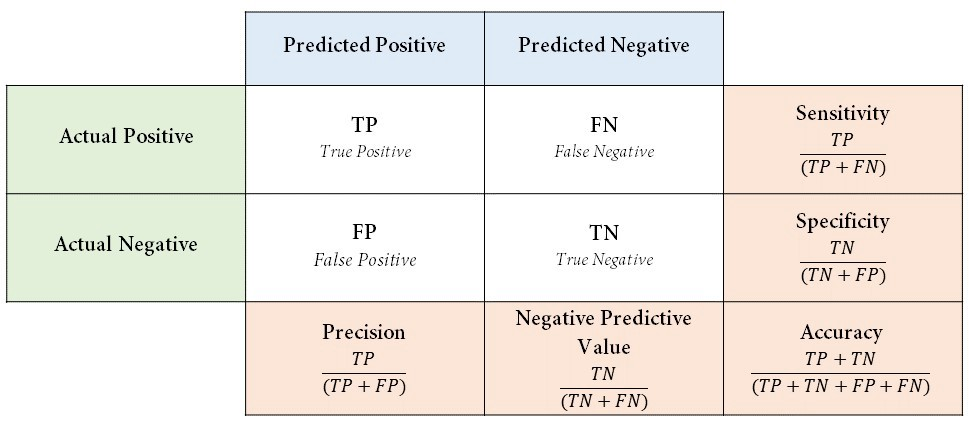

# Confusion Matrix

### True Situations

**TP** : True Positive ( Actual is True | Prediction is also True )
**TN** : True Negative ( Actual is False | Prediction is also False )

### False Situations 
**FP** : False Positive (Type I Error) (Actual is False | but Prediction is True)
**FN** : False Negative (Type II Error) (Actual is True | but Prediction is False)

### Accuracy 
- TP + TN / (TP + FP + FN + TN)

### Precision  
- How many Correct True Predictions where Actually True ?  
- TP / (TP + FP)

### Recall 
- How many Actal True are Predicted Correctly ?  
- TP / (TP + FN)
