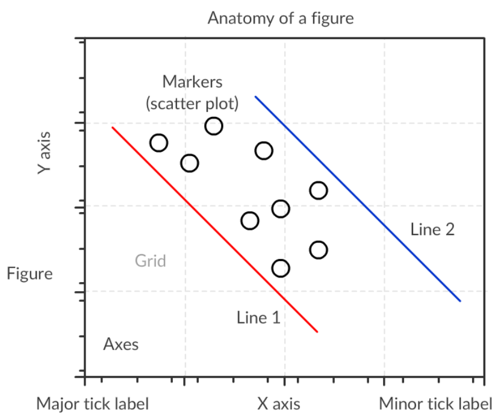

# Data Visualization

- New data is generated every second, data is `collected` and `stored`, `charts`, `graphs` and `tables` add meaning to data.
- Data begins to tell some story, data is illustrated using visualization.
- `Matplotlib` : Most widely used Python data visualization library and 3rd party library.

```python
pip install matplotlib
```

- `Seaborn` : Generate `informative statistical graphics`, it is dependent on `matplotlib`

```python
pip install seaborn
```

- `Bokeh` : Generate interactive plots, accessed as `JSON`, `HTML` objects or interactive web applications.

```python
pip install bokeh
```

### Figure `Anatomy`


### `Parts` of `Matplotlib Figure`
- `Figure` : Whole area choosen for plotting.
- `Axes` : Area were the data is plotted.

```python 
# Axes is added by using add_subplot method.
add_subplot(nrows, ncols, index)
# add_subplot(1, 1, 1) and add_subplot(111) are same.
```

- `Axis` : Horizontal and vertical number lines, which defines the graph limits.

```python
import matplotlib.pyplot as plt

# Figure
-------------------------------
fig = plt.figure(figsize=(8,6)) # Adjusting figure size # Default (width=6, height=4)
-------------------------------

# Axes
-------------------------
ax = fig.add_subplot(111)
-------------------------

# Set Parameters
-----------------------------------------------------------------------------------------
ax.set(title='My Plot Title', xlabel='X Axis', ylabel='Y Axis', xlim=(0, 5), ylim=(0,10))
                                         or 
ax.set_title("My Plot Title")
ax.set_xlabel("X Axis"); ax.set_ylabel('Y Axis')
ax.set_xlim([0,5]); ax.set_ylim([0,10])                                         
-----------------------------------------------------------------------------------------

# Plot
----------------------------------
x = [1, 2, 3, 4]; y = [2, 4, 6, 8]
plt.plot(x, y)
----------------------------------

# Plot Attributes
------------------------------------------
plt.title('My First Plot')
plt.xlabel('X-Axis'); plt.ylabel('Y-Axis')
plt.xlim(0,5); plt.ylim(0,10)
plt.plot(x, y, label='linear-growth')
------------------------------------------

# Legends
------------
plt.legend()
------------

# Show Plot
----------
plt.show()
----------
```

### Purpose of Visualization
- Make `Comparison` ( Magnitudes )
- Ask lots of questions to data, chart selection, design and labels.
- We should keep `cause` on `X Axis` and it's `effect` on `Y Axis`
- Always keep `magnitude` related to `height` or `frequency` in vertical position.
- Always put `time` on `X Axis`

### 1. Bar Chart | Column Chart ( Comparison )
- Data **Comparison** ( Categorical Features : Nominal | Ordinal )
- Can be used for **Categorical** as well as **Numeric Data**
- Change over a Period of Time | Compare Magnitude | Ranking | Length ( Height, Width, Distance )
- Represented **Vertically** or **Horizontally** or **Grouped** ( If we want to Measure more than One Variable )
- `Similar` Charts : **Lolipop** Chart ( Bubble at Top | Can be used if Number of `Bars` are more in **Bar** Chart )

### 2. Histogram
- **Distribution** of Data | **Frequency | Occurence** of **Continuous** Data
- Comparing Two **Entities**
- **Bins** : **Range of Values** divided into **Series of Intervals**

### 3. Scatter 
- Determine the **Relationship** between **Dependent** and **Independent** Variables
- Value of One Variable | Feature determines the position on the **Horizontal Axis** ( **X Axis** )
- Value of One Variable | Feature determines the position on the **Vertical Axis** ( **Y Axis** )

### 4. Area | Stack | Streamgraph
- Tracking the **Changes** over time
- Useful to Represent **Time Series Relation**

### 5. Pie  | Doughnut ( Proportion )
- A Circular Graph divided into **Segments** or **Slices**.
- Represent **Percentage** or **Proportion** Data where each **Slice** of Pie represents **Category**.

### 6. Boxplot
- Represent `Outliers` and `Distribution` of Data.

### 7. Line | Sparkline ( Overview | Without Units and Labels )
- Change over `Time` | Trends | Profits | Loss | Increase | Decrease | Flow
- Univariate and Multivariate (Compare two variables)
```python
plot(x, y) # x, y data values representing two variables.
```
# Common `Parameters` of `plot` function
- `color` : Sets the color of the line.
- `linestyle` : Sets the line style, e.g., solid, dashed, etc.
- `linewidth` : Sets the thickness of a line.
`marker` : Chooses a marker for data points, e.g., circle, triangle, etc.
`markersize` : Sets the size of the chosen marker.
`label`: Names the line, which will come in legend.
