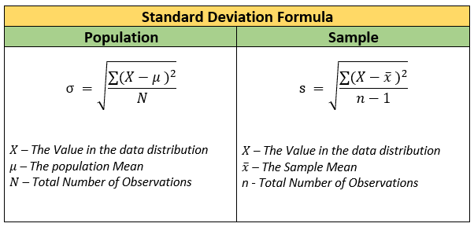

<a align="right" href="https://github.com/KIRANKUMAR7296/Library/blob/main/Interview.md">Back to Questions</a>

# `Error` in `Regression`

- Each machine learning algorithm has its own way of being **evaluated**.
- `Regression` : Error is calculated by finding **sum of squared difference** between `actual` and `predicted` values.
- `Classification` : Error is determined by getting the **proportion** of values `missclassified` by the model.
- Created **model** will have a lot of `error` because of `noise`
- `Noise` is unwanted, it **weakens** the learning process of **model**.

### Reasons for `Noise`
- `Large` training data set with more number of `features` as compared to number of `observations` 
- Unobserved attributes ( Features which are not `cleaned` and `transformed` before training ) 

### `Data Visualization` helps to find Hidden Patterns in the dataset

### Important `Terms`

1. Sum of Squared Residual ( `RSS` ) or Sum of Squared Error ( `SSE` )
2. Explained Sum of Square ( `ESS` ) or Sum of Squared Regression ( `SSR` )
3. Total Sum of Square ( `TSS` ) or Sum of Squared Total ( `SST` )
4. R Squared or R2 or Coefficient of Determination or Squared Correlation Coefficient 

### RSS | SSE

> Residual Sum of Squares | Sum of Squares Error

- `e` : Error
- `SSE` = Sum ( Actual - Prediction ) 2
- `Residuals` : Sum of Squares of Errors.
- Unexplained variability.
- `Variability` : Distance of **actual value** from its **mean** or **predicted value**.

### ESS | SSR

> Explained Sum of Squares | Sum of Squares Regression.

- Measures how well our line fits the data.
- Sum ( Prediction - Mean ) 2
- Explained variability.

### TSS | SST

> Total Sum of Squares | Sum of Squares Total

- Measures total variability
- Explained Variability + Unexplained Variability
- Sum ( Actual - Mean ) 2
- SST = SSR + SSE
- TSS = ESS + RSS

### `R Squared`

- Measures goodness of fit ( How well the model fits the data ? )
- Explains `variability` of model ( How `close` the data points are to the regression line ? )
- R2 = SSR / SST
- R2 = ESS / TSS
- Explained Variability / Total Variability.
- R2 ranges between `0` and `1`
- R2 = `0` means our regression line explains none of the variability of the data.
- R2 = `1` means our model explains the entire variability of the data.

### Note

- R2 = `0` or R2 = `1` is very rare.
- R2 actually ranges between `0.2` to `0.9`

### What is `Variability` ?

- How `spreadout` the data is ( Data points are `close` to each other or `scattered` away )

### How to Describe `Variability` ?

### 1. `Range`

- `Range` = `Max` - `Min` ( Distance between the `highest` and `lowest` data points in a data set )

### 2. Interquartile Range `IQR`

- Data set is divided in `4` equal `quartiles` | `quarters` ( Tells where most of the data points lies )
- `IQR` = `Q3` - `Q1` 
- `Q0` = Min
- `Q1` = First Quartile | 25th Percentile
- `Q2` = Second Quartile | Median | 50th Percentile.
- `Q3` = Third Quartile | 75th Percentile
- `Q4` = Max
- `Outliers` : Data Point < `Q1` - `1.5` * `IQR` or Data Point > `Q3` + `1.5` * `IQR`

### 3. Variance `VAR`

- How `spreadout` the data points are with respect to each other.
- `Small` variance : Data set is tightly clustered ( Data points are `close` to **each other** )
- `Large` variance : Data set is spread apart ( Data points are `scattered` away from each other )

### 4. Standard Deviation `STD`

- How `spreadout` the data points are with respect to the mean ( Data is `close` or `away` from `mean` )
- `Tall` bell curve : Data is `tightly` around `mean`
- `Small` bell curve : Data is `uniformely` spread.

<a align="right" href="https://github.com/KIRANKUMAR7296/Library/blob/main/Interview.md">Back to Questions</a>

