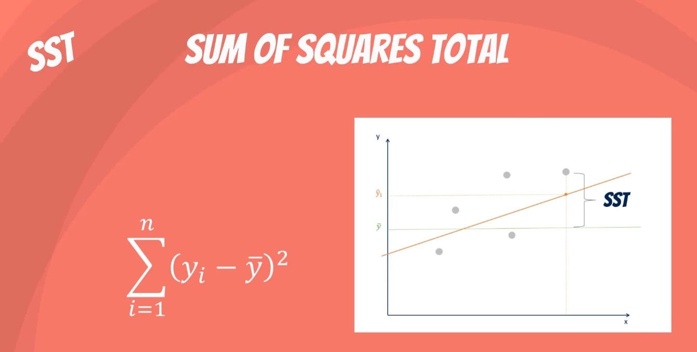
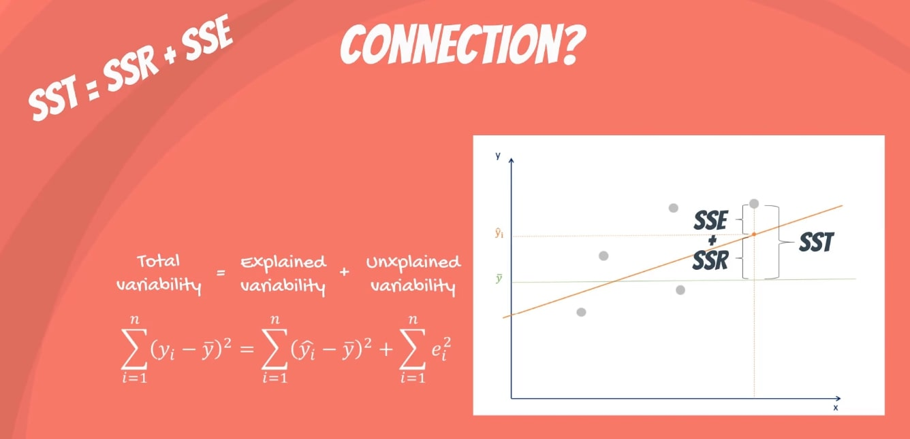

<a align="right" href="https://github.com/KIRANKUMAR7296/Library/blob/main/Interview.md">Back to Questions</a>

# Error in Linear Regression

### Manage Noise
- Created **Model** will have a lot of `Error` because of `Noise`
- `Noise` is unwanted, It **Weakens** the learning process of **Model**.

### Reasons for **Noise**
- `Large` Training Data Set. ( More Features as compared to Observations )  
- Unobserved Attributes. 
- Hidden complicated patterns.

### Data Visualization helps to find Hidden Patterns.

### Important Confusing Terms

1. Sum of Squared Residual ( `RSS` ) or Sum of Squared Error ( `SSE` )
2. Explained Sum of Square ( `ESS` ) or Sum of Squared Regression ( `SSR` )
3. Total Sum of Square ( `TSS` ) or Sum of Squared Total ( `SST` )
4. R Squared or R2 or Coefficient of Determination or Squared Correlation Coefficient 

### RSS | SSE

> Residual Sum of Squares | Sum of Squares Error

- `e` : Error
- `SSE` = Sum ( Actual - Prediction ) 2
- `Residuals` : Sum of Squares of Errors.
- Unexplained Variability.
- `Variability` : Distance of Actual Value from its Mean or Predicted Value.

### ESS | SSR

> Explained Sum of Squares | Sum of Squares Regression.

- Measures How well our Line Fits the Data.
- Sum ( Prediction - Mean ) 2
- Explained Variability.

### TSS | SST

> Total Sum of Squares | Sum of Squares Total

- Measures Total Variability
- Explained Variability + Unexplained Variability
- Sum ( Actual - Mean ) 2
- SST = SSR + SSE
- TSS = ESS + RSS

### R Squared

- Measures Goodness of Fit ( How well the model fits the data ? )
- Explains Variability of Model ( How close the data points are to the regression line ? )
- R2 = SSR / SST
- R2 = ESS / TSS
- Explained Variability / Total Variability.
- R2 ranges between 0 and 1
- R2 = 0 means our Regression Line Explains None of the Variability of the Data
- R2 = 1 means our Model Explains the Entire Variability of the Data.

### Note

- R2 = `0` or R2 = `1` is very Rare.
- R2 Actually Ranges between `0.2` to `0.9`.

### What is Variability ?

- How **spread** out the data is ( Data points are `Close` to each other or `Scattered` away )

### How to Describe ?

1. Range
2. Interquartile range | `IQR` 
3. Variance | `VAR`
4. Standard Deviation | `STD`

### Range 

- `Range` = `Max` - `Min`
- Distance between the largest and smallest data point in a data set.

### Interquartile Range

- Data set is divided in 4 equal `Quartiles` | `Quarters` ( Tells where most of the values lies )
- `IQR` = `Q3` - `Q1` 
- `Q0` = Min
- `Q1` = First Quartile | 25th Percentile
- `Q2` = Second Quartile | Median | 50th Percentile.
- `Q3` = Third Quartile | 75th Percentile
- `Q4` = Max

### Variance

- How spread out the data points are ?
- `Small` Variance : Data set is tightly clustered ( Data points are `Close` to each other )
- `Large` Variance : Data set is spread apart ( Data points are `Scattered` away from each other )

### Standard Deviation

- `STD` = Sum ( X - Mean ) /  N 
- `X` : Input data point.
- `Mean` : The Population Mean.
- `N` : Total number of Observations.
- Data is **Close** to Mean or **Away** from Mean.
- `Tall` Bell curve : Data is `Tightly` around Mean.
- `Small` Bell curve : Data is `Uniformely Spread`.

<a align="right" href="https://github.com/KIRANKUMAR7296/Library/blob/main/Interview.md">Back to Questions</a>

