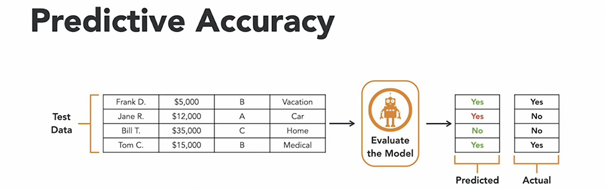

# Data Science

<table>
  <tr><td colspan=2></td></tr>
  <tr><td colspan=2></td></tr>
  <tr><td colspan=2></td></tr>
  <tr><td colspan=2></td></tr>
  <tr><td colspan=2></td></tr>
  <tr><td></td><td></td></tr>
  <tr><td colspan=2></td></tr>
</table>

