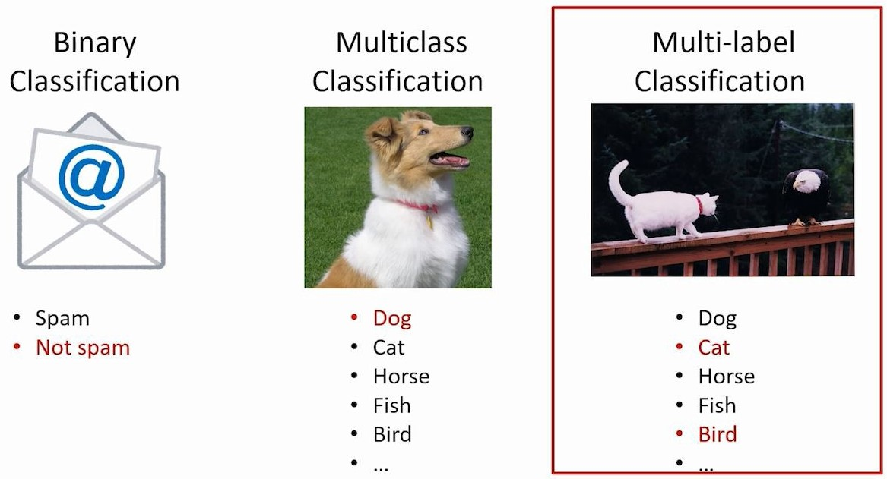

# Multi Class and Multi Label Classification

### Types of Classification Tasks

### 1. **Binary** Classification
- Yes or No | True or False | 1 or 0 | T or F

### 2. **Multiclass** Classification
- One **Picture** and only One **Class** 

### 3. **Multilabel** Classification
- One **Picture** and **Multilabel**
