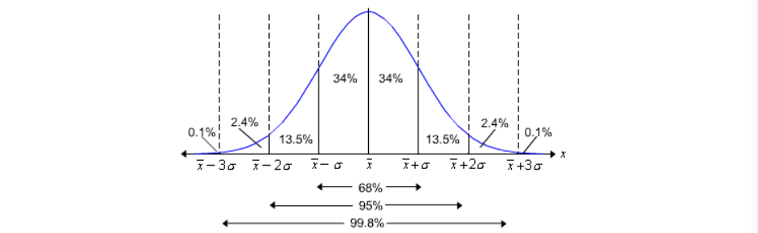

<a align="right" href="https://github.com/KIRANKUMAR7296/Library/blob/main/Machine%20Learning/Machine%20Learning%20Models.md">Back to ML</a>

# How to Deal with Outliers ?

<h3><a href="#zscore">Z Score ( Extreme Value Analysis )</a> | <a href="#dbscan">DBSCAN</a> | <a href="#summary">5 Number Summary</a> | <a href="#algo">Algorithm</a></h3>

### Outliers
- **Data Point** that differs significantly from other **Observations** in the Dataset.
- Outliers in a **Dataset** can **Skew** the Data and lead to make False Decisions based on **Faulty Data**.

### Cause of Outliers 

> Human Error ( Data Entry ) | Measurement ( Instrumental ) | Experimental ( Data Extraction ) | Natural Case ( Special Unique Case )

How many **Features** to take into account to **Detect Outliers** ?
- **Univariate** | **Multivariate**

> **Data Visualization** is a most important part that plays the role of communicating with Data and Visualize `Outlier`.

> **Boxplot**, **Scatter Plot** and **Histograms** are better plots to find **Outliers** in the Data Set.

### Methods for Outlier Detection

<h3 name="zscore"> Z Score or Extreme Value Analysis</h3>

- How many **Standard Deviations** a **Data Point** is from the **Sample's Mean**
- **z** = ( x - **mean** ) / **standard deviation**
- Data Points after **3 Standard Deviations** ( `mean` +- `3` * `std` ) are considered as **Outliers**.

> **Solution** : Apply Transformation of Data : Scaling

<h3 name="dbscan"> ( DBSCAN ) | Density Based Spatial Clustering of Applications with Noise</h3>

- **Clustering** methods are useful tools that helps us to **Visualize** and **Understand** Data better.
- Relationships between **Features** can be represented via **Clustering**.
- **DBSCAN** is a **Density Based Clustering Algorithm**, it is focused on finding **Neighbors** by **Density**.
- Outlier lies in No Cluster it is Seperate from every other Data point.

### How to Deal with Outliers ?

1. Setup a **Filter** and **Trim** Data Set.
2. Remove the Outlier if it is very Small.
3. **Inter Quartile** Range ( `IQR` ) 
4. Change the Value of Outlier or Replace it with something Meaningful.
5. `Rescale` Data or Standardize.
6. Apply Ensemble Learning Techniques ( Bagging and Boosting )

<h3 name="summary"> Five Number Summary</h3>

> Divide the Data into 4 Equal Quarters ( Quartiles ) 

1. Minimum : **Smallest** value in a Dataset.
2. 1st **Quartile** ( **Q1** ) | 25th **Percentile** : 25% of Data Values are smaller and 75% are larger.
3. 2nd **Quartile** ( **Q2** ) | 50th **Percentile** : **Median** | 50% of Data Values are smaller and 50% are larger the Median.
4. 3rd **Quartile** ( **Q3** ) | 75th **Percentile** : 75% of Data Values are smaller and 25% are larger.
5. Maximum : **Largest** Value in a Dataset.

> **Five Number Summary** can be visually represented using **Boxplot**.
- Horizontal Line on both ends of Boxplots are **Whiskers**.
- Box is called **Interquartile Range** ( **IQR** ).
- **IQR = Q3 - Q1** 

> Data Value is considered as **Outlier** 
- Data Value **<** Q1 - 1.5 * ( **IQR** ) 
- Data Value **>** Q3 + 1.5 * ( **IQR** ) 

> **Outlier** is represented by dot ( **o** ) in **Boxplot**  

<table>
  <tr>
    <th colspan="2">Machine Learning Algorithms</th>
  </tr>
  <tr>
    <th>Sensitive to Outliers</th>
    <th>Not Sensitive to Outliers</th>
  </tr>
   <tr>
    <td>
      <ol type="1">
        <li>Linear Regression</li>
        <li>Logistic Regression</li>
        <li>K Nearest Neighbours</li>
        <li>K Means Clustering</li>
        <li>Support Vector Machine</li>
        <li>Principle Component Analysis</li>
      </ol>
    </td>
    <td>
      <ol type="1">
        <li>Decision Tree</li>
        <li>Random Forest</li>
        <li>Naive Bayes</li>
        <li>Boosting Algorithms</li>        
      </ol>
    </td>
  </tr>
</table>

<a align="right" href="https://github.com/KIRANKUMAR7296/Library/blob/main/Interview.md">Back to Questions</a>

