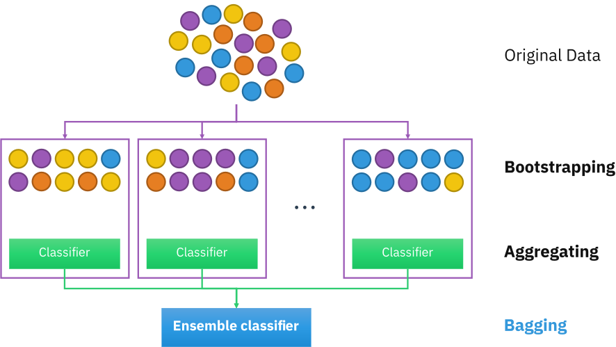
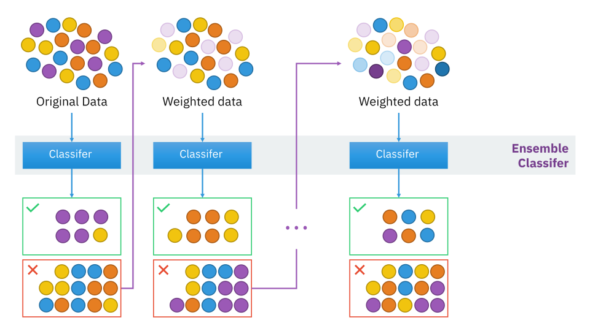

# Ensemble Techniques

> Combining Multiple **Models** (Homogeneous | Heterogeneous).

### A. Bagging (Bootstrap Aggregation)

> The Combination of **Weak Learners** into one very **Accurate Prediction**.

- Dataset is divided as **Subsamples** and passed to **Multiple Base Learners**.
- **Parallel Tree** growing **Subsamples**
- Dataset is passed with **Row Sampling** with **Replacement** ( **Bootstrap** )
- Each Learning Model is **Trained** on its particular **Sample** of Data
- Voting Classifier is used to find the Final Result ( **Aggregation** )
- Combine **Weak Base Learners** into **Strong Learner** in terms of **Classifier** or **Prediction**
- Test Sample is passed to each Model for the Output
- Final Prediction is based on **Voting**
- Improves **Accuracy**

### 1. Random Forest

- Dataset is divided as **Subsamples** and passed to **Multiple Base Learners** (Decision Tree)
- Training Sample consist of **Row Sampling** and **Column Sampling** with **Replacement**.
- **Parallel Tree** growing **Subsamples**
- If I Create Decision Tree to its complete depth, problem of **Overfitting** will occur. 
- But when we combine Multiple Decision Trees, **High Variance** gets converted to **Low Variance**, i.e. Reduces **Overfitting**

- Regressor : **Mean** or **Median** of Output of Decision Trees.
- Classifier : **Majority Vote**.

### B. Boosting

- Base Learners are Created **Sequentially** and the **Subsamples** are passed for Training.
- **Sequential Tree** growing  with **Weighted Samples**.
- **Weight** is attached with each and every **Instance** | Row | Record.
- If the portion of Dataset is incorrectly classified then that portion is transfered to next **Base Learner** for Training again.
- Weights are **Adjusted** before each Training and Miss Classified Instances are focused with High Priority.
- Test Sample is passed to each Model for the Output.

### 1. ADABOOST

- In ADABOOST **Weights** is assigned with **Incorrect Values** in Samples.
- **Sequential Tree** growing  with **Weighted Samples**.
- Base Learners are **Decision Trees**.
- Decision Trees are Created with only **One Depth** (**Stumps**)
- The Stump will Less **Entrophy** is Selected First.
- ADABOOST allow us to capture **Non Linear Relationships**.

### 2. Gradient Boosting
- Uses the **Loss Function** of Base Model ( **Decision Tree** ) for minimizing the **Error** of overall Model.

### 3. XGBoost | Extreme Gradient Boosting
- Uses **2**nd Order **Partial Derivative** for Approximation.

### Hard Voting vs Soft Voting

- Hard Voting : **Majority Voting** is more important.
- Soft Voting : **Predictive Probability** of Class is important, **Mean** of Probability is Calculated for each Class.
