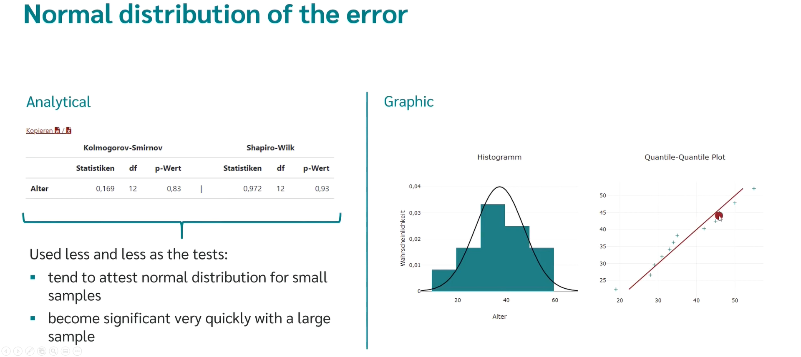
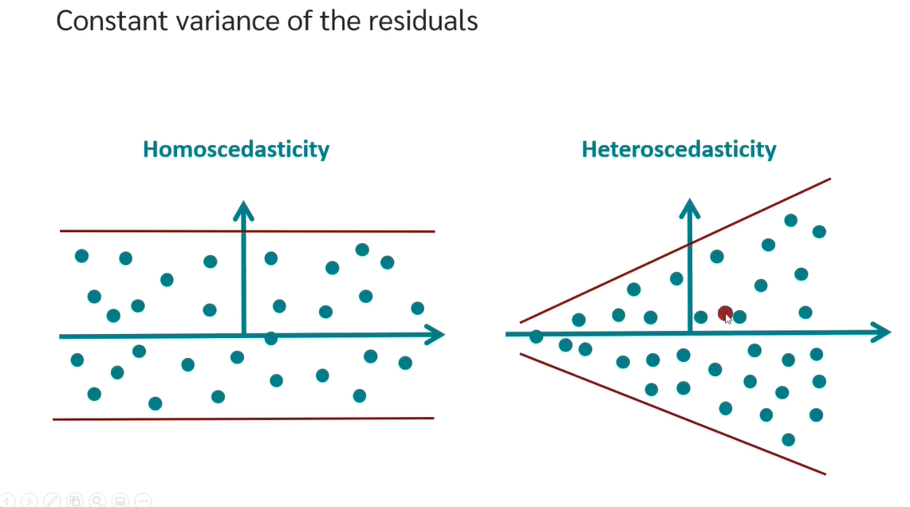
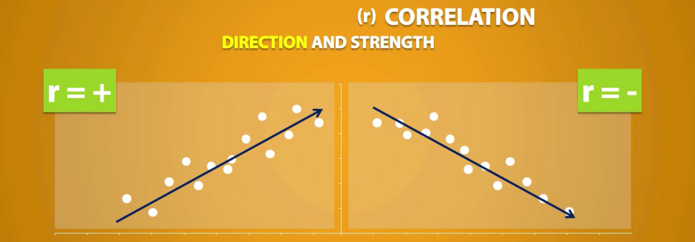
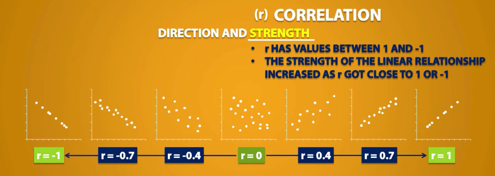
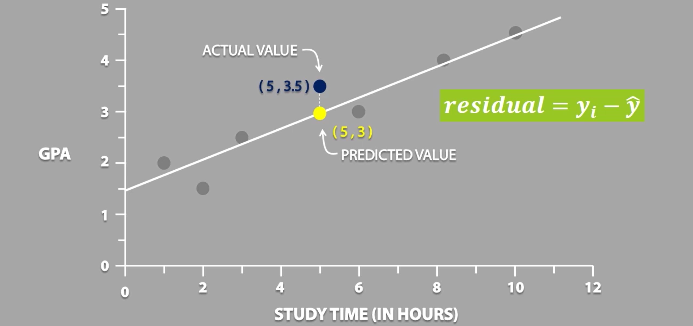
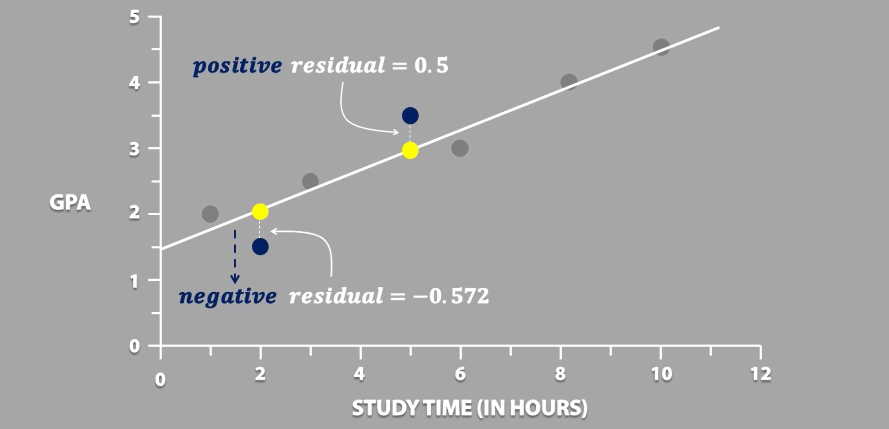
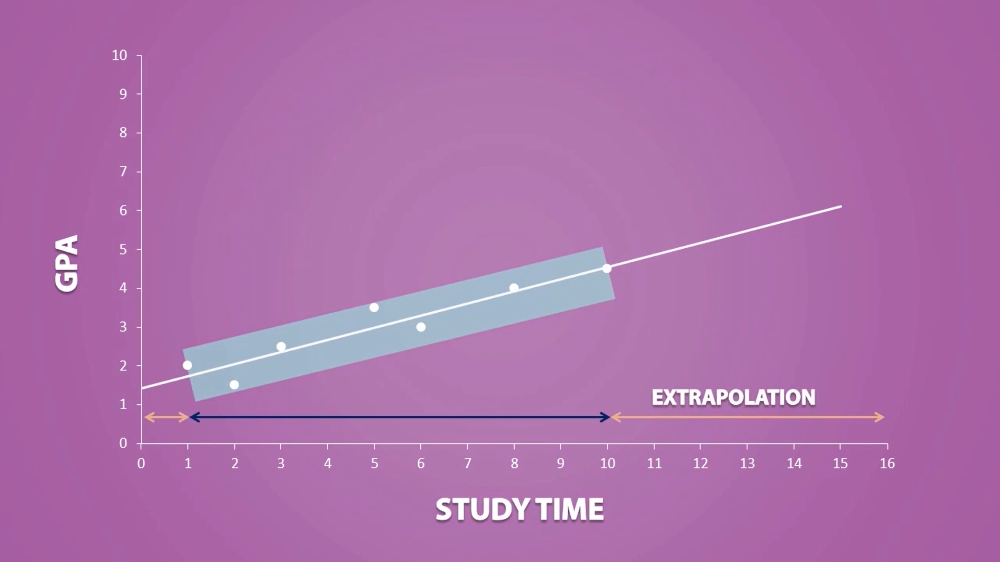
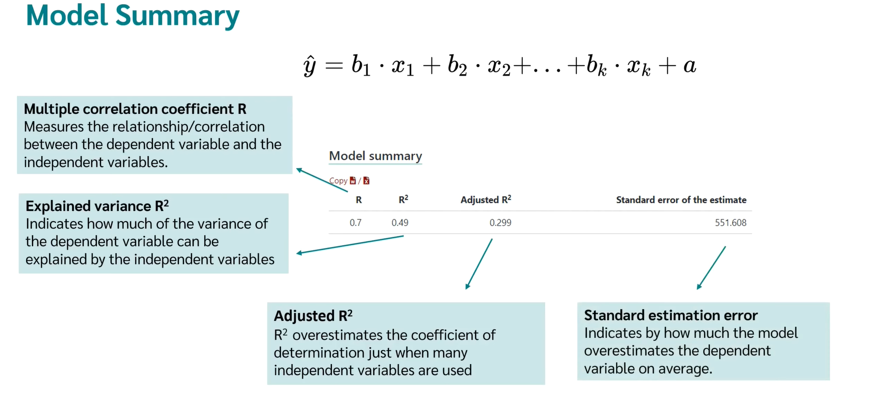

<a align="right" href="https://github.com/KIRANKUMAR7296/Library/blob/main/Interview.md">Back to Questions</a>

# Linear Regression 📈

### Regression

- A Statistical Process for Estimating the **Relationships** among **Variables** and to make **Predictions**

### Linear Regression 

- Form of Regression where Target Variable is **Continuous**
- **Simple** to Implement 
- Easier to **Interpret** Output
- **Sensitive** to Overfitting ( But can be Prevented using some **Dimensionality Reduction**, **Regularization** and **Cross Validation** )

### Logistic Regression 

- Form of Regression where Target Variable is **Binary**

**Learning** a Linear Regression Model means Estimating the Values of the **Coefficient** 

**Predict** Dependent Variable based on One or More Independent Variables.

**Measure** the Influence of One or More Independent Variable on Dependent Variable.

**Predict** the Value of a **Feature** based on the Value of Another Feature.

### Y = X * B1 + B0

### B1 : Slope 
- Gradient | **Steepness** in Line | **Direction** of Line | **Weight**
- Indicates how much the **Dependent Variable** changes, if an **Independent Variable**  changes by **One Unit**

### B0 : Intercept 
- Bias | Constant | The Place where **Regression Line** Intersects the Y Axis (Value of Y when X = 0)

### R2 : Coefficient of Determination

- The **Variance** of the Data captured by the Model (0.7 to 0.9 is Good value for R2) 
- Larger R2 indicates a Better Fit (The Model can Explain the Variation of Predictions with Actual in much Better Way)
- R2 = 1 corresponds to SSR = 0 (**Perfect Fit**) 
- Low R2 causes **Underfitting**
- High R2 resultss into **Overfitting**

### Residuals 
- Actual - Prediction

### Simple Linear Regression
- Single Input | Independent Feature 
- Dependent Variable is **Continuous**
- Use Statistics to Estimate Coefficients
- Mean | Median | Standard Deviations | Correlation and Covariance

### Muliple Linear Regression
- Dependent Variable is **Continuous**
- Muliple Input ( Independent Features ) 

### Logistic Regression
- Dependent Variable is **Categorical**
- Used for **Classification**  
- **Probability** of **Occurence** of Target Label is Predicted on the basis of **Threshold** ( 0.5 )
- **Range** Value of **Prediction** lies between 0 to 1

### Ordinary Least Squares (OLS)
- More than One Independent Features
- Minimize the Sum of Squared Residuals | Errors 
- Sum(Square(Distance between the Actual Data Point and the Predicted Point (Regression Line)))
- Treat Data as Matrix
- Use Linear Algebra to Estimate | Predict the Optimal Value for the Coefficients.

### Gradient Descent
- A Process of Optimizing the Values of the Coefficients by Iteratively Minimizing the **Error** of Model on Training Data.
- Starts with Random Values for each Coefficient
- Sum of Squared Errors (**SSE**) are Calculated for each Pair of Independent and Dependent Values.
- **Learning Rate** is used as a Scale and the coefficients are updated in the direction towards minimizing the Error.
- The Process is Repeated until a minimum SSE is Achieved or no further improvement is possible.
- Learning Rate (alpha) Parameters that determines the size of Improvement Step on each Iteration.

### Regularization
- Seek to Minimize SSE of the Model on Training Data 
- Reduce **Complexity** of Model (**Overfitting**)
- Add some Bias on Training Data for Decreasing Variance on Test Data 

1. **LASSO** (L1) : OLS is modified to minimize the **Absolute** Sum of Coefficients : Cost Function + (Lambda) * |Slope|
2. **Ridge** (L2) : OLS is modified to minimize the **Squared** Sum of Coefficients : Cost Function + (Lambda) * Square(Slope)

Used when there is Collinearity (One Independent Feature can completely Describe Other Independent Feature) in Data 

# Preparing Data for Linear Regression

### 1. Linear Assumptions
- **Linearity** : There is **Linear Relationship** between **Dependent Variable** and **Independent Variables**
- The **Errors** or **Residuals** of the **Data** are **Normally Distributed** and **Independent** from each other
- There is Minimal **Multicollinearity** between **Independent Variables**
- Error should be **Normally** Distributed ( P Value > 0.05  ) | Quantile Quantile Point : Data Points should be Close to Line
- **Homoscedasticity** : **Variance** around the **Regression Line** is **Same** for all values of the **Independent Variable**

- **Homoscedasticity** : **Variance** along the Line of **Best Fit** should remain **Constant** as we move along the line.

- **Multicollinearity** : Two or more **Independent** Variables **Correlate** strongly with each other. ( Age - DOB )
- Observations and Features should be **Independent**  

### Correlation

- Measures the **Direction** and **Strength** of **Relationship** between two **Quantitative** Variable.
- One Variable can Predict the other Variable.
- Varies between -1 to 1

Amount of R | Strength of Correlation
:--- | :---
0.0  | No Correlation
0.1 - 0.3 | Little Correlation
0.3 - 0.5 | Medium Correlation
0.5 - 0.7 | High Correlation
0.7 - 1.0 | Very High Correlation

### Test Correlation Coefficient for Significance ( T Test ) 
- **Null** Hypothesis ( H0 ) : There is **No Linear Relationship**
- **Alternate** Hypothesis ( H1 ) : There is a **Linear Relationship**
- P Value is Calculated ( if P Value > 0.05 : Then Accept Null Hypothesis else Reject Null Hypothesis )

### Multicollinearity
- Two or More Independent Features **Correlate** Strongly with each other.
- Regression Equation becomes **Unstable** and Create **Confusio** 
- **Remove** One Feature to Prevent from Multicollinearity and make Regression **Stable**.
- We Can Identify Multicollinearity
- Tolerance = 1 - R2 ( T < 0.1 | There is Multicollinearity ) 
- Variance Inflation Factor : VIF = 1 / ( 1 - R2 ) ( VIF > 10 | There is Multicollinearity )

### Causality
- Relationship between **Cause** and its **Effect**
- One Variable affects other Variable ( Temperature affect Icecream Sale | Sale of Icecream is more in Summer )

### 2. Remove Noise 
- Remove **Outliers** 

### 3. Remove Collinearity
- If Independent Features are Highly Correlated, Linear Regression will Over Fit your Data.
- Pairwise Correlations for Independent Features and Remove the Correlated.

### 4. Gaussian Distributions
- More Reliable Predictions.
- Using **Transform** makes Data more Gaussian.

### 5. Rescale Independent Features
- Rescale Independent Features for more Reliable Predictions
- Use **Standardization** or **Normalization**

### 6. Residuals 

- The Difference between **Predicted Value** from the **Actual Value**.
- Check the **Residual** | **Error** of the Regression Line.

- Should be as low as Possible (Complete Removal of Error is Impossible)

- **Positive** Residual : Actual Value is **above** the Regression Line.
- **Negative** Residual : Actual Value is **below** the Regression Line.

### Extraploation

- Making **Predictions** outside range of Data.

<a align="right" href="https://github.com/KIRANKUMAR7296/Library/blob/main/Interview.md">Back to Questions</a>

