
<a align="right" href="https://github.com/KIRANKUMAR7296/Library/blob/main/Interview.md">Back to Questions</a>

# Linear Regression 📈

<h3><a href='#simple'>Simple Linear</a> | <a href='#multiple'>Multiple Linear</a> | <a href='#ass'>Assumptions</a></h3>

### Regression
- A statistical method used to estimate the relationship between a dependent variable (Y) and one or more independent variables (x).

#### Important Terms:
- Y | Dependent Variable | Target Vector: A list of numbers, can be in a single row or column.
- x | Independent Variables | Features Matrix: An array of numbers, one or more rows / columns
- m | Slope: How much y changes when x changes?
- c | Intercept: The baseline value of Y when x is 0.
- Residual | Error: The difference between actual and predicted values.

### Linear Regression:
- A straight line can represent the linear relationship between two variables.
- A straight line that passes through the data with the least prediction error.
- Predict a continuous numeric dependent variable (Y) based on one or more independent variables (x)
- Predict a best-fit straight line (regression line that best fits the data) with the least residuals.
- Learning a linear regression model means estimating the values of the regression coefficients (slope and intercept)
- Linear regression is sensitive towards overfitting and outliers.
- But can be prevented using [dimensionality reduction](https://github.com/KIRANKUMAR7296/Library/blob/main/Data%20Science/Unsupervised%20Learning/Dimensionality%20Reduction.md), [regularization](https://github.com/KIRANKUMAR7296/Library/blob/main/Data%20Science/Regularization.md), [standardization](https://github.com/KIRANKUMAR7296/Library/blob/main/Data%20Science/Regularization.md) and [cross validation](https://github.com/KIRANKUMAR7296/Library/blob/main/Data%20Science/Cross%20Validation.md) techniques.

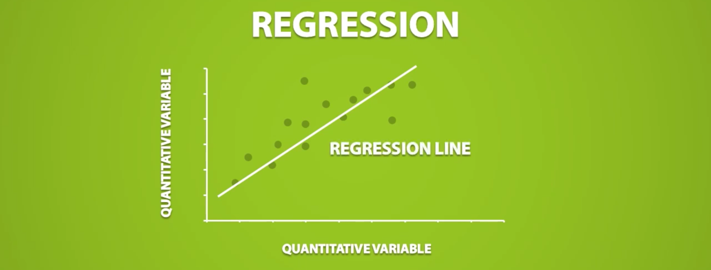
- Linear Regression gives reliable predictions if certain <a href="#ass">assumptions</a> are true. 
- [Metrics](https://github.com/KIRANKUMAR7296/Library/blob/main/Data%20Science/Supervised%20Learning/Regression/Regression%20Metrics.md): Evaluate how good the model learnt from the data.
- **Y = m * x + c** (m and c are also called as regression coefficients)

### m | Slope | Gradient | Steepness | Direction | Weight | Coefficient (of a line)
- Indicates how much the dependent variable (Y) will change if an independent variable (x) changes by one unit.

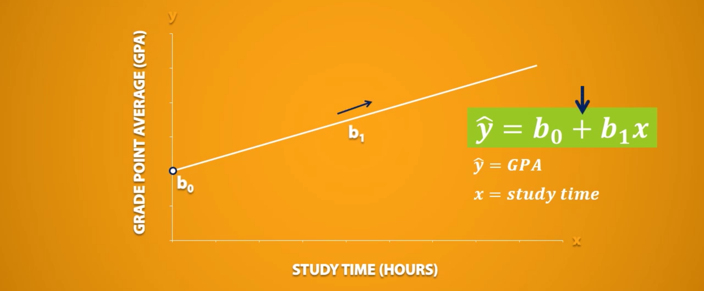

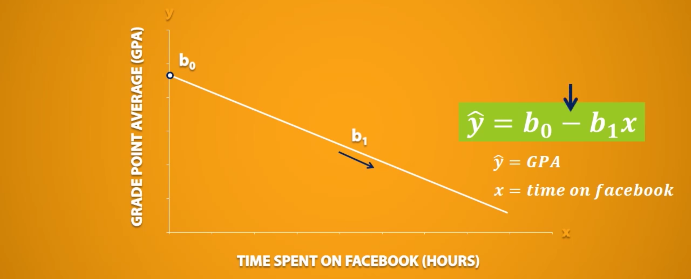

### How do we check the relationships between independent and dependent variables?

Data visualization is one of the best ways to check the dataset's relationship, distribution and variance.

### 1. Scatter Plots:
- Plot the independent variable(s) on the x-axis and the dependent variable on the y-axis.
- The pattern of the data points can reveal the direction and strength of the relationship.
- A positive slope suggests a positive relationship (as x increases, y increases)
- A negative slope suggests a negative relationship (as x increases, y decreases)
- A random scatter plot suggests a non-linear relationship.

### 2. Correlation Coefficient (r):
- The strength and direction of the linear relationship between independent and dependent variables.
- It ranges from -1 (perfect negative correlation) to +1 (perfect positive correlation), with 0 indicating no linear correlation.

### 3. Regression Analysis:
- By fitting a model to the data, the effect of changes in the independent variable(s) on the dependent variable can be estimated.
- The model's coefficients (how much the dependent variable changes on the unit change of an independent variable)

### 4. Residual Analysis:
- The difference between the actual and predicted values of the dependent variable can reveal potential issues with the model.
- Randomly scattered residuals suggest a good fit, while patterns in the residuals indicate potential problems like non-linearity or outliers.

### 5. R squared | Adjusted R Squared:
- Train the model with different feature subsets and evaluate their performance on a validation set.
- The subset with the best performance is chosen.

### c | Intercept | Bias | Constant | Coefficient
- The point where the regression line intersects the Y-axis. 
- Value of **Y** when the value of **x** and value of coefficients = 0.

### [Residuals](https://github.com/KIRANKUMAR7296/Library/blob/main/Data%20Science/Error.md) | Error | e | Noise | Actual - Prediction

<h3 name='simple'>Simple Linear Regression</h3>

- Only one **independent variable** and one **dependent variable** (**Continuous Numeric**)
- Use **statistics** to estimate the **coefficients** i.e. slope (m) and intercept (c).

<h3 name='multiple'>Multiple Linear Regression</h3>

- More than one **independent variables** and only one **dependent variable** (**Continuous Numeric**)
- Consider **features** that have **good correlation** with the **dependent variable** (**no multicollinearity**).
- **Multicollinearity:** One independent feature can completely describe the other independent feature.

# Preparing Data for Linear Regression

<h3 name='ass'>Assumptions</h3>
  
- **Linearity:** The relationship between the independent variable (x) and the dependent variable (y) should be linear.
- **Independence:** Each data point should be independent of the others.
- **No Multicollinearity:** The independent variables should not be highly correlated (Should not be extremely similar to each other)
- **Homoscedasticity (Constant Variance):** The variance of the regression line should remain **constant** throughout.
- **Normality:** The prediction errors/residuals should be roughly normally distributed. Data points should be close to the regression line.

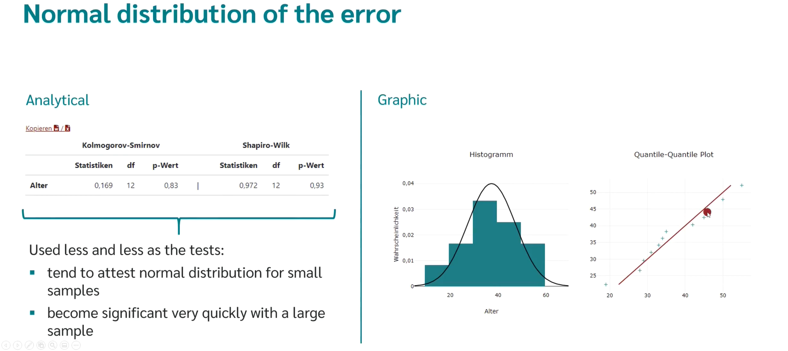

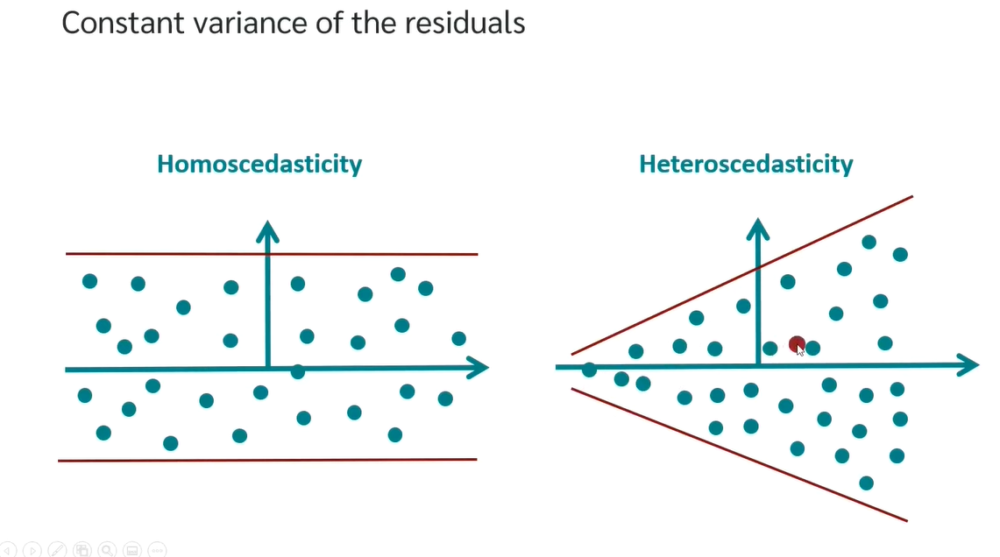

### Covariance: Direction

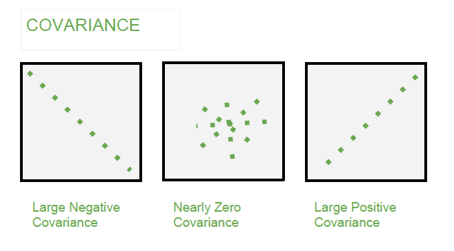 

- Covariance measures how much two variables change together (Direction of the linear relationship)
- **Positive Covariance:** Two variables move in the same direction.
- **Negative Covariance:** Two variables move in opposite directions.

### Correlation: Strength and Direction
- Correlation is a standardized version of covariance, that measures the strength and direction of a linear relationship.
- Measure how closely two variables are related and one variable can predict the other variable.
- Varies between -1 (Perfect Negative Correlation) to +1 (Perfect Positive Correlation)

### Correlation Coefficient 
- A number between -1 and +1 that measures the strength and direction of the relationship between two variables.

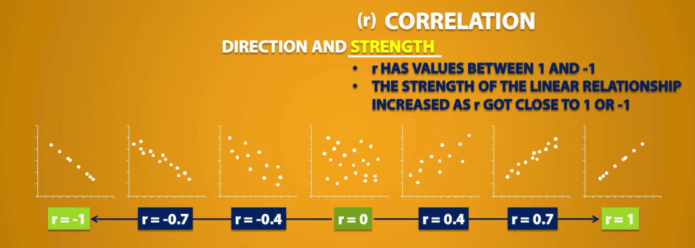

### Difference between Covariance (only direction) and Correlation (strength and direction)
- Linear Relationship: A relationship between variables where a change in one is directly associated with other.
- Both covariance and correlation measures the relationship and the dependency between two variables.
- Unlike Covariance, Correlation values are standardized.

### Variance Inflation Factor (VIF)
- A metric used to detect Multicollinearity in Linear Regression.
- VIF measures how much an independent variable is correlated with other independent variable in a regression model.
- How much the variance of a regression coefficient is inflated because of collinearity between the independent variables?
- **VIF = 1** indicates that there is no collinearity between the independent variables.
- **VIF > 10** indicates that there is high collinearity between the independent variables.
- VIF detect multicollinearity. Lower VIF is better, high VIF indicates duplicate or overlapping independent variable.
- We should consider removing one of the independent variable to reduce the VIF.
- VIF does not tell us exactly which independent variable should be removed.
- VIF can be higher due to more independent features and features with high scales or different scales.

<code>VIF = 1 / 1 - R2</code>

### T-Test: Correlation coefficient for significance

Correlation Coefficient (r) | Relationship (Numerical measure of the strength of a linear relationship)
:--- | :---
0 | No Correlation between two variables
1 | Perfect Positive Correlation (Directly proportional, as one variable increases, the other also increases)
-1 | Perfect Negative Correlation (Indirectly proportional, as one variable increases, the other decreases)

- Compare the mean of two separate groups to observe the significant difference between them.
- Measure of the **strength** and **direction** of the relationship between two variables.
- **Null Hypothesis (H0):** There is no difference in the mean.
- **Alternate Hypothesis (H1):** There is a difference in the mean.
- P value is calculated, if the **p-value > 0.05**, then the Null Hypothesis (H0) is accepted.
- **One sample t-test:** This compares the mean of one group to a specific hypothesized value.
- **Two sample t-test:** This compares the means of two independent groups.
- Assumptions: The data is normally distributed and the variances of the two groups are similar.

Significance Level | P-value
:--- | :---
95% | 0.05
99% | 0.01
99.9% | 0.1

### Multicollinearity
- Generally occurs when there is a high correlation between two or more independent variables.
- One independent variable can be used to predict the other. This creates redundant information.
- Regression equation becomes **unstable** and create **confusion**.
- Observations (rows) and features (columns) should be **independent**.
- **Remove** one feature to prevent from **multicollinearity** and make regression **stable**.
- e.g. Experience vs Salary, Height vs Weight, Age of Car vs Car Price.   
- **Tolerance** | T = 1 - R2 (T < 0.1 | There is **multicollinearity**) 
- **Variance Inflation Factor** | VIF = 1 / (1 - R2) (VIF > 10 | There is **multicollinearity**)

### Causation
- Correlation ≠ Causation (Just because two things move together doesn't mean one causes the other.)
- Causation: Relationship between **cause** and its **effect**
- One variable **affects** another variable (Temperature affects ice cream sale | Sale of ice cream is more in summer)
- Is summer: Ice cream and Sunglasses sales increases. Strong correlation may exist, but ice-cream does not cause sunglasses sales.
- A strong correlation between two variables does not necessarily mean that one causes the other.

### Rescale Independent Features
- Rescale-independent features for more reliable predictions use standardization or normalization.

### Residual | Error

- The difference between the predicted value and the actual value.

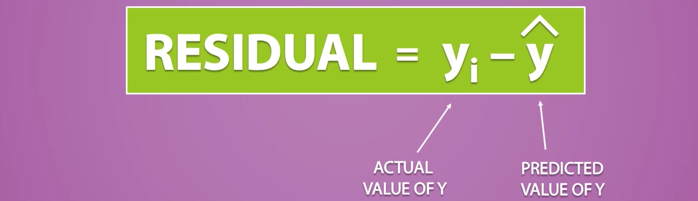

- Error should be as low as possible (Complete removal of error is impossible)

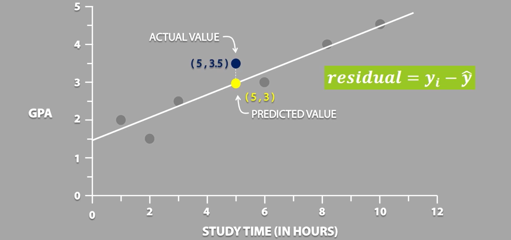

- **Positive Residual:** The actual value is **above** the regression line.
- **Negative Residual:** The actual value is **below** the regression line.

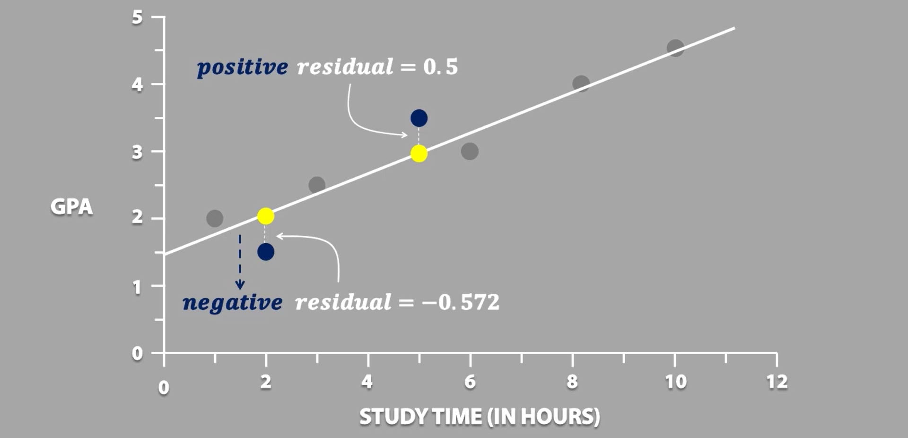

### Extrapolation
Making predictions outside the range of data due to the presence of **outliers**.

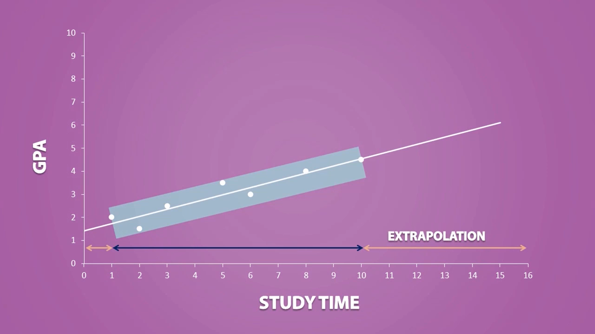

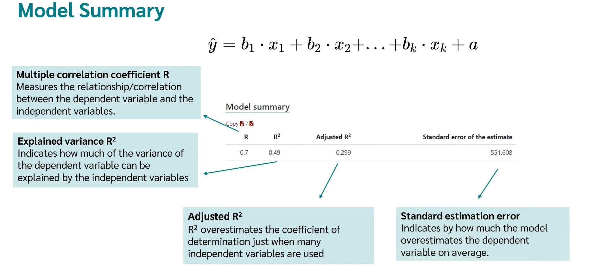

<a align="right" href="https://github.com/KIRANKUMAR7296/Library/blob/main/Interview.md">Back to Questions</a>

