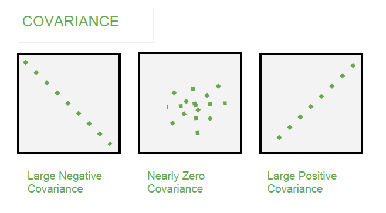

<a align="right" href="https://github.com/KIRANKUMAR7296/Library/blob/main/Interview.md">Back to Questions</a>

# **Linear Regression** 📈

<h3><a href='#simple'>Simple Linear</a> | <a href='#multiple'>Multiple Linear</a> | <a href='#ass'>Assumptions</a></h3>

### **Regression**
- Estimating the relationships between independent and dependent variables to make predictions.

#### **Important Terms:**
- Independent Variable | Features Matrix (An array of numbers, one or more rows, one or more columns)
- Dependent Variable | Target Vector (A list of numbers, can be in a single row or column)

### **Linear Regression:**
- Predict a continuous numeric dependent variable based on one or more independent variables.
- The best-fit line which gives the least number of errors.
- Residual | Error: Difference between actual and predicted value for given data points.
- Learning a linear regression model means estimating the values of the coefficients (Slope and Intercept)
- Sensitive to overfitting and outliers.
- But can be prevented using [dimensionality reduction](https://github.com/KIRANKUMAR7296/Library/blob/main/Data%20Science/Unsupervised%20Learning/Dimensionality%20Reduction.md), [regularization](https://github.com/KIRANKUMAR7296/Library/blob/main/Data%20Science/Regularization.md), [standardization](https://github.com/KIRANKUMAR7296/Library/blob/main/Data%20Science/Regularization.md) and [cross validation](https://github.com/KIRANKUMAR7296/Library/blob/main/Data%20Science/Cross%20Validation.md)

- Predict the value of a target vector based on the value of the feature matrix.
- The parameters **m** and **c** are **learnt** by the **algorithm** based on the **data point** pairs of (x, y)
- There are few **statistical** <a href="#ass">assumptions</a> as well for **linear regression**. 
- Also there are ways to **evaluate** how **good** our **model** learnt from the **data**, using [metrics](https://github.com/KIRANKUMAR7296/Library/blob/main/Data%20Science/Supervised%20Learning/Regression/Regression%20Metrics.md)
- **y = m * x + c** (m and c are also called as coefficients)

### `m` | `Slope` | `Gradient` | `Steepness` of Line | `Direction` of Line | `Weight`
- Indicates how much the `dependent variable` changes, if an `independent variable`  changes by `one unit`

### `c` | `Intercept` | `Bias` | `Constant` 
- The point where the regression line `intersects` the `Y` axis. 
- Value of `Y` when the value of `X` and value of `coefficients` = `0`

### [Residuals](https://github.com/KIRANKUMAR7296/Library/blob/main/Data%20Science/Error.md) | `Error` | `e` | `Noise` | `Actual - Prediction`

<h3 name='simple'>Simple Linear Regression</h3>

- Only one **independent features** and one **dependent variable** ( **Continuous Numeric** )
- Use **statistics** to estimate **coefficients** ( `Slope` and `Intercept` )

<h3 name='multiple'>Multiple Linear Regression</h3>

- More than one **independent features** and only One **dependent variable** ( **Continuous Numeric** )
- Consider **features** that have **good correlation** with **dependent variable**.
- Checking **multicollinearity** is important.
- `Multicollinearity`: One `independent` feature can completely describe the other `independent` feature.

# Preparing Data for Linear Regression

<h3 name='ass'>Assumptions</h3>
  
- `Linearity`: The relationship between `independent variable (x)` and `dependent variable (y)` must be linear.
- `Independence`: The `residuals` | `errors` must be `independent`.
- `Normality`: The `residuals` of the data must be `normally distributed` ( P value > 0.05  )
- `Multicollinearity`: The `independent variables` must not be highly correlated.
- `Homoscedasticity`: `Variance` of residuals must be constant for all the data points near the regression line | Residuals must be spread out evenly around the line of best fit.

`Quantile Quantile Point`: Data points should be `close` to the regression line.

- `Homoscedasticity` : **Variance** along the line of **best fit** should remain **constant** as we move along the line.
- **Variance** is same for all **data points**.

### `Covariance`: `Direction`

 

- `Relationship` between two variables measures how much two variables change together.
- `Direction` of the `linear relationship` between `quantitative` variables.
- `Positive Covariance`: Two variables tend to move in `positive` | same direction.
- `Negative Covariance`: Two variables tend to move in `negative` | opposite direction.

### `Correlation`: `Strength` and `Direction`

- Standardized version of `covariance`
- `Strength` and `direction` of `linear relationship` between `quantitative` variables.
- Measure how closely two variables are related to each other.
- One variable can predict the other variable.
- Varies between `-1` ( Perfect Negative ) to `1` ( Perfect Positive )
- `-1`: Perfect negative linear relationship.
- `+1`: Perfect positive linear relationship.

Amount of R | **Strength** of **Correlation**
:--- | :---
0.0  | **No** Correlation
0.1 - 0.3 | **Little** Correlation
0.3 - 0.5 | **Medium** Correlation
0.5 - 0.7 | **High** Correlation
0.7 - 1.0 | **Very High** Correlation

### Difference between `Covariance` and `Correlation`

- `Covariance` reveals how two variables change together.
- `Correlation` determines how closely two variables are related to each other.
- Both `covariance` and `correlation` measure the `relationship` and the dependency between two variables.
- `Covariance` indicates the `direction` of the linear relationship between variables.
- `Correlation` measures both the `strength` and `direction` of the linear relationship between two variables.
- `Correlation` values are standardized.
- `Covariance` values are not standardized.

### Variance Inflation Factor (VIF)

- A measure of how much the variance of the regression coefficient is inflated due to collinearity between the independent variables.
- `VIF = 1` indicates that there is no collinearity between the independent variables.
- `VIF > 10` indicates that there is high collinearity between the independent variables.
- We should consider removing the independent variable to reduce the VIF.
- VIF does not tell us which independent variable should be removed.
- VIF can be higher due to more number of independent features in the model.
- VIF can be higher if independent variables have high scale values or variables are measured at different scales.

<code>VIF = 1 / 1 - R2</code>

### `T-Test`: Correlation Coefficient for `Significance`

Correlation Coefficient | Relationship
:--- | :---
0 | No Correlation between two variables
1 | Perfect Positive Correlation ( Directly Proportional )
-1 | Perfect Negative Correlation ( Indirectly Proportional )

- Compare the mean of two separate groups to observe the significance difference between them.
- Measure of the `strength` and `direction` of the relationship between two variables.
- **Null** Hypothesis `H0`: There is no difference in the mean
- **Alternate** Hypothesis `H1`: There is a difference in the mean
- `P value` is calculated (if `P-Value > 0.05`: Then `accept` Null Hypothesis else `reject` Null Hypothesis)
- One sample t-test: This compares the mean of one group to a specific hypothesized value.
- Two sample t-test: This compares the means of two independent groups.
- Assumptions: The data is normally distributed and the variances of the two groups are similar.

Significance Level | P value
:--- | :---
95% | 0.05
99% | 0.01
99.9% | 0.01

### `Multicollinearity`
- Generally occurs when there are `high correlation` between two or more `independent` variables.
- One `independent` variable can be used to predict the other. This creates `redundant` information.
- Regression equation becomes **unstable** and create **confusion**.
- Observations ( Rows ) and features ( Columns ) should be **independent**.
- **Remove** one feature to prevent from **multicollinearity** and make regression **stable**.
- e.g. Experience vs Salary, Height vs Weight, Age of Car vs Car Price.   
- `Tolerance | T`  = 1 - R2 ( T < 0.1 | There is **multicollinearity** ) 
- `Variance Inflation Factor | VIF` = 1 / ( 1 - R2 ) ( VIF > 10 | There is **multicollinearity** )

### `Causality`
- Relationship between **cause** and its **effect**.
- One variable **affects** another variable ( Temperature affects ice cream sale | Sale of ice cream is more in summer )

### `Remove Collinearity`
- If Independent features are **highly** correlated, Linear regression will **overfit** your data.
- Pairwise correlations for independent features and remove the correlated.

### `Rescale` Independent Features
- `Rescale` Independent Features for more reliable predictions use `Standardization` or `Normalization`

### `Residuals`

- The difference between `predicted value` and `actual value`

- Should be `low` as possible ( Complete removal of error is impossible )

- `Positive` Residual: The actual value is `above` the regression line.
- `Negative` Residual: The actual value is `below` the regression line.

### Extrapolation

- Making `predictions` outside the `range` of data.

<a align="right" href="https://github.com/KIRANKUMAR7296/Library/blob/main/Interview.md">Back to Questions</a>

