<p align='right'><a align="right" href="https://github.com/KIRANKUMAR7296/Library/blob/main/Machine%20Learning/Machine%20Learning%20Models.md">Back to ML</a></p>

# Metrics 🧮

<table align=center> 
  <tr><th><h3><a href="#linear"> Regression</a></h3></th><th><h3><a href="#logistic">Classification</a></h3></th></tr>
  <tr>
    <td>
      <ol>
        <li>Mean Absolute Error ( <a href='#mae'>MAE</a> )</li>
        <li>Mean Squared Error ( <a href='#mse'>MSE</a> )</li>
        <li>Root Mean Squared Error ( <a href='#rmse'>RMSE</a> )</li>
        <li>Coefficient of Determination ( <a href='#r2'>R<sup>2</sup></a> )</li>
        <li>Adjusted R<sup>2</sup> ( <a href='#ar2'>Adj R<sup>2</sup></a> )</li>
      </ol>
    </td>
    <td>
       <ol>
        <li><a href='#cm'>Confusion Matrix</a></li>
        <li><a href='#acc'>Accuracy</a></li>
        <li><a href='#pre'>Precision</a></li>
        <li>Recall | True Positive Rate ( <a href='#tpr'>TPR</a> ) | Sensitivity</li>
        <li>False Positive Rate ( <a href='#fpr'>FPR</a> ) | Specificity</li>
        <li><a href='#f1'>F1 Score</a> or F Measure</li>
        <li><a href='#roc'>ROC</a> | Receiver Operating Characteristic Curve</li>
        <li><a href='#auc'>AUC</a> | Area Under Curve</li>
      </ol>
    </td>
  </tr>
</table>

### 🎯 How do you evaluate the performance of an ML model?
```
📝 First, we give some input data to the model with initial configuration and let it make predictions.
🔍 We compare the output predicted by the model with the actual correct output.
📊 We calculate performance metrics (Accuracy, Precision, Recall) to see how well the model is performing.
🔄 Based on these metrics, we adjust the model's parameters and train it again to improve its performance.
📈 This process is repeated until the model reaches the best possible performance.
🧪 We then test the model on new, unseen data to check how well it generalizes.
🏆 Finally, we select the model that performs best on unseen data.
🚨 Compare it with other models to choose the most suitable one for the task.
```

<h2 name="linear">Linear Regression</h2>

🔮 Predicts continuous numeric dependent variables based on one or more independent variables.

<h3 name='mae'>1. Mean Absolute Error (MAE) </h3>

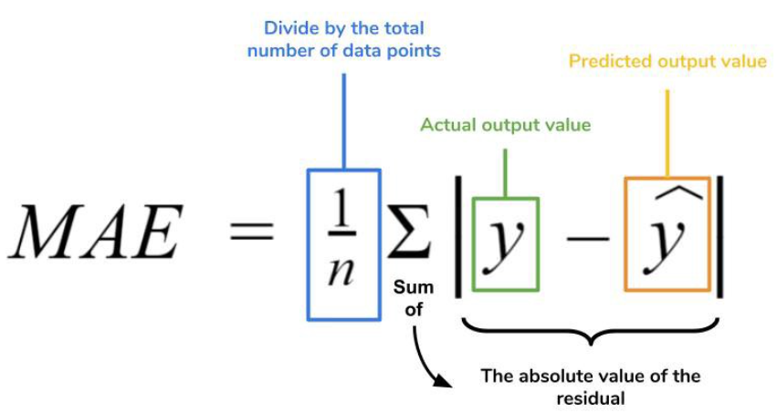
```
📏 MAE measures the average difference between the actual values and the predicted values.
➖ It calculates the absolute difference, ignores whether the error is positive (+) or negative (-).
📐 The MAE value is expressed in the same unit as the target variable (Y), making it easy to understand.
😊 Since it uses absolute values instead of squaring the errors, MAE is less sensitive to outliers.
📉 A lower MAE means the model's predictions are closer to the actual values, indicating better performance.
```

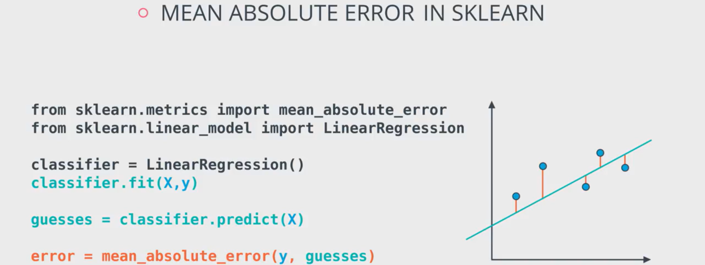

<h3 name='mse'>2. Mean Squared Error (MSE) | LOSS</h3>

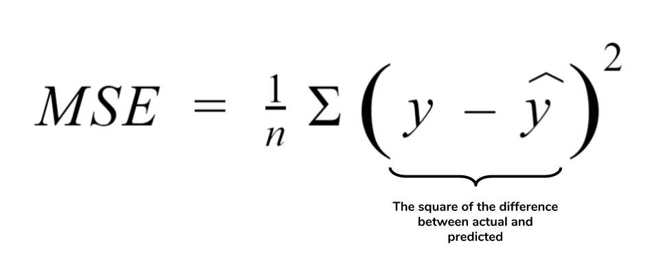
```
📏 MSE measures the average of the squared differences between the actual values and the predicted values.
🔢 Instead of taking the absolute value like MAE, MSE squares each error before averaging.
⚠️ Because errors are squared, large errors get much bigger, making MSE highly sensitive to outliers.
📐 The unit of MSE is squared units (e.g., ₹², m², kg²), which makes it less intuitive to interpret than MAE.
➕➖ Squaring the errors removes negative signs, so MSE is always zero or positive.
📉 A lower MSE means the model's predictions are closer to the actual values and the model is performing better.
```

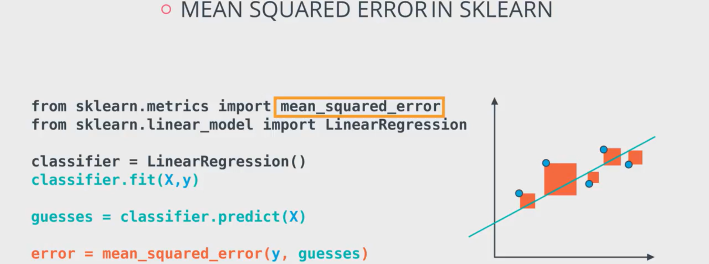

<h3 name='rmse'>3. Root Mean Square Error (RMSE)</h3>

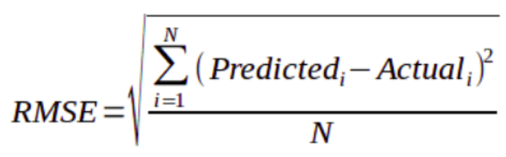
```
📏 RMSE is the square root of MSE (Mean Squared Error).
📐 Unlike MSE, RMSE is expressed in the same unit as the target variable, making it easier to understand.
⚠️ Since RMSE is based on squared errors, large errors receive a higher penalty than small errors.
🎯 RMSE is especially useful when large prediction errors are undesirable and need to be minimized.
🤝 RMSE combines:
  ✅ MAE's Advantage: Same unit as the target variable.
  ✅ MSE's Advantage: Penalizes large errors more strongly.
📉 A lower RMSE means the model's predictions are closer to the actual values and the model is performing better.
```

MAE | MSE | RMSE
:--- | :--- | :---
Absolute (Actual - Predicted) | Squared (Actual - Predicted) | Square Root (MSE)
Good for small errors | Magnify small errors | Shrinks down larger errors
Units of predicted value remain same | Unit gets squared | Units remain same
Less sensitive towards outliers | More sensitive towards outliers | Less sensitive towards outliers

<h3 name='r2'>4. Coefficient of Determination (R<sup>2</sup>) | Squared Correlation Coefficient</h3>

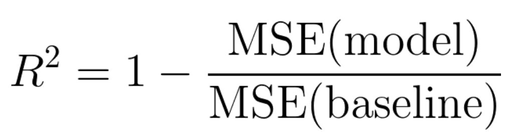
```
📊 R² measures how well the model explains the variation in the target variable (Y).
📈 It tells us how closely the data points fit the regression line.
🔍 In simple terms, R² shows how much of the changes in Y can be explained by the input variables (X).
🎯 A higher R² value generally means the model fits the data better.

🔴 R² = 0
  The model explains none of the variation in the target variable.
  It performs no better than simply predicting the average value.

🟡 R² = 0.50
  The model explains 50% of the variation in the target variable.

🟢 R² = 1
  The model explains 100% of the variation.
  Predictions perfectly match the actual values.

📏 Measures how well the model fits the data.
📊 Helps compare the model against a simple baseline (predicting the mean).
🔍 Shows how much variance in Y is explained by X.
🏆 Helps compare multiple regression models.

➕ Adding more features always increases R², even if the new features are not useful.
🚨 Therefore, a higher R² does not always mean a better model.
⚠️ A very high R² does not automatically mean overfitting, but it can be a warning sign.
```
  
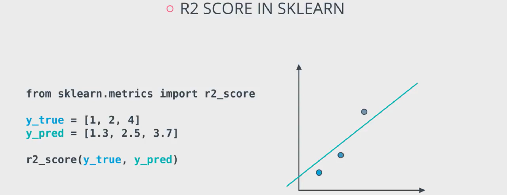

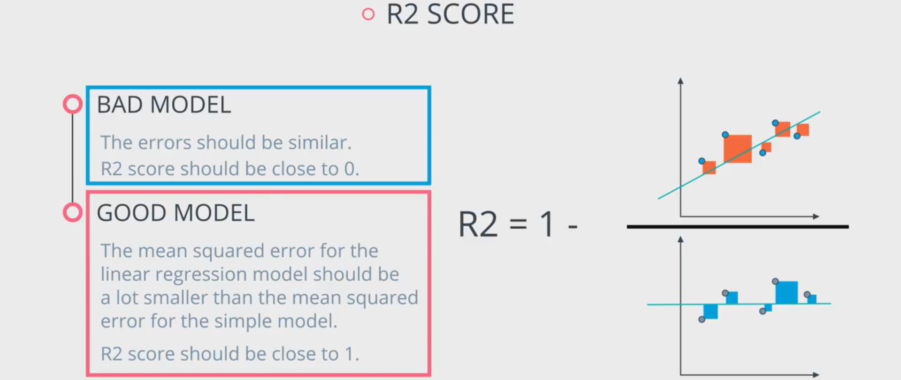

<h3 name='ar2'>5. Adjusted R<sup>2</sup></h3>

```
📈 Adjusted R² is an improved version of R².
🔍 While R² always increases (or stays the same) when new features are added.
⚡ Adjusted R² increases only if the new feature actually improves the model.
📊 Therefore, Adjusted R² is a more reliable measure of model performance than R².
📉 Adjusted R² is usually lower than or equal to R².
🏆 It is especially useful when comparing models with different numbers of independent variables (features).
```

MAE or MSE or RMSE | R<sup>2</sup> | R<sup>2</sup> ( Adj )
:--- | :--- | :---
Good Model: Value closer to 0 | Good Model: Value closer to 1 | Increases only if new term improves model
MAE (Small errors), RMSE (Large errors) | Measures variability | Good if the dataset has many independent variables

<h2 name="logistic">Logistic Regression | Classification</h2>

```
🏷️ Classification is a ML technique used to predict a class label based on one or more input features.
🔍 Instead of predicting a number (like Regression), Classification predicts a label such as:
  Spam / Not Spam 📧
  Fraud / Not Fraud 💳
  Pass / Fail 🎓
  Disease / No Disease 🏥

1️⃣ Binary Classification: When there are only two possible classes.

Examples:
✅ Yes / ❌ No
😊 Positive / 😞 Negative
📧 Spam / Not Spam

2️⃣ Multiclass Classification: When there are more than two classes.

Examples:
🐱 Cat | 🐶 Dog | 🐰 Rabbit
🔴 Red | 🔵 Blue | 🟢 Green

⚖️ Balanced Dataset:
A good classification model works best when the dataset has a balanced distribution of classes.

Example of Balanced Data: Total Students = 100
👦 Boys = 50
👧 Girls = 50
This is balanced because both classes have similar numbers.

Example of Imbalanced Data: Total Students = 100
👦 Boys = 95
👧 Girls = 5
This is imbalanced and can lead to biased predictions.
```

<h3 name='cm'>1. Confusion Matrix</h3>

```
📊 A Confusion Matrix is a table used to evaluate the performance of a classification model.
🔍 It shows how many predictions were correct and how many were incorrect.
🏷️ It helps us understand how well the model is classifying each class label.
🎯 Instead of looking only at accuracy, a confusion matrix provides a detailed breakdown of predictions.

It helps calculate important metrics:
📊 Accuracy
🎯 Precision
🔍 Recall
⚖️ F1 Score
These metrics are all derived from: TP, TN, FP, and FN.
```

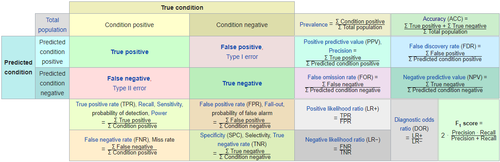

```
True Positive  (TP): Predicts 1 when Actual is 1 
True Negative  (TN): Predicts 0 when Actual is 0 
False Positive (FP): Predicts 1 when Actual is 0 | Type I Error  | Incorrect True Prediction 
False Negative (FN): Predicts 0 when Actual is 1 | Type II Error | Incorrect False Prediction 

📊 There is no single best evaluation metric for every problem.
🎯 The right metric depends on the business goal and the cost of different types of errors.
⚠️ Sometimes a False Positive (FP) is more costly, while in other cases a False Negative (FN) is more dangerous.
```

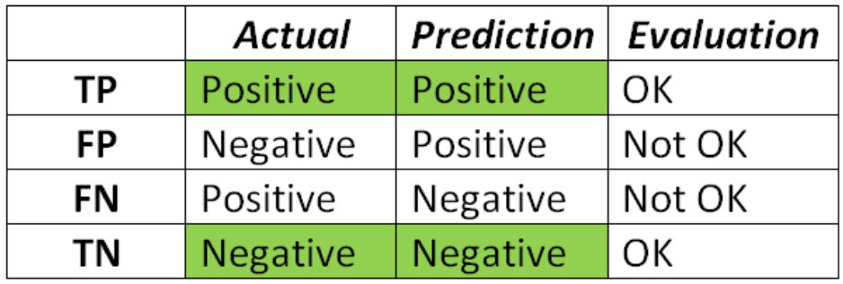

<h3 name='acc'>2. Accuracy</h3>

```
📊 Accuracy measures the percentage of predictions that the model got correct.
🤔 It answers the question: "Out of all predictions, how many were correct?"
🎯 In simple words, Accuracy tells us how often the model is right.
💡 The ratio of correct predictions to the total number of predictions.
⚖️ Accuracy score is good for balanced datasets, but misleading for imbalanced datasets.

📐 Formula: Accuracy =  TP+TN / TP+TN+FP+FN
	​
Where:
  ✅ TP (True Positive) = Correct Positive Predictions
  ✅ TN (True Negative) = Correct Negative Predictions
  ❌ FP (False Positive) = Wrong Positive Predictions
  ❌ FN (False Negative) = Wrong Negative Predictions

Use Accuracy when:
  ✅ Dataset is balanced
  ✅ TP, TN, FP, and FN are equally important
```

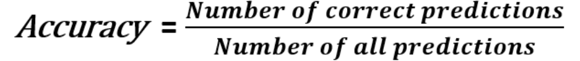

<h3 name='pre'>3. Precision</h3>

```
📊 Precision measures how many of the predicted positive cases were actually positive.
🤔 When the model says Yes/True/1, how often is it correct? Can I trust the positive predictions?
✅ Measures the correctly identified positive cases (TPs) from all the predicted positive cases.
💡 Precision focuses on reducing False Positives (FP). Example: Spam Filter, Antivirus
🚨 The model predicts Positive, but the actual answer is Negative.
⚡ A high Precision means: Fewer false alarms and more trustworthy positive predictions.

📧 Spam Filter Example:
Suppose a genuine email is marked as Spam.
❌ This is a False Positive.

Examples:
📧 Job offer email
🏦 Bank notification
📩 Important client email
being sent to the spam folder.
👉🏻 We want high Precision to avoid such mistakes.

🎯 When to Use Precision: Use Precision when False Positives are costly.
📧 Spam Detection
🛡️ Antivirus Software
🔒 Face Recognition Security
💳 Fraud Alerts that inconvenience customers
```

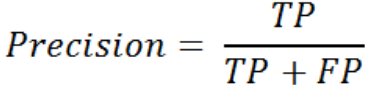

<h3 name='tpr'>4. Recall | True Positive Rate (TPR) | Sensitivity</h3>

```
📊 Recall measures how many of the actual positive cases were correctly identified by the model.
🤔 Out of all actual positive cases, how many did the model find? Did the model miss any?
✅ Measures the correctly identified positive cases (TPs) from all the actual positive cases.
💡 Recall focuses on reducing False Negatives (FN). Example: Medical Diagnosis, Corona, Fraud Detection
🚨 The model predicts Negative, but the actual answer is Positive.
⚡ A high Recall means: Fewer missed positive cases and better detection of important events.

🏥 Medical Diagnosis Example
Suppose a cancer detection model says: ❌ "No Cancer"
But the patient actually has cancer. This is a False Negative.
🚨 Missing a sick patient can have serious consequences.
👉🏻 Therefore, medical diagnosis systems aim for high Recall.

🦠 COVID Detection Example
If a person has COVID but the model predicts: ❌ "No COVID"
the infected person may continue interacting with others and spread the disease.
👉🏻 High Recall is critical.

🎯 When to Use Recall: Use Recall when False Negatives are costly.
🏥 Medical Diagnosis
🦠 Disease Detection (COVID, Cancer, etc.)
💳 Fraud Detection
🚨 Security Threat Detection
🔥 Disaster Warning Systems
```

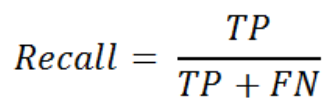

<h3 name='fpr'>5. False Positive Rate (FPR) | Specificity</h3>

```
📊 False Positive Rate (FPR) measures how often the model incorrectly labels a negative case as positive.
✅ Measures the incorrectly identified positive cases from all the actual negative cases.
🤔 Out of all actual negative cases, how many were wrongly predicted as positive?
🚨 A high FPR means the model is generating many false alarms.

📧 Spam Filter Example

Actual Situation:
📩 Genuine Email → Negative Class
🚫 Spam Email → Positive Class
If a genuine email is marked as spam:

❌ False Positive
A high FPR means:
Important emails may be missed 😱
Users lose trust in the spam filter 😤
``` 

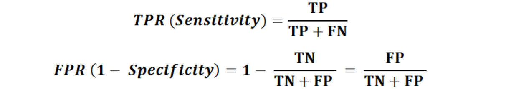

<h3 name='f1'>6. F1 Score | F Measure</h3>

```
📊 F1 Score is the harmonic mean of Precision and Recall.
👉🏻 F1 Score gives a single number that balances both.
⚖️ It provides a balance between Precision and Recall.
🎯 F1 Score is useful when both False Positives (FP) and False Negatives (FN) are important.
📈 It is especially helpful for imbalanced datasets, where one class has significantly more examples than the other.
🏆 The best F1 Score is 1 (100%), which indicates perfect Precision and Recall.
❌ The worst F1 Score is 0, which indicates poor performance.

⚖️ F1 Score Example (Both FP and FN Matter)
Fraud Detection
FP → Genuine transaction blocked 😠
FN → Fraudulent transaction missed 😱
Both errors are costly.
👉🏻 Focus on F1 Score

🎯 Why F1 Score is Important in Real Life

Many real-world datasets are imbalanced.
Examples:
💳 Fraud Detection
🏥 Disease Detection
📧 Spam Filtering
🔒 Cybersecurity Threat Detection
In these cases, Accuracy can be misleading.
✅ F1 Score gives a more realistic measure because it considers both Precision and Recall.
```


### Support

```
📊 Support refers to the number of actual occurrences of a class in the dataset.
🔢 How many real examples of a particular class are present in the data?
🏷️ Support is calculated from the actual (true) labels, not from the model's predictions.
📈 It helps us understand the distribution of classes in the dataset.

🏠 Simple Example: Suppose we have a dataset of 100 emails:

Class (Number of Emails)
📧 Spam	(30)
📩 Not Spam	(70)

✅ Support
	Spam Support = 30
	Not Spam Support = 70
👉🏻 These numbers represent the actual occurrences of each class in the dataset.
```

<h3 name='roc'>7. ROC | Receiver Operating Characteristic</h3>

```
🎯 Explains the characteristics of curves by plotting TPR and FPR at different classification thresholds
📈 It plots:
	TPR (True Positive Rate / Recall) on the Y-axis
	FPR (False Positive Rate) on the X-axis
📊 ROC Curve shows how well a classification model separates positive and negative classes.
🔄 The curve is created by testing the model at different classification thresholds.
🎯 ROC helps us choose the optimal threshold that provides the best balance.
```

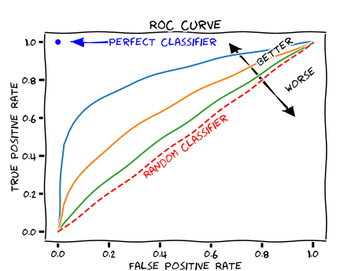

<h3 name='auc'>8. AUC | Area Under ROC Curve</h3> 

```
📊 AUC stands for Area Under the ROC Curve.
📈 It measures the overall performance of a classification model across all classification thresholds.
🎯 AUC tells us how well the model can distinguish between positive and negative classes.
🏆 A higher AUC indicates a better classifier.

🎯 Understanding AUC

AUC = 1.0 🏆
	Perfectly separates positive and negative classes.
	No classification mistakes.

AUC = 0.5 🎲
	Performs no better than random guessing.
	Cannot distinguish between classes.

AUC < 0.5 ❌
	Worse than random.
	Predictions are effectively reversed.

📈 Relationship Between ROC and AUC
📊 ROC Curve shows model performance at different thresholds.
📏 AUC summarizes the entire ROC Curve into a single number.

Think of it this way:
ROC Curve = Full report 📋
AUC = Final score 🎯
```

**Score** | **Classifier**
--- | ---
AUC = 1.0 | Perfect Classifier  
AUC > 0.75 | Good Classifier 
AUC > 0.5 | Bad Classifier 
AUC < 0.5 | Worst Classifier

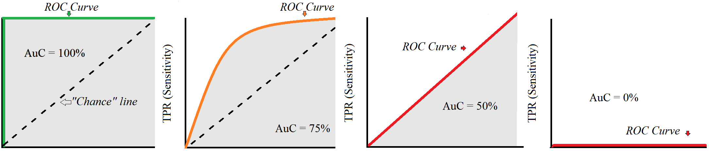

<p align='right'><a align="right" href="https://github.com/KIRANKUMAR7296/Library/blob/main/Interview.md">Back to Questions</a></p>
