<p align='right'><a align="right" href="https://github.com/KIRANKUMAR7296/Library/blob/main/Machine%20Learning/Machine%20Learning%20Models.md">Back to ML</a></p>

# Metrics 🧮

<table align=center> 
  <tr><th><h3><a href="#linear"> Regression</a></h3></th><th><h3><a href="#logistic">Classification</a></h3></th></tr>
  <tr>
    <td>
      <ol>
        <li>Mean Absolute Error ( <a href='#mae'>MAE</a> )</li>
        <li>Mean Squared Error ( <a href='#mse'>MSE</a> )</li>
        <li>Root Mean Squared Error ( <a href='#rmse'>RMSE</a> )</li>
        <li>Coefficient of Determination ( <a href='#r2'>R<sup>2</sup></a> )</li>
        <li>Adjusted R<sup>2</sup> ( <a href='#ar2'>Adj R<sup>2</sup></a> )</li>
      </ol>
    </td>
    <td>
       <ol>
        <li><a href='#cm'>Confusion Matrix</a></li>
        <li><a href='#acc'>Accuracy</a></li>
        <li><a href='#pre'>Precision</a></li>
        <li>Recall | True Positive Rate ( <a href='#tpr'>TPR</a> ) | Sensitivity</li>
        <li>False Positive Rate ( <a href='#fpr'>FPR</a> ) | Specificity</li>
        <li><a href='#f1'>F1 Score</a> or F Measure</li>
        <li><a href='#roc'>ROC</a> | Receiver Operating Characteristic Curve</li>
        <li><a href='#auc'>AUC</a> | Area Under Curve</li>
      </ol>
    </td>
  </tr>
</table>

1. We `start` with some `initial configuration` of **model** and `predict` the **output** based on some **input**.
2. Then we compare `predicted value` with `target` and **measure** the `performance` of our model.
3. `Parameters` of the **model** are `adjusted` **iteratively** in order to reach the `optimal value` of the `performance metric`

<h3 name="linear">Linear Regression</h3>

- `Predict` **continuous numeric dependent variable** on the basis of one or more **independent** variables.

<h3 name='mae'>1. Mean Absolute Error ( MAE ) </h3>

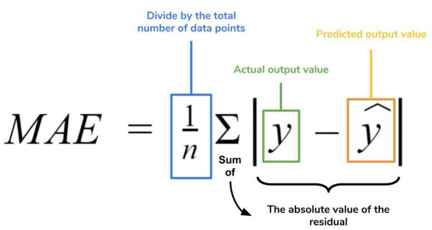

- `Sum` of `absolute` difference between `actual` and `predicted` values.
- `MAE` is better for datasets with `outliers`, `fails` in case of **larger errors**.

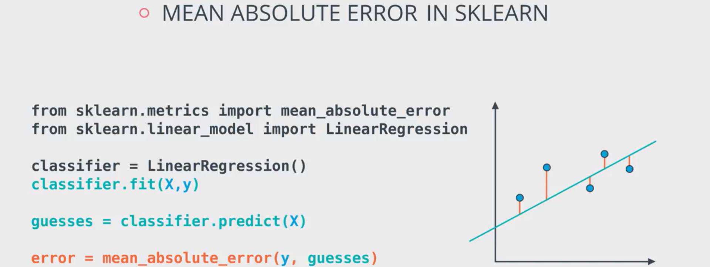

<h3 name='mse'>2. Mean Squared Error ( MSE ) | LOSS</h3>

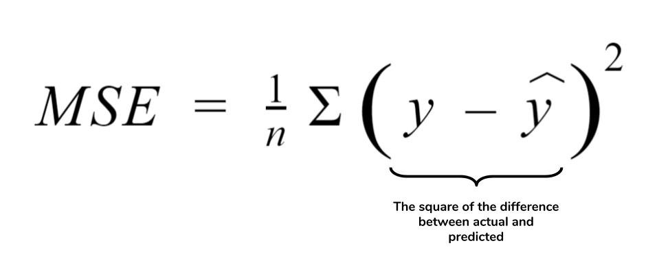

- `Sum` of `squared` difference between `actual` and `predicted` values.
- **Squared** differences penalizes `small` errors.

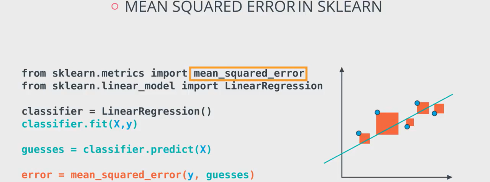

<h3 name='rmse'>3. Root Mean Square Error ( RMSE )</h3>

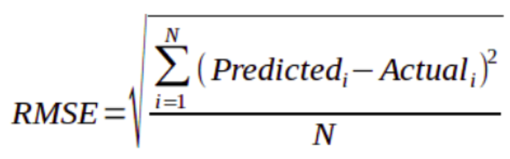

- **Square Root** of `MSE`, `RMSE` is useful at the time of undesired `large` errors.

<h3 name='r2'>4. Coefficient of Determination ( R<sup>2</sup> ) | Squared Correlation Coefficient</h3>

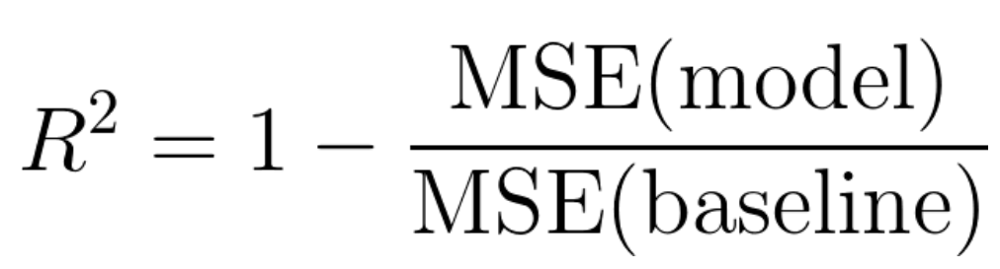

- Helps to understand how well the model `fits` the data i.e. how well the model make `predictions` on new observations.
- Measure how `close` each **data point** `fits` the **regression line** i.e. how well the **regression line** `predicts` **actual values**.
- Ideal value for R<sup>2</sup> is between `70%` to `90%` ( i.e. Model `fits` the data very well )
- Help us to `compare` **created** model with the `baseline` model ( Mean )
- `Low` R<sup>2</sup> causes `underfitting` and `high` R<sup>2</sup> results into `overfitting`
- `Best fit line` predicts better than `base fit line` ( `Mean` ) 

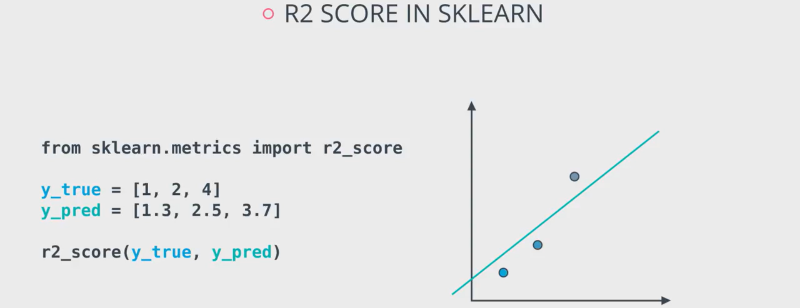

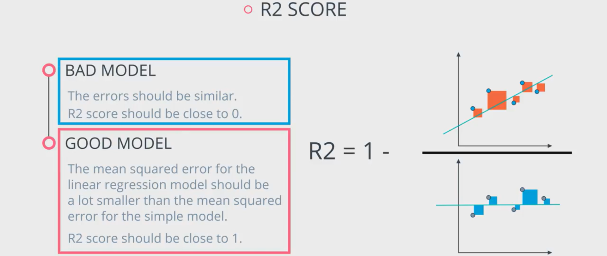

<h3 name='ar2'>5. Adjusted R<sup>2</sup></h3>

- Improvement of R<sup>2</sup> ( Adjusted R<sup>2</sup> is always `lower` than R<sup>2</sup> )
- Compare models with different number of `independent` features.
- Adjusted R<sup>2</sup> `increases` only if the new `independent` feature improves the model `more` than expected.
- Provides more accurate `correlation` between features.

| MAE or MSE or RMSE | R<sup>2</sup> | R<sup>2</sup> ( Adj )
| :--- | :--- | :---
| Good Model : Value closer to `0` | Good Model : Value closer to `1` | Increases only if new term improves model

<h3 name="logistic">Logistic Regression | Classification</h3>

- `Predict` the `class` | `label` of a data point on the basis of one or more `independent` features.
- Depending on the number of `classes` | `labels` that `target` variable includes, it can be `Binary` or `Multiclass` classification.
- Data set should contain well `balanced` class distribution. ( e.g. Total Students = 100 : 50 Boys + 50 Girls )
- **Good Classifier** : `1 or 100%` | **Bad Classifier** < `0.5 or 50%`

<h3 name='cm'>1. Confusion Matrix</h3>

- Help us to evaluate `correct` and `incorrect` classifications on each `class` | `label`


```
True Positive  (TP) : Predicts 1 when Actual is 1 
True Negative  (TN) : Predicts 0 when Actual is 0 
False Positive (FP) : Predicts 1 when Actual is 0 | Type I Error  | Incorrect True Prediction 
False Negative (FN) : Predicts 0 when Actual is 1 | Type II Error | Incorrect False Prediction 
```

**FP** is `Acceptable` but **FN** is Dangerous | Fatal for Problems related to **Medical Field**

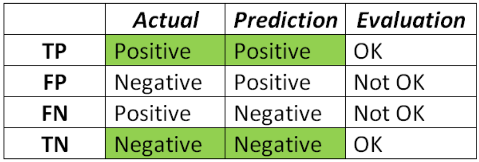

<h3 name='acc'>2. Accuracy</h3>

- Number of `Correct` predictions to the `Total` predictions.
- Accuracy score is good if dataset contains `Balanced` class distribution.
- Used when all the classes ( `TP`, `TN`, `FP` and `FN` ) are equally important.
- Accuracy: (TP + TN) / TP + TN + FP + FN

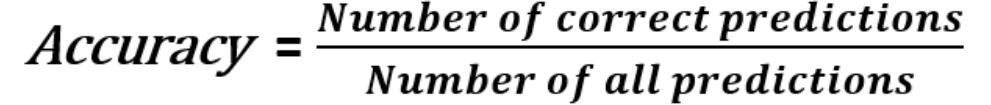

<h3 name='pre'>3. Precision</h3>

- Measures the `Correctly` identified `Positive` cases from all the `Predicted` positive cases.
- Used when the **Cost** of False Positive ( `FP` ) is **High**. ( e.g. There is virus but still antivirus is predicting that the system is safe it's costly )

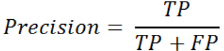

<h3 name='tpr'>4. Recall | True Positive Rate ( TPR ) | Sensitivity</h3>

- Measures the `Correctly` identified `Positive` cases from all the `Actual` positive cases. 
- Used when the **Cost** of False Negatives ( `FN` ) is **High**. ( e.g. Person is really prone to COVID 19 but test result is negative it can be fatal. )
- **True Positive Rate** : Proportion of **Positive Class** that is `Correctly` Predicted as **Positive**.

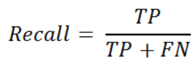

<h3 name='fpr'>5. False Positive Rate ( FPR ) | Specificity</h3>

- Measures the `Incorrectly` identified `Positive` cases from all the `Actual` negative cases. 
- **False Positive Rate** : Proportion of **Negative Class** that is `Incorrectly` Predicted as **Positive**.

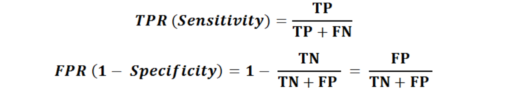

<h3 name='f1'>6. F1 Score | F Measure</h3>

- Weighted Average ( Harmonic Mean ) of `Precision` and `Recall`
- `F1 Score` keeps a `balance` between `Recall` and `Precision` for the `classifier model`
- Useful for `Imbalanced` Datasets ( `Uneven` Class Distribution ) and it also considers `FP` and `FN`.
- **Better Measure** for the **Incorrectly Classified Cases** than the **Accuracy Metric**.
- **Accuracy** is used when `TP` and `TN` are more **Important**.
- **F1 Score** is used when `FN` and `FP` are more **Crucial**.
- **F1-score** is a better metric to evaluate in **Real Life Application**.
- `Best` value for **F1 Score** is `1` | `Worst` value for **F1 Score** is `0`
- **Precision**, **Recall** and **F1 Score** are better `Metrics` for **Imbalanced Dataset**


<h3 name='roc'>7. ROC | Receiver Operating Characteristic Curve</h3>

- Helps to understand `characteristics` of curve by plotting, 
- `TPR` ( True Positive Rate ) on `Y Axis` and `FPR` ( False Positive Rate ) on `X Axis` at different `classification thresholds`
- If `threshold` is closer to `1.0` or `100%`: **Classifications** gets more `accurate`


<h3 name='auc'>8. AUC | Area Under ROC Curve</h3> 

- Helps to understand `performance` of a classification model across all `classification thresholds`

Score | Classifier
--- | ---
AUC = 1.0 | `Perfect` Classifier  
AUC > 0.75 | `Good` Classifier 
AUC > 0.5 | `Bad` Classifier 
AUC < 0.5 | `Worst` Classifier

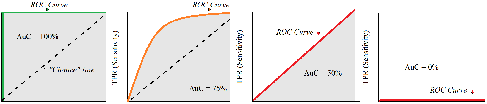

<p align='right'><a align="right" href="https://github.com/KIRANKUMAR7296/Library/blob/main/Interview.md">Back to Questions</a></p>
