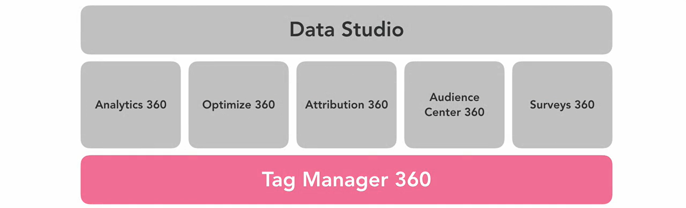
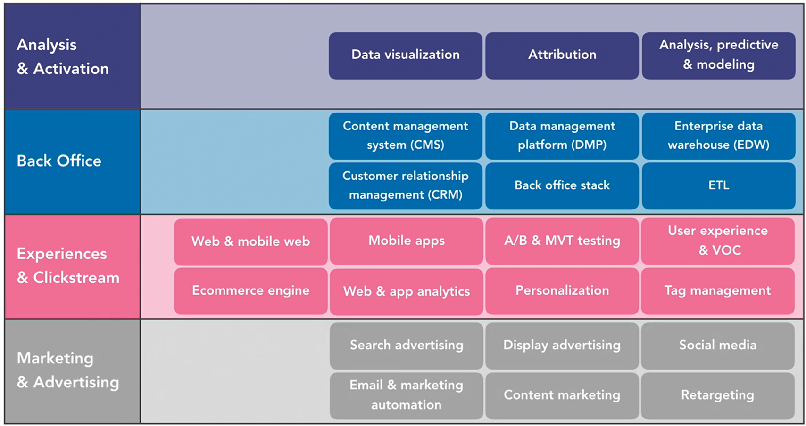
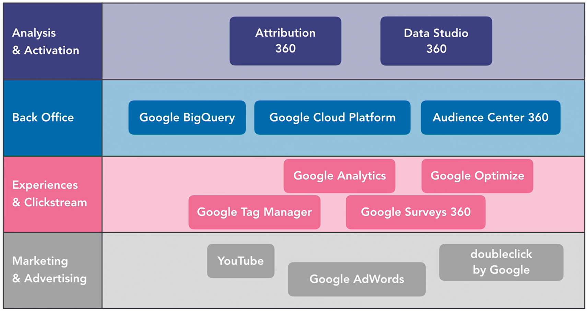

# Google 360 Suite

### A Collectiion of 7 Different Tools built for Enterprise ( Integrated as One Platform )

<table align=center>
  <tr></tr>
  <tr></tr>
  <tr></tr>
</table>

### 1. Google Analytics 360 ( Paid ) | Google Analytics ( Free ) : Understand Data
- How **Visitors** Arrive and **Interact** at **Websites** and **Apps**.
- What they do while they are there.
- How they Interact at different Stages of there Consumer Journey.
- Which **Campaigns** are working.
- Additional Features, Higher Limits, Support and Service Level Agreement ( SLA )

### 2. Optimize 360 ( Paid ) | Optimize ( Free ) : Understand User Experience
- Optimization Efforts ( Test, Create and Run A/B Test and Multivariate Test )
- Perform Experiment and Accomplish **Personalization**.
- Identify Target Groups and then Change Content to be more Relevant to them.
- Understand and Optimize User Experience.

### 3. Attribution 360 ( Paid ) | Attribution ( Free ) : Undersrtand Expense and Budget
- Attribute the Value along the Path of Purchase ( Understand Return of Investment )
- e.g. I saw an AD of Phone on TV, Searched on Google about its Specification, 
- Saw Videos on YouTube, Searched for Price and EMI Options on Application and Booked the Phone.
- Linear Attribution : 25% ( TV Ads ) + 25% ( Search Engine ) + 25% ( YoouTube ) + 25% ( Application )
- It Helps the Marketers to Understand that the Roadmap People Follow before Purchasing the Product.
- They will next time use to Optimize the Flow and Budgets into there Marketing Campaign.
- Helps to Find how much you are generating from each Campaign you running across the Digital Channels.
- Helps to Allocate Right Budget to Right Channels.

### 4. Audience Centre 360 ( Only Paid ) : Understand Audience
- Data Management Platform ( DMP ) to Create, Analyze, Manage and Activate Audiences with Personalized Ads.
- Connecting with Right Audience on Right Time ( Geographic Report of User, What Audience like and Want )
- Helps to Understand and Create Group of Peoples with Similar Interests, Behavior and Attributes.
- Keep Track of that Group, Add or Remove People from that Group or People who Leave that Group.
- So if you want to Create a Campaign for Group of People | Target of a Certain Age and Gender who have been on the Website.
- You can Publish a Message or Offer to that Group of Audiences through **Double Click**.
- Uses Existing Cookie of Google, No Data Loss within Google Platform Products.
- Create a Multi Channel, Multi Device and Multi Platform Campaigns.

### 5. Surveys 360 : Understand User 
- Survey for Voice of the Customer Research ( Review and Question Form )
- Google Pay Credits for Survey ( Google Play Credits )
- Design and Target Surveys to Target Audiences ( Survey for the Product and Satisfaction | Feedback )

### 6. Tag Manager 360 ( Paid ) | Tag Manager ( Free )
- Uses a Container Tag and Data Layer Tag to be Embedded in Every HTML Pages of Websites. 

### 7. Data Studio ( Free for Everyone )
- Manage and **Automate** **Data Connections** with various Data Sources.
- Prepare Data and Create Live **Dashboards** and **Reports** for **Analysis** and **Insights** + Share them across Organization.

___ 

# Google New Tools for Marketing and Advertisement 

Every Tools are Integrated and Crafted to Achieve Specialization in each Factor.

Double Click Studio Tools are Renamed and Redesigned.

### Studio ( Google Analytics + Google Marketing Platform )
- Create Rich Media Creatives and Dynamic Advertising Mediums for Online Marketing.
- Rich Media ADS for Desktop, Mobiles, Tablets and TV's by using Simple Templates and Tools.

### Campaign Manager 
- Web Based AD Management System for Advertisers and Agencies.
- Helps to Manage **Digital Campaigns** across Websites and Mobile.
- Includes Robust Set of Features for AD Serving, Targeting, Verification and Reporting.

### Search AD 360 
- What should User Search on Website ?
- Search Campaign Management, Manages Awareness Campaigns with Real Time Performance KPI ( Key Performer Indicator )  
- KPI Evaluate Success of an Organization ( Integrated with Data Analytics, Display and Video 360 and other Marketing Platforms )

### Display and Video 360 
- What should we Show to Customer for Successful Business Conversions.
- Understand Viewing Audience and provide Better Recommendations.
- End to End Campaign Management ( TV, Desktop, Mobile and Digital Platforms )
- Reach the Right Audience on Right Time.
- Media Planning and Creative Development to Measurement and Optimization.

### Web Designer
- GUI Tool to Create Interactive **HTML5 ADS** and other HTML Contents for Marketing.
