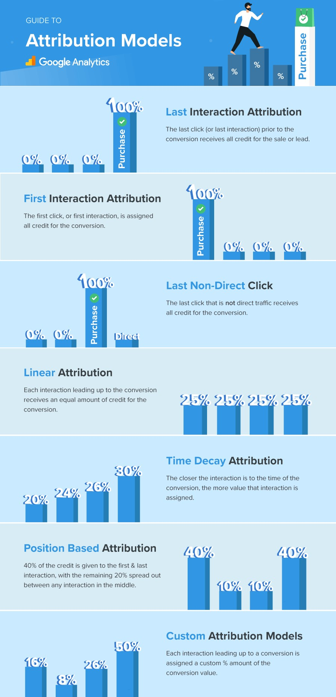

# Marketing Terms

### Attribution : A Set of User Actions that Contributes to Desired Outcome. 
- Set of User Actions ( Visiting Website, Buying a Product from Online Ecommerce Store, Watching a Video, Searching for Product )

<table align=center>
  <tr></tr>
</table>
