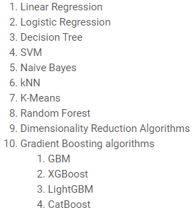

# Machine Learning

<h3><a href="">Supervised Learning</a> &nbsp;| &nbsp; <a href="">Unsupervised Learning</a> &nbsp;| &nbsp; <a href="">Reinforcement Learning</a> </h3> 
  
# Supervised Learning

### Regression ( Predict Continuous Data )

1. Linear Regression
2. Polynomial Regression
4. Ridge and Lasso Regression
 
### Classification ( Classify Discrete Data )

1. Logistic Regression
2. Decision Tree
3. Support Vector Machine 
4. Naive Bayes
5. K Nearest Neighbors

<a href=#linreg><strong>1. Linear Regression</strong></a>&nbsp; |&nbsp; <a href=#logreg><strong>2. Logistic Regression</strong></a>&nbsp; |&nbsp; <a href=#tree><strong>3. Decision Tree<strong></strong></a>&nbsp; |&nbsp; <a href=#forest><strong>4. Random Forest</strong></a>&nbsp; |&nbsp; <a href=#svm><strong>5. SVM</strong></a>&nbsp; |&nbsp; <a href=#knn><strong>6. KNN</strong></a>&nbsp; |&nbsp; <a href=#naive><strong>7. Naive Bayes</strong></a>
 
<h3><a href=#unsup>Unsupervised Learning</a> : Cluster | Segment | Group Similar Data </h3> 

<a href=#kmean><strong>1. K Mean</strong></a>&nbsp; |&nbsp; <a href=#hc><strong>2. Hierarchical</strong></a>

### Steps of Machine Learning
1. Gathering Data
2. Preparing Data ( Data Preprocessing )
3. Explore Data ( Exploratory Data Analysis | **EDA** ) 
4. Clean Data ( Data Cleaning )
5. Feature Engineering ( Important Features to Train Model )
6. Choosing a Correct Model
7. Training Data
8. Testing Data and Evaluation
9. Hyperparameter Tuning
10. Prediction
