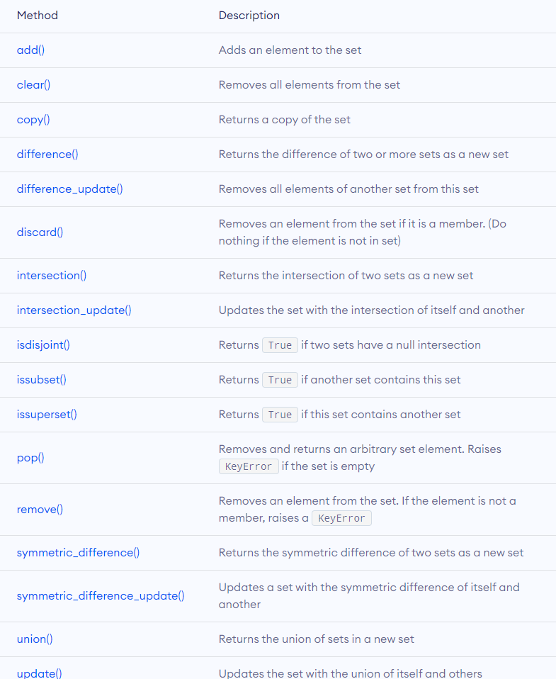
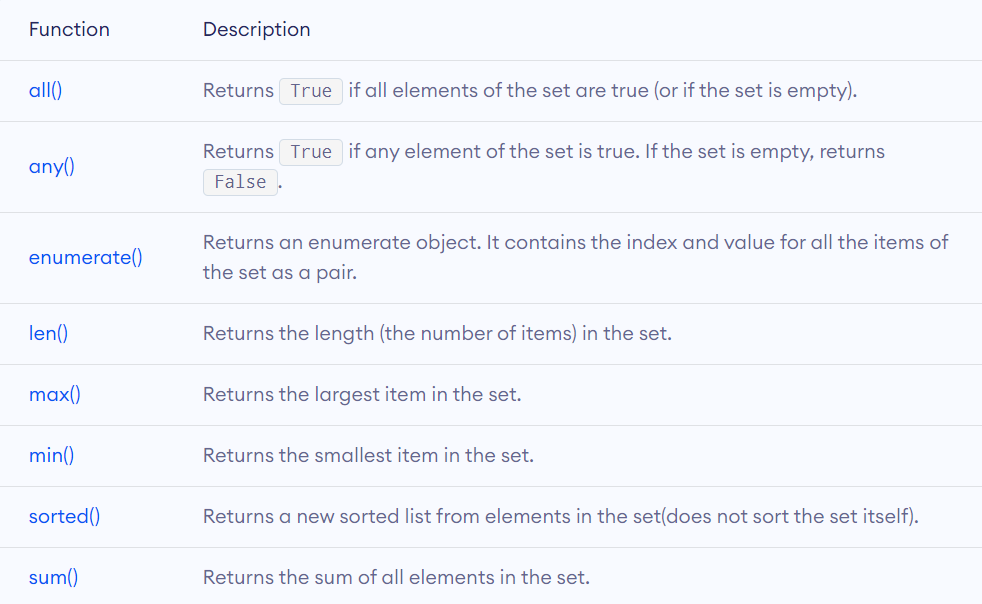
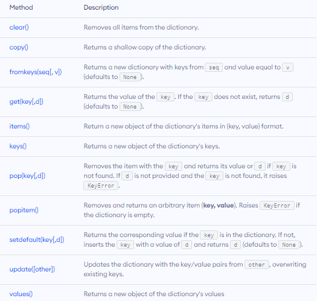
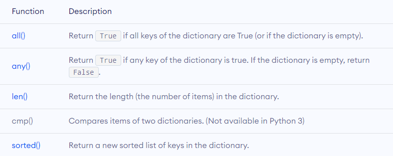

# Data Types

### 1. **Numeric** 
- **Integer** | **Floating Point** | **Complex** 

### 2. **Boolean**   
- **True** | **False** 

### 3. **String**  
- Sequence of **Characters**

### 4. **List** 
- **Ordered** Sequence | **Mutable** 
- \[ 1, 'A', True, \[ 1, 2, 3 ], { 1, 2, 3 }, ( 1, 2, 3 ) ] 
- **`list([1, 2, 3])`**

- **Add New Element** : `append(1)`, `extend([1,2,3])`, `insert(index, 1)` 

- **Remove Element** : `pop()`, `remove()`

### 5. **Tuple**  
- **Ordered** Sequence | **Immutable**  
- \( 1, 'A', True, \[ 1, 2, 3 ], { 1, 2, 3 }, ( 1, 2, 3 ) ) 
- **`tuple( )`**

Methods in Tuple
- **tuple**.**count**( **element** )
- **tuple**.**index**( **element** )

### 6. **Set**  
- **Unordered** Sequence of **Unique** Items | **Mutable** 
- \{ 1, 'A', True,( 1, 2, 3 ) } 
- **`set( )`**
- **Indexing** has no meaning ( **Unordered** )
- **List** and **Dictionary** are Unhashable
- Since **Set** is an **Unordered** Data type, Popped is completely Arbitrary ( Random )
- **Frozenset** is an **Immutable** Set

- **Add New Element** : `add(1)` `update()`

- **Remove Element** : `pop()`, `remove()`, `discard()`

### 7. **Dictionary** 
- **Unordered** Collection of **`Key` : `Value`** pairs.  
- { 1 : \[ 1, 2, 3 ], 2 : \[ 'A', 'B', 'C' ] } 
- **`dict( )`**

