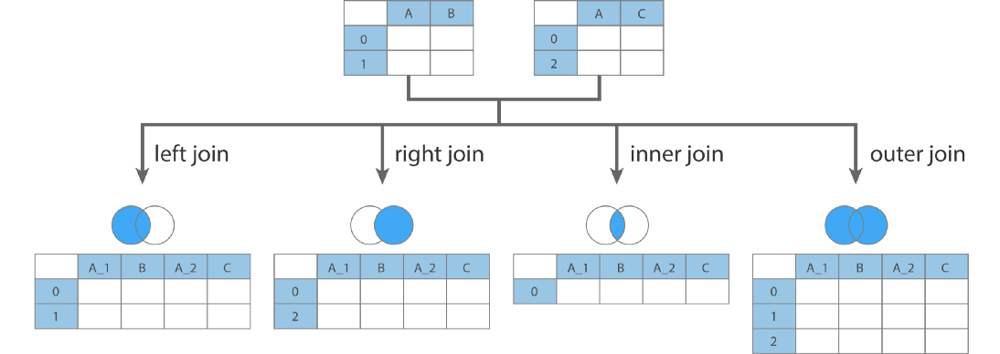
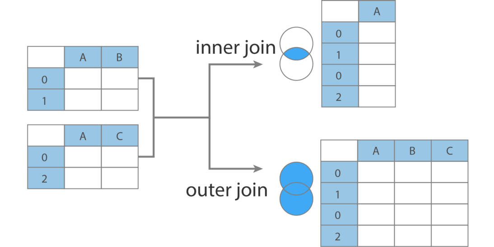
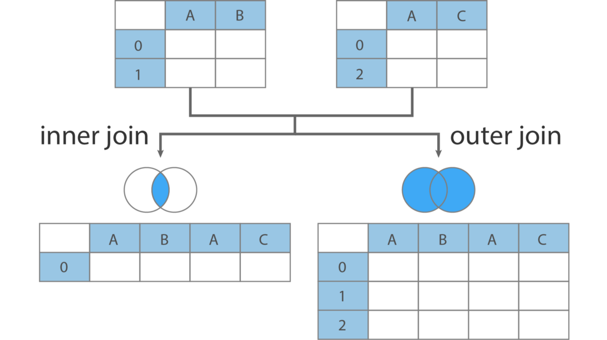

# `Join`, `Merge` and `Concat`

### `DataFrame.join()`



```python
DataFrame.join(self, 
               other, 
               on=None, 
               how='left', 
               lsuffix='', rsuffix='', 
               sort=False)
```


### `DataFrame.merge()`

```python
DataFrame.merge(self, 
                right, 
                how='inner', 
                on=None, 
                left_on=None, right_on=None, 
                left_index=False, right_index=False, 
                sort=False, 
                suffixes=('_x', '_y'), 
                copy=True, 
                indicator=False, 
                validate=None)
```

### `pandas.concat()`

### `axis = 0` : `Horizontally` | `Row Wise`


### `axis = 1` : `Vertically` | `Column Wise`


```python
pandas.concat(objs, 
              axis=0, # 0 for row and 1 for column
              join='outer', join_axes=None, 
              ignore_index=False, 
              keys=None, 
              levels=None, 
              names=None, 
              verify_integrity=False, 
              sort=None, 
              copy=True)
```
