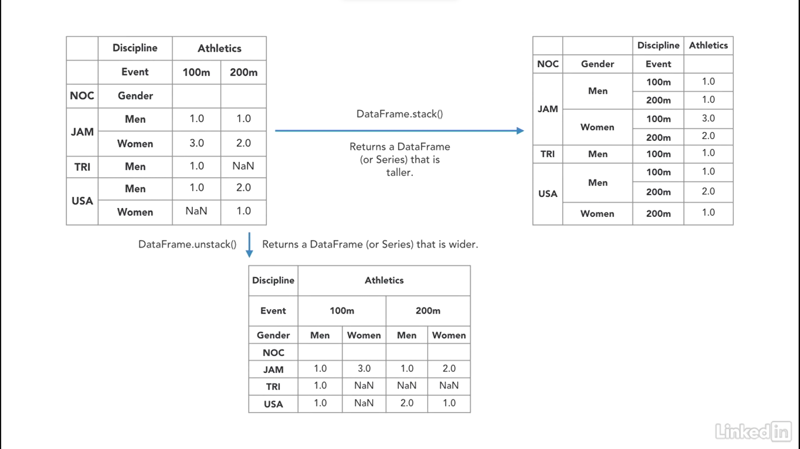

<p align='right'><a align="right" href="https://github.com/KIRANKUMAR7296/Library/blob/main/Interview.md">Back to Questions</a></p>

# Pandas 🐼 

```python
import pandas as pd
```
Toolkit to `read`, `write`, `analyze`, `filter`, `manipulate`, `aggregate`, `merge`, `pivot` and `clean` the data.

### Excel for Python. 

- `Column` | `Feature` | `Attribute` | `Series` | `Field` | `Dimension`        
- `Row` | `Index` | `Record` | `Tuple` | `Observation` | `Sample`
- Financial term for a tabular data is `Panel`
- Pandas is an exploratory data analysis toolkit.
- Read | `import` and write | `export` data: `.csv`, `.tsv`, `.txt`, `.xls`, `.xlsx`, `.json`, etc.
- Preview data: `head()`, `tail()`, `sort_values()`, `columns`, `dtypes`, `shape`, `describe()`, `value_counts()`, etc.
- Clean data: `dropna()`, `fillna()`, `drop_duplicates()`, `rename()`, `set_index()`, etc. 
- Transform data: `apply()`, `explode()`, etc.
- Aggregate data: `concat()`, `merge()`, `groupby()`, `pivot_table()`, etc.
- Pandas is used in economics, finance, statistics and analytics.
- Data Types: `Series` ( **1** Dimensional ) and `DataFrames` ( **2** Dimensional )
- Panel: **3** Dimensional ( major_axis and minor_axis )
- Read, Write, Transform, Explore, Pivot, Join, Manipulate, Merge, GroupBy, Aggregate, Clean, Stack and Visualize.  

### `Index`

- Index object is an `immutable` array.
- There are two types of index in a DataFrame `row index` and `column index`
- Both indexes ( row index and column index ) starts from `0`
- Indexing allows to access a `row` or `column` using a label.

```python
# First row and first column:
df.iloc[0, 0]
```

### `Series` : 1 Dimensional Array

- `Series` holds `homogeneous` data values, i.e. All data values are of `same` data type.
- Data axis labels are called as `index`

```python
# Create a series:
pd.Series([1, 2, 3,4])

# Accessing a series:
DataFrame['SeriesName'] or DataFrame.SeriesName
```


### `DataFrame` : 2 Dimensional Array

- Data is aligned in tabular form with `rows` and `columns`
- `DataFrame` is a sequence of `Series` that shares the same index.

```python
# Empty DataFrame:
pd.DataFrame()

# Accessing DataFrame:
DataFrame[['SeriesName1', 'SeriesName2', 'SeriesName3']]
```


### Important features of Pandas library:
1. Data reading from various input and writing to various output: `.read_csv()`, `.read_excel()`, `.read_sql_table()`, `.to_csv()`, etc.
2. Data filtering: `.query()`
3. Data indexing and slicing: `.loc[]`, `.iloc`, `.at[]`, `iat[]`       
4. Data cleaning: 
5. Handling missing data: `.fillna()`, `.dropna()`
6. Supports multiple file formats.
7. Merge, concate and join different datasets.
8. Performance optimization: `.apply()`, `.map()`, `.reduce()`         
9. Data visualization: `.plot()`
10. Grouping and reshaping: `.groupby()`, `.pivot_table()`, `.stack()`, `.unstack()`, etc.             
11. Performing different mathematical operations on the available data.
12. Masking out irrelevant data to only use the required data.
13. Taking out unique data from various repetitions in the dataset.
14. Time series analysis.

<table align="center">
      <tr><td></td></tr>
</table>

# `Access` Data

- Access only `scalar` value ( Data present at x row y column )

### `DataFrame.at[]` : Label based location
```python
print(df.at[1, 'Country'])
```
### `DataFrame.iat[]` : Integer based location
```python
print(df.iat[1, 3])
```

- Access scalar value or entire record | row or field | column

### `DataFrame.loc[]` : Label based location
```python
# DataFrame.loc[]
print(df.loc[0, 'City'])

# DataFrame.Series.loc[]
print(df['City'].loc[1])
```      
### `DataFrame.iloc[]` : Integer based location
```python
# DataFrame.loc[]
print(df.iloc[0, 1])

# DataFrame.Series.loc[]
print(df['City'].iloc[1])
```      

# DataFrame `Attributes`

### `DataFrame.index` : Display the row labels of a DataFrame object.

```python
print(df.index)

-- By default it automatically creates a RangeIndex(start=0, stop=len(df), step=1)
-- We can manually add index by passing list to index parameter i.e. index = [1, 2, 3]
-- We can also set some existing column as an index i.e index = 'City'
```

### `DataFrame.columns` : Display the label values for columns present in the DataFrame.

```python
print(df.columns)
```

### `DataFrame.axes` : Display the label values of all rows and columns in the DataFrame.

```python
print(df.axes)
```

### `DataFrame.dtypes` : Display the data types for each column of DataFrame.

```python
print(df.dtypes)
```

### `DataFrame.size` : Display the total number of elements in a DataFrame.

```python
print(df.size)
```

### `DataFrame.shape` : Dimensions of DataFrame ( Number of rows, Number of columns )

```python
# Dimensions of the dataframe:
print(df.shape)

# Extract only the total number of rows in a dataframe:
print(df.shape[0])

# Extract only the total number of columns in a dataframe:
print(df.shape[1])
```            

### `DataFrame.ndim` : Number of dimensions of DataFrame.

```python
print(df.ndim)
```

### `DataFrame.empty` : Check whether DataFrame is empty or not.

```python
print(df.empty)
```

### `DataFrame.T` : Change the rows into columns and columns into rows.

```python
print(df.T)
```

### `DataFrame.values` : Represents the values of DataFrame in NumPy array.

```python
print(df.values)
```

# DataFrame `Methods`

### `DataFrame.head(n)` : Displays top n rows from the DataFrame.

```python
# Default value for n is 5
df.head(n=10)
```          

### `DataFrame.tail(n)` : Displays bottom n rows from the DataFrame.

```python
# Default value for n is 5
df.tail(n=10)
```          

### `DataFrame.info()` : Represents the summary of the DataFrame:

1. Number of rows
2. Number of columns
3. Data type
4. Number of Non Null rows
5. Memory usage by the data frame

```python
df.info()
```                 

### `DataFrame.query()` : Filter DataFrame by query conditions.

```python
df.query("Country == 'India' and State in ('Maharashtra', 'Hyderabad') and Year > 2021")

# Query using variable name:
Name = input('Enter Employee Name:')
JoiningYear = int(input('Enter Joining Year:'))
df.query("EmployeeName == @Name and YearofJoining == @JoiningYear" )

# Query rows using list of values:
ITState = ['Hyderabad', 'Bangalore', 'Chennai']
df.query("Country == 'India' and State in @ITState")
```

### `Series.value_counts()` : Represents an object containing counts of unique values.

```python
df['City'].value_counts(normalize=False, sort=True, ascending=False, bins=None, dropna=True)
```            

### `Series.sort_values()` : Sort values along either axis.

```python   
df['Age'].sort_values(axis=0, ascending=True, inplace=False, kind='quicksort', na_position='last')
```            

### `DataFrame.sort_values()` : Sort value by Column values.

```python
df.sort_values(by=['Age', 'Salary'], axis=0, ascending=[True, True], inplace=False, kind='quicksort', na_position='last')
```

### `Series.str` : Perform string operations.

String handling is done by using attribute `str`: Access values of series as `strings` and apply several methods on that.

```python
# Series.str.contains()
df['City'].str.contains('Mumbai')

# Series.str.startswith()
df['LastName'].str.startswith('Yadav')

# Series.str.isnumeric()
df['Pincode'].str.isnumeric()
```            

### `DataFrame.set_index()` : Set other column as an index.

```python
# Set column "City" as an index:
df.set_index(keys='City', drop=True, append=False, inplace=False, verify_integrity=False)

# Set multi index:
df.set_index(keys=['City', 'State'], drop=True, inplace=False)
```

### `DataFrame.reset_index()` : Returns a DataFrame with the default `integer based` index.

```python
df.reset_index(level=None, drop=False, inplace=False, ...)
```

### `DataFrame.sort_index()` : Sort objects by a label along the axis.

- `axis=0` represents rows and `axis=1` represents columm.

```python
df.sort_index(axis=0, level=None, ascending=True, inplace=False, by=None)
```

# DataFrame `Groupby`

1. `Split` a DataFrame into groups based on filter.
2. Apply `aggregate` function on each group independently.
3. `Combine` each group into a DataFrame.

Returns a groupby object: `pandas.core.groupby.DataFrameGroupBy`

### `DataFrame.groupby()`

```python
# DataFrame.groupby(by='Column', axis=0, level=None, as_index=True, sort=True, group_keys=True, squeeze=False)
df.groupby(by=['City'])

# Iterating through groups:
for key, value in df.groupby(by=['City']):
      print(key)
      print(value)
      
# Group By Chaining: Date = 01/01/2022
df.groupby([df['Date'].str[:4], 'Product']).sum().reset_index().rename(columns={'Date': 'Year'}).head()
```                  

# Dataframe `Reshaping` : Changing the structure of DataFrame to represent data in desired form.



### `DataFrame.stack()` : Represents a taller DataFrame. 

- `Stacking` increases the height of data frame.
- `stack()` method helps us to move the columns into row values.

### `DataFrame.unstack()` : Represents a wider DataFrame.

- `Unstacking` decreases the height of data frame.
- `unstack()` method helps us to move the row values to seperate columns. 

### Time Period

- Time Stamp ( Days, Years, Quarter or Month)

### How to iterate over a Pandas DataFrame?

```python
for i in df.iterrows():
      pass
```
