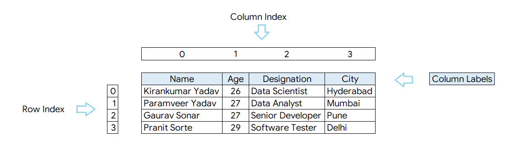
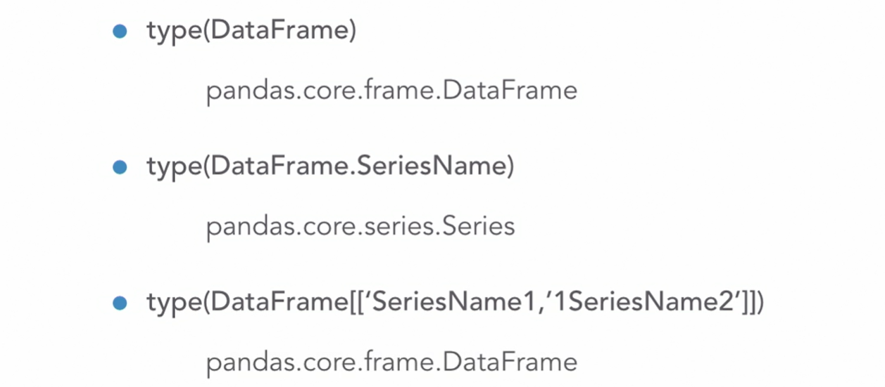
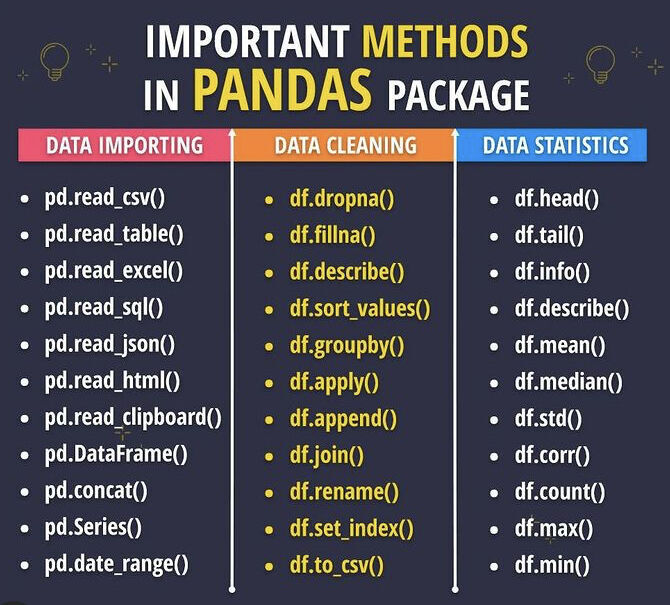

<p align='right'><a align="right" href="https://github.com/KIRANKUMAR7296/Library/blob/main/Interview.md">Back to Questions</a></p>

# Pandas 🐼 

```python
import pandas as pd
```
Toolkit to `read`, `write`, `analyze`, `filter`, `manipulate`, `aggregate`, `merge`, `pivot` and `clean` the data.

### Excel for Python. 

- `Column` | `Feature` | `Attribute` | `Series` | `Field` | `Dimension`        
- `Row` | `Index` | `Record` | `Tuple` | `Observation` | `Sample`
- Financial term for a tabular data is `Panel`
- Pandas is an exploratory data analysis toolkit.
- Read | `import` and write | `export` data: `.csv`, `.tsv`, `.txt`, `.xls`, `.xlsx`, `.json`, etc.
- Preview data: `head()`, `tail()`, `sort_values()`, `columns`, `dtypes`, `shape`, `describe()`, `value_counts()`, etc.
- Clean data: `dropna()`, `fillna()`, `drop_duplicates()`, `rename()`, `set_index()`, etc. 
- Transform data: `apply()`, `explode()`, etc.
- Aggregate data: `concat()`, `merge()`, `groupby()`, `pivot_table()`, etc.
- Pandas is used in economics, finance, statistics and analytics.
- Data Types: `Series` ( **1** Dimensional ) and `DataFrames` ( **2** Dimensional )
- Panel: **3** Dimensional ( major_axis and minor_axis )
- Read, Write, Transform, Explore, Pivot, Join, Manipulate, Merge, GroupBy, Aggregate, Clean, Stack and Visualize.  

### `Index`

- Index object is an `immutable` array.
- Indexing allows to access a `row` or `column` using a label.
- In Python both the indexes (row index and column index) starts from `0`

```python
# First row and first column:
df.iloc[0, 0]
```

### `Series`: 1 Dimensional Array

- Hold data value of `homogeneous` data type, i.e. All data values are of **same** data type.
- Data axis labels are called as `index`

```python
# Create a series:
pd.Series([1, 2, 3,4])

# Accessing a series:
DataFrame['SeriesName'] or DataFrame["SeriesName"] or DataFrame.SeriesName
```



### `DataFrame`: 2 Dimensional Array

- Data is aligned in tabular form with `rows` and `columns`
- `DataFrame` is a sequence of `Series` that shares the same index.

```python
# Empty DataFrame:
pd.DataFrame()

# Accessing DataFrame:
DataFrame[['SeriesName1', 'SeriesName2', 'SeriesName3']]
```



### Important features of Pandas library:
1. Data reading from various input and writing to various output: `.read_csv()`, `.read_excel()`, `.read_sql_table()`, `.to_csv()`, etc.
2. Data handling and filtering: `.query()`
3. Data indexing and slicing: `.loc[]`, `.iloc`, `.at[]`, `iat[]`       
4. Data cleaning: 
5. Handling missing data:
6. Supports multiple file formats.
7. Merge, concate and join different datasets.
8. Performance optimization
9. Data visualization.
10. Grouping and reshaping: `.groupby()`, `.pivot_table()`, `.stack()`, `.unstack()`, etc.             
11. Performing different mathematical operations on the available data.
12. Masking out irrelevant data to only use the required data.
13. Taking out unique data from various repetitions in the dataset.
14. Time series analysis.

### Time Period:
- Time Stamp ( Days, Years, Quarter or Month)

### How to Iterate over a Pandas DataFrame?

```python
for i in df.iterrows():
      pass
```

<table align="center">
      <tr>
            <td>
            </td>
      </tr>
</table>

## Access Index

### `DataFrame.loc[]`

A label based indexer for selection by label.

```python
# DataFrame.loc[]
df.loc[0, 'City']

# DataFrame.Series.loc[]
df['City'].loc[1]
```      

### `DataFrame.iloc[]`

An index location based indexer for selection by index.

```python
# DataFrame.loc[]
df.iloc[0, 1]

# DataFrame.Series.loc[]
df['City'].iloc[1]
```      

## DataFrame `Attributes`

### `DataFrame.shape`

Dimensions of DataFrame (Number of rows, Number of columns)

```python
# Dimensions of the dataframe:
print(df.shape)

# Extract only the total number of rows in a dataframe:
print(df.shape[0])

# Extract only the total number of columns in a dataframe:
print(df.shape[1])
```            

## DataFrame `Methods`

### `DataFrame.head(n)`

Returns the top n rows from the dataframe

```python
# Default value for n is 5
df.head(n=10)
```          

### `DataFrame.tail(n)` 

Returns the bottom n rows from the dataframe

```python
# Default value for n is 5
df.tail(n=10)
```          

### `DataFrame.info()`

Returns the summary of the DataFrame:
1. Number of rows
2. Number of columns
3. Data type
4. Number of Non Null rows
5. Memory usage by the data frame

```python
df.info()
```                  

### `Series.value_counts()`

Returns an object containing counts of unique values.

```python
df['City'].value_counts(normalize=False, sort=True, ascending=False, bins=None, dropna=True)
```            

### `Series.sort_values()`

Sort values along either axis

```python   
df['Age'].sort_values(axis=0, ascending=True, inplace=False, kind='quicksort', na_position='last')
```            

### `DataFrame.sort_values()`

```python
df.sort_values(by=['Age', 'Salary'], axis=0, ascending=[True, True], inplace=False, kind='quicksort', na_position='last')
```

### `Series.str`

String handling is done by using attribute `str`: Access values of series as `strings` and apply several methods on that.

```python
# Series.str.contains()
df['City'].str.contains('Mumbai')

# Series.str.startswith()
df['LastName'].str.startswith('Yadav')

# Series.str.isnumeric()
df['Pincode'].str.isnumeric()
```            

### `DataFrame.set_index()`

Set other column as an index

```python
# Set column "City" as an index:
df.set_index(keys='City', drop=True, append=False, inplace=False, verify_integrity=False)

# Set multi index:
df.set_index(keys=['City', 'State'], drop=True, inplace=False)
```

### `DataFrame.reset_index()`

Returns a DataFrame with the default `integer based` index.

```python
df.reset_index(level=None, drop=False, inplace=False, ...)
```

### `DataFrame.sort_index()`

- Sort objects by a label along the axis.
- `axis=0` represents rows and `axis=1` represents columm.

```python
df.sort_index(axis=0, level=None, ascending=True, inplace=False, by=None)
```

# **Groupby**

1. `Split` a DataFrame into groups based on filter.
2. Apply `aggregate` function on each group independently.
3. `Combine` each group into a DataFrame.

Returns a groupby object: `pandas.core.groupby.DataFrameGroupBy`

### `DataFrame.groupby()`

```python
# DataFrame.groupby(by='Column', axis=0, level=None, as_index=True, sort=True, group_keys=True, squeeze=False)
df.groupby(by=['City'])

# Iterating through groups:
for key, value in df.groupby(by=['City']):
      print(key)
      print(value)
```                  
