
<a align="right" href="https://github.com/KIRANKUMAR7296/Library/blob/main/Interview.md">Back to Questions</a>

<h1 align=center>Types of Distribution</h1>

<table align=center>
  <tr>
    <th><h3>Discrete</h3></th>
    <th><h3>Continuous</h3></th>
  </tr>
  <tr>
    <td>
      <ol>
        <li><a href='#uniform'>Uniform</a> : X ~ U ( 3 , 7 ) Equal Distribution</li>
        <li><a href='#bernoulli'>Bernoulli</a> : X ~ Bern ( Probability )</li>
        <li><a href='#binomial'>Binomial</a> : X ~ B ( Trials , Probability )</li>
        <li><a href='#poisson'>Poisson</a> : X ~ Po ( Frequency )</li>
      </ol>
    </td>
    <td>
      <ol>
        <li><a href='#normal'>Normal</a> : X ~ N ( mean, std )</li>
        <li><a href='#std'>Standard Normal</a> ( mean = 0, std = 1 )</li>
        <li><a href='#t'>T Distribution</a> : X ~ t ( degree of freedom )</li>
        <li><a href='#chi'>Chi2</a> : X ~ chi2 ( degree of freedom )</li>
      </ol>
    </td>
  </tr>
</table>

# Density Curve

> **Density Curve** helps us to **Visualize** the overall shape of a distribution. 

- We use **Histogram** to represent **Frequency Distribution** of Data ( Number of Data Points in given **Intervals** )

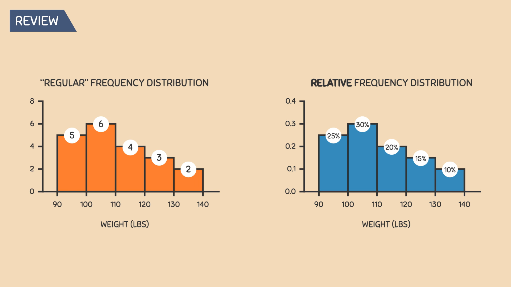

- **Regular Frequency Distribution** can be converted into **Relative Frequency Distribution** ( **Proportion** | **Percentage** )

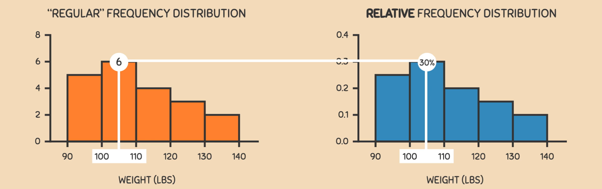

- Relative Frequency Distribution : **Divide** Each Interval **Data Points** with **Total** Number of Data Points in a Dataset.

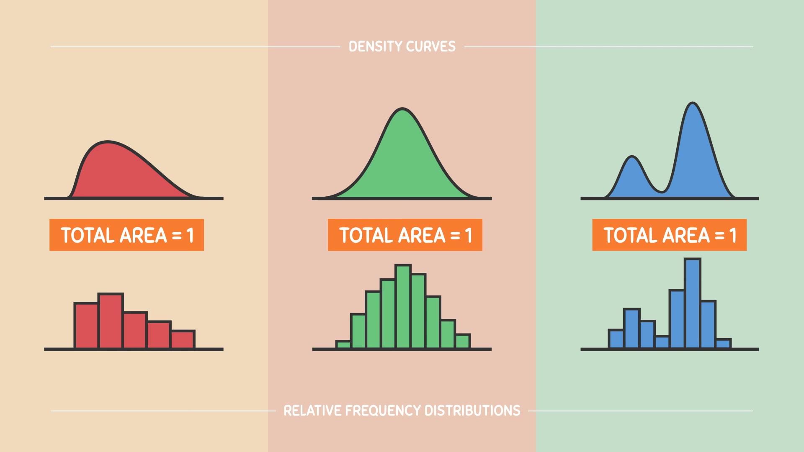

- **Total Area** of any type of **Distribution** is always **1** or **100%**

> Density Curve gives a better Picture about how the Dataset is distributed. 

## Discrete Events.

- **Finite** number of outcomes : Die | Picking a Card : 

<h3 name='uniform'>1. Uniform Distribution</h3>

- **X ~ U ( 3 , 7 )**
- Variable **X** follows an **Uniform Distribution** ranging from 3 to 7.
- Events with **Finite** outcomes. 
- All the outcomes have Equal | **Same** Probability. 
- Flip a Coin ( H | T )
- Roll a Dice ( 1 | 2 | 3 | 4 | 5 | 6 )

<h3 name='bernoulli'>2. Bernoulli Distribution</h3>

- **X ~ Bern ( p )**
- Variable `X` follows a **Bernoulli Distribution** with `p` ( Probability | Likelihood ) of **Success**. 
- Event with only `1` **Trial** and `2` **Possible Outcomes** ( `True` or `False` | `Yes` or `No` | `1` or `0` ) 
- We know the **Probability** of Outcome.
- If probability of one outcome is **p**( `1` ) the probability of an other outcome is **1 - p**( `0` ).
- E ( X ) = p or ( 1 - p ) | p > 1 - p
- **Expected Outcome** Probability of X : **p** | **Alternative Outcome** : **1 - p**
- Variance : p * ( 1 - p )
- A Coin flip | A Single True or False Question | Vote between 2 Parties.

<h3 name='binomial'>3. Binomial Distribution</h3>

- **X ~ B ( n , p )**
- Variable **X** follows a **Binomial Distribution** with **n** trials and **p** ( probability | likelihood ) of success in each **Individual Trial**.
- **Sequence** | **Trials** of **Identical Bernoulli Events**.
- Flipping a Coin **Twice** | Rolling two Dies | Quiz of 10 True or False Questions.

<h3 name='poisson'>4. Poisson Distribution</h3>

- **X ~ Po ( lambda )** 
- Number of **Occurences**.
- `lambda` : **Frequency** with which an **Event** happens within a specific Interval of **Time**. 
- Number of **Goals** in Football | Number of **Baskets** in Basketball.
- e.g. a Fire Fly lights up 3 times in 10 Seconds.

## Continuous Events.

- **Infinite** number of outcomes : Time | Distance : 

<h3 name='normal'> 1. Normal Distribution | Gaussian Distribution | Bell Shaped Curve</h3>

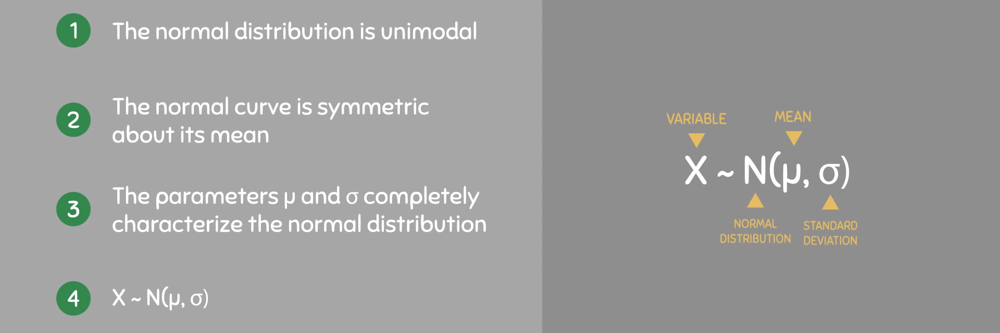

- **X ~ N ( mean, variance )** 
- Variable **X** follows a **Normal Distribution** with **Mean** and **Variance**. 
- Normal Events in Nature. 
- Average Height of Person ( **Exceptions** are considered as **Outliers** ).
- Majority of Data is centered around **Mean**.
- **Mean** = **Median** = **Mode** are Exactly the `Same`

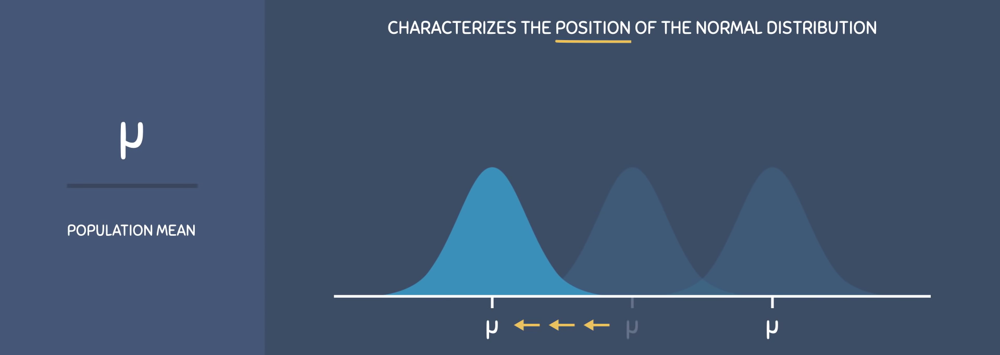
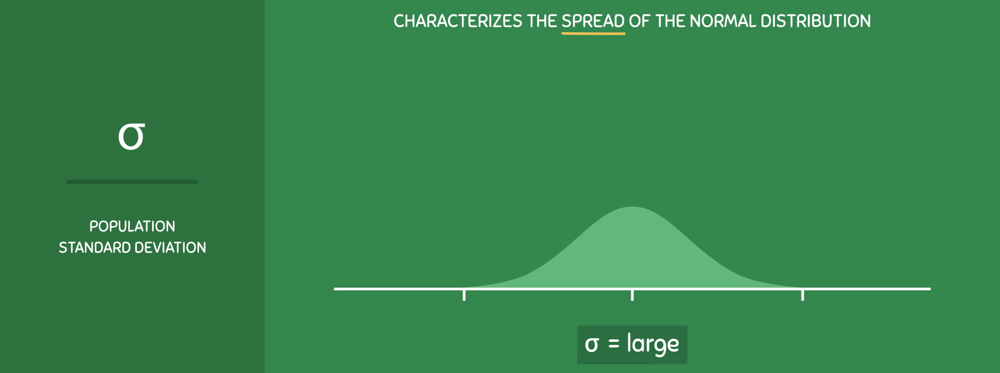
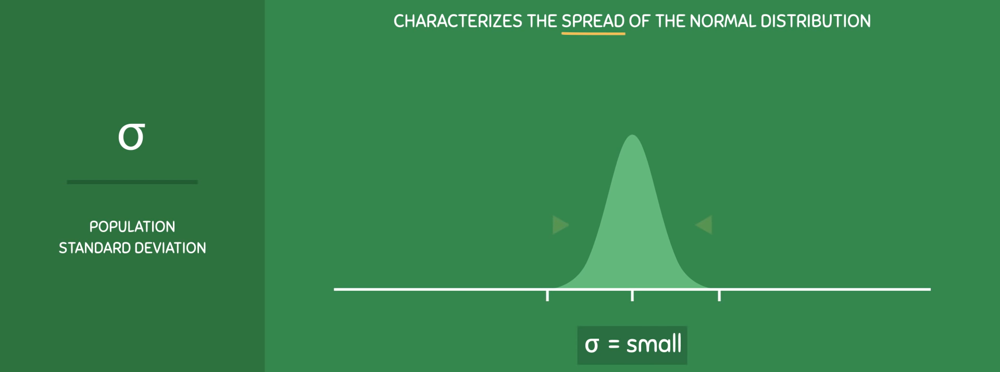

- Graph is **Symmetric** around **Mean**.

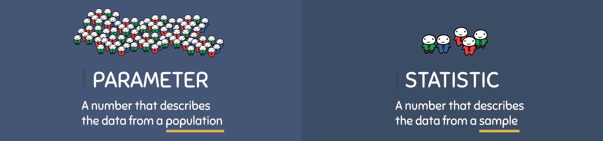
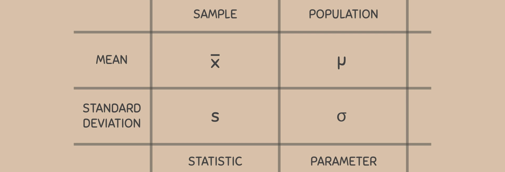

### 68, 95, 99.7 Law |  Empirical Rule

- Around `68%` of values are within `1` **Standard Deviation** from the **Mean**
- Around `95%` of values are within `2` **Standard Deviations** from the **Mean**
- Around `99.7%` of values are within `3` **Standard Deviations** from the **Mean**

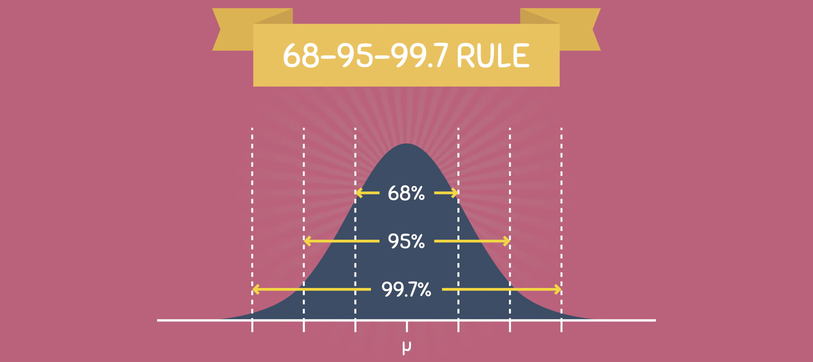

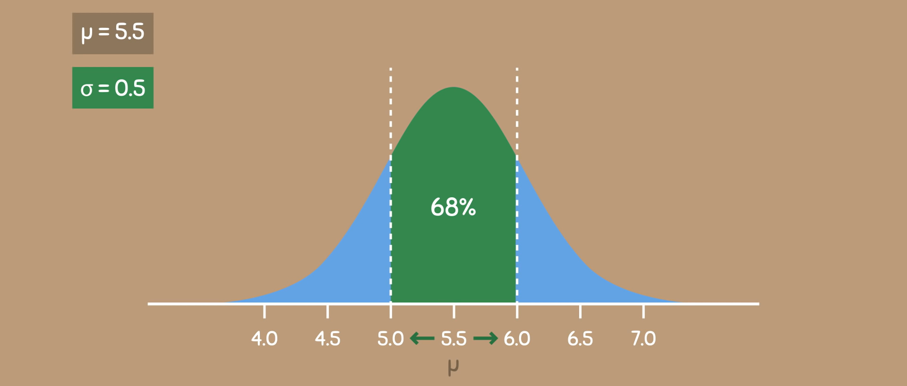

- **68 %** of Outcomes fall withins **1** Standard Deviation

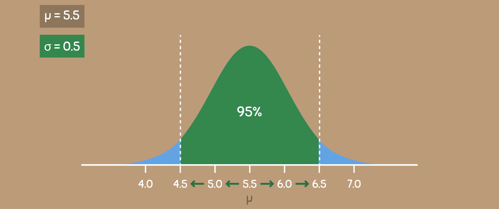

- **95 %** of Outcomes fall withins **2** Standard Deviation

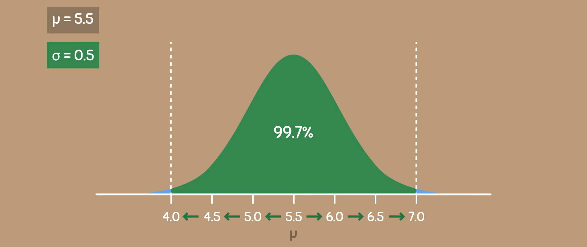

- **99.7 %** of Outcomes fall withins **3** Standard Deviation
- **Outliers** are **Extremely Rare** in Normal Distribution.

<h3 name='std'>2. Standard Normal Distribution</h3> 

- **X ~ N ( mean = 0 , standard deviation = 1 )** 
- Variable **X** follows a **Normal Distribution** with **Mean** = 0 and **Variance** = 1. 

- Each Number on **Horizontal Axis** represents **Z Score**.

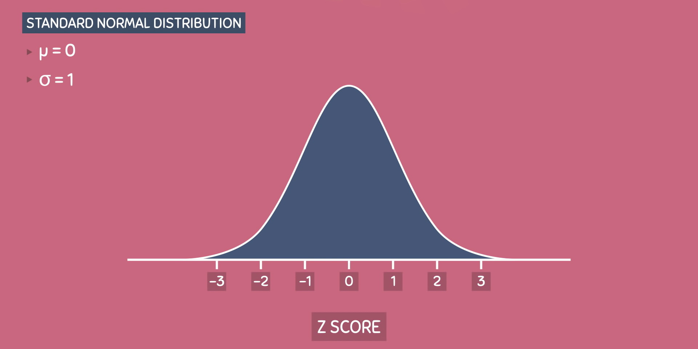

- Standardization

- Moving Graph to the Left or Right until Mean = 0.
- **Transformation** : **Alter** every elements of a **Distribution** to get **New Distribution**.
- Z = X - Mean / Standard Deviation.

- **Addition** and **Subtraction** will move the Distribution on **X Axis** to **Left** or **Right**.

- **Multiplication** and **Division** will **Contract** or **Expand** on **Y Axis**.

<h3 name='t'>3. T Distribution ( A Normal Distrbution used for Small Sample Size )</h3>

- **X ~ t ( k )** 
- Variable **X** follows a **t Distribution** with k **Degree of Freedom**.
- Most Observations falls close to **Mean**
- Rest Observations make up the **Tails** on either side.
- Used for **Hypothesis Testing** with **Limited Data**.
- **Variance** in the Data is **Unknown**.
- Tails are Fat at the both ends.

<h3 name='chi'>4. Chi Squared Distribution ( Goodness of Fit )</h3>  

- **X ~ chi2 ( k )** 
- Variable **X** follows a **chi2 Distribution** with k **Degree of Freedom**.
- E( X ) = k
- Var ( X ) = 2k
- Few Events in Real Life.
- It is Squared therefore only **Positive**.
- Rapid changing Event follows **Exponential Distribution**.
- Very Low Chi2 : Data fits very well.
- Very High Chi2 : Data does not fits well.
- Test for Independence of two Categorical Variables and returns Probability.
- Probability = 0 : Categorical Variables are Dependent.
- Probability = 1 : Categorical Variables are Independent.

<table>
  <tr>
    <td colspan=3>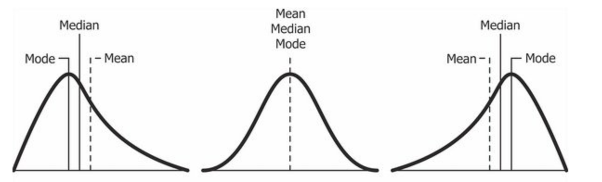</td>
  </tr>
  <tr>
    <th>Right Skew</th>
    <th>Symmetric</th>
    <th>Left Skew</th>
  </tr>
  <tr>
    <th>Positive Skew</th>
    <th>Symmetric ( Normal )</th>
    <th>Negative Skew</th>
  </tr>
  <tr>
    <th>Mean > Median > Mode</th>
    <th>Mean = Median = Mode</th>
    <th>Mode > Median > Mean</th>
  </tr>
  <tr>
    <th>Wealth ( Rich People )</th>
    <th>Age, Height, Weight, Iris</th>
    <th>Life Span of Human Being</th>
  </tr>
</table>

<a align="right" href="https://github.com/KIRANKUMAR7296/Library/blob/main/Interview.md">Back to Questions</a>

