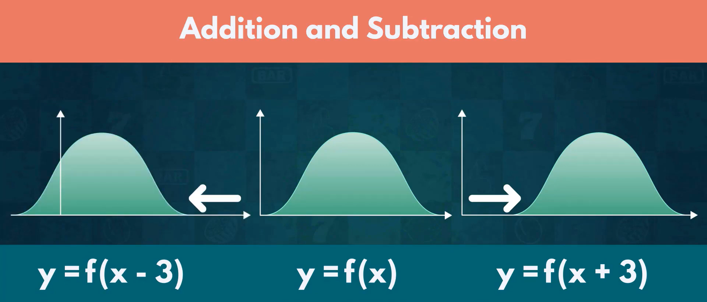
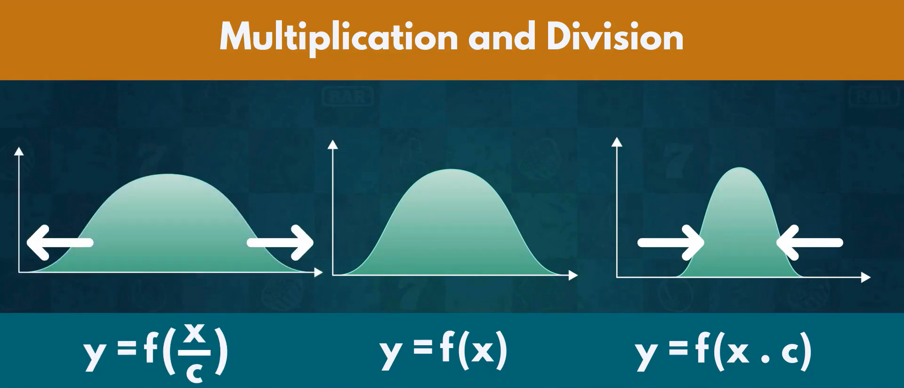

# Types of **Distribution**.

## Discrete Events.

- **Finite** number of outcomes : Die | Picking a Card : 

### 1. Uniform Distribution

- **X ~ U ( 3 , 7 )**
- Variable **X** follows an **Uniform Distribution** ranging from 3 to 7.
- Events with **Finite** outcomes. 
- All the outcomes have Equal | **Same** Probability. 
- Flip a Coin ( H | T )
- Roll a Dice ( 1 | 2 | 3 | 4 | 5 | 6 )

### 2. Bernoulli Distribution

- **X ~ Bern ( p )**
- Variable **X** follows a **Bernoulli Distribution** with **p** ( probability | likelihood ) of success. 
- Event with only 1 Trial and 2 Possible Outcomes ( True or False | Yes or No | 1 or 0 ) 
- We know the **Probability** of Outcome.
- If probability of one outcome is **p**(1) the probability of an other outcome is **1 - p**(0).
- E ( X ) = p or ( 1 - p ) | p > 1 - p
- **Expected Outcome** Probability of X : **p** | **Alternative Outcome** : **1 - p**
- Variance : p * ( 1 - p )
- A Coin flip | A Single True or False Question | Vote between 2 Parties.

### 3. Binomial Distribution

- **X ~ B ( n , p )**
- Variable **X** follows a **Binomial Distribution** with **n** trials and **p** ( probability | likelihood ) of success in each **Individual Trial**.
- **Sequence** | **Trials** of **Identical Bernoulli Events**.
- Flipping a Coin **Twice** | Rolling two Dies | Quiz of 10 True or False Questions.

### 4. Poisson Distribution

- **X ~ Po ( lambda )** 
- Number of **Occurences**.
- lambda : **Frequency** with which an **Event** happens or not within a specific interval of **Time**. 
- Number of **Goals** in Football | Number of **Baskets** in Basketball.
- e.g. a Fire Fly lights up 3 times in 10 Seconds.

## Continuous Events.

- **Infiinite** number of outcomes : Time | Distance : 

### 1. Normal Distribution | Gaussian Distribution | Bell Shaped Curve

- **X ~ N ( mean, variance )** 
- Variable **X** follows a **Normal Distribution** with **Mean** and **Variance**. 
- Mean = 0 and Standard Deviation = 1
- Normal Events in Nature. 
- Average Height of Person (**Exceptions** are considered as **Outliers**).
- Majority of Data is centered around **Mean**.
- Graph is **Symmetric** around **Mean**.

### 68, 95, 99.7 Law

- **68 %** of Outcomes fall withins **1** Standard Deviation
- **95 %** of Outcomes fall withins **2** Standard Deviation
- **99.7 %** of Outcomes fall withins **3** Standard Deviation
- **Outliers** are **Extremely Rare** in Normal Distribution.

- **Normal Distribution** with **Limited Samples** follows **T Distribution**.
- 
- **Chi Squared Distribution** : Asymmetric Distribution Starts from 0 and only positive : Measure Goodness of Fit
- Rapid changing Event follows **Exponential Distribution**.
- Forecast and Prediction Events follows **Logistic Distribution**. (Which Team will Win, Weather Forecast)

### 2. Standard Normal Distribution 
- Standardizing
- **Transformation** : **Alter** every elements of a **Distribution** to get **New Distribution**.

- **Addition** and **Subtraction** will move the Distribution on **X Axis** to **Left** or **Right**.

- **Multiplication** and **Division** will **Contract** or **Expand** on **Y Axis**.

