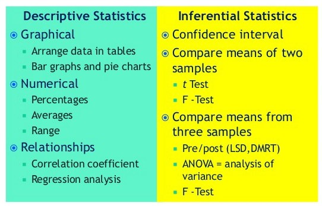
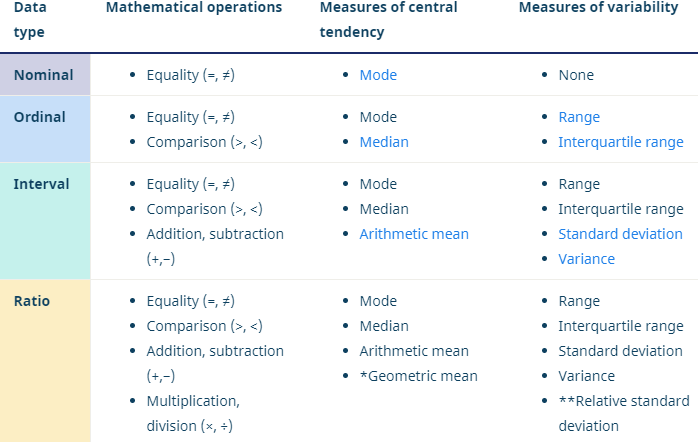
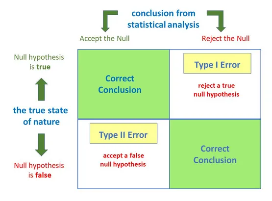
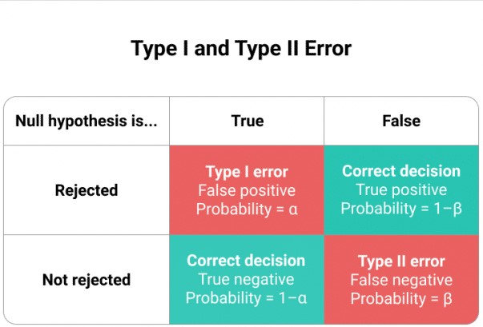
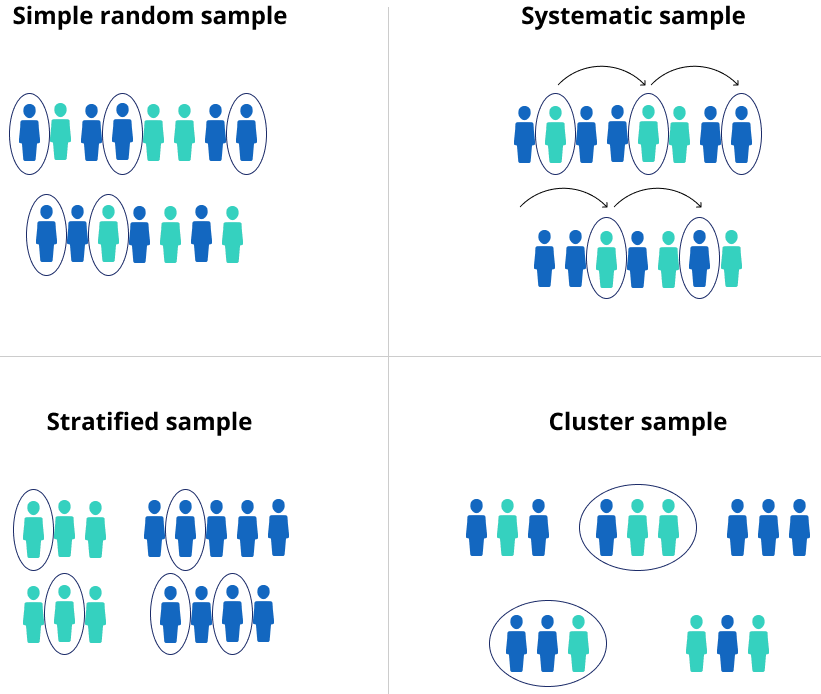

<a align="right" href="https://github.com/KIRANKUMAR7296/Library/blob/main/Interview.md">Back to Questions</a>

# Statistical Concepts you should know for Data Science

<h3> <a href='#data'>Data </a> </h3>
<h3> <a href='#hyp'>Hypothesis </a> </h3>
<h3> <a href='#sample'>Sampling </a> </h3>

### Independent | Feature | Regressor | Explanatory | Input | Predictor

### Dependent | Labels | Regressand | Response | Output

<h3 name='data'> Data Set </h3> 

- A **Collection** of **Observations** from a **Sample** or Entire **Population**

### Type of Data 
- Quantitative ( Real Numbers | Discrete and Continuous )
- Categorical ( Group | Binary, Nominal and Ordinal )
 
### Statistical Analysis
- Investigating **Trends**, **Patterns**, and **Relationships** using **Quantitative** Data.

### Descriptive Statistics
- **Frequency** of Each Value ( Absolute, Relative and Cumulative )
- Central tendency ( Mean, Median, Mode and Sum ) ( Histogram )
- Variability | Dispersion ( Min, Max, Range, IQR, Standard Deviation, Variance ) ( Histogram, Boxplot )
- Standard Deviation : The Average amount of Variability. ( Scatter Plot )
- Variance : Squared Deviations from Mean

### Inferential Statistics
- **Understand** the Population from the Sample.
- Test Hypothesis and Draw Conclusion about Population. 
- Simple Test ( Hypothesis, T test, Chi2 test )
- Regression Analysis ( Simple Linear, Multiple Linear and Logistic )
- Correlation 
- ANOVA ( One way and Two Way )

Inferential Statistics | Descriptive Statistics
:--- | :---
Using **Sample** Data to draw a certain **Conclusion** for Population | **Organizing** and **Summarizing** Data using **Numbers** and **Graphs**
Draw **Conclusion** of Population Data | Describe **Characteristics** of **Sample** or **Population**
Drawing **Conclusions**, performing **Estimations** and making **Predictions** | **Collecting**, **Organizing**, **Summarizing** and **Presenting** Data
**Hypothesis Test, ANOVA** | Measure of **Central Tendency** and **Dispersion**
Dataset is **Large** | Data set is **Small**

### Quantitative Data
- Process of Collecting and Analyzing **Numerical** Data
- Find **Trends**, **Patterns**, **Relationship** and **Correlation**
- Dealing with Measuring **Central Tendency** and **Measures of Spread** 
- Analysis is done on **Sample** that Generalize Results for **Population**

### Qualitative Data
- Process of Collecting and Analyzing **Non Numerical** Data
- Text, Image, Video or Audio
- Gather **Insights** by converting in  form of **Array**

Quantitative Data | Qualitative Data
:--- | :---
Numerical Data | Non Numerical Data
Confirm or Test ( Hypothesis ) | Understand ( Concepts )
Find **Trends**, **Relations** and **Patterns** | Find **Insights**
Numeric Data ( Central Tendency and Measures of Spreads ) | Text, Image, Video or Audio

### Level of Measurements

1. **Nominal** : Data can only be Categorized ( No Order )
2. **Ordinal** : Data can be Categorized and Ranked ( Order )
3. **Interval** : Data can be Categorized, Ranked, and Evenly Spaced
4. **Ratio** : Data can be Categorized, Ranked, Evenly Spaced, and has a Natural Zero.

<h3 name='hyp'> Hypothesis </h3> 

- Test Specific **Prediction** or **Claim**
- An **Assumption** | An **Idea** that is Proposed so that it can be **Tested** to See if it might be **True**
- We Test the Liklihood of Statement being **True** in order to decide whether to **Accept** or **Not Accept** the **NULL Hypothesis**

NULL Hypothesis | Alternative Hypothesis 
:--- | :---
H0 | Ha
Statement about a **Population** Parameter | Statement directly **Contradicts** the NULL Hypothesis
H0 : U = U0 | Ha : U != U0 or Ha : U < U0 or Ha : U > U0

### Type I and Type II Error

**Type I** Error : The **Null Hypothesis** is **True** but **Rejected**

**Type II** Error : The **Null Hypothesis** is **False** but **Fails** to **Reject**

### 1. P Values

- **Probability** of **Achieving** a result.
- Determine **Strength** of your Results in **Hypothesis Test**.
- if p value < alpha ( 0.05 | 5% ) we remove that feature. ( **Reject** Null Hypothesis )
- if p value > alpha ( 0.05 | 5% ) we keep that feature. ( **Accept NULL Hypothesis** : **H0** )

**Significance** Level ( **Alpha** )
- At what point the **Null Hypothesis** is **Rejected**.
- Significance Level is usually ( 5% or 1% )
- Alpha <= 1% | High Significance
- Alpha <= 5% | Significant
- Alpha > 5% | No Significant ( Accept Null Hypothesis )

### 2. Z Test

- A **Hypothesis Test** with a **Normal Distribution** that uses a **Z Statistics**.
- We use **Z Test** when we have **Large Sample Size** ( **Data Size** > 30 )
- Data is distributed **Normally**.
- Data is selected **Randomly**.
- Standard Normal Distribution ( Mean = 0 and Std = 1 )

### 3. T Test

- A **Hypothesis Test** with a **T Distribution** that uses a **T Statistics**.
- We use **T Test** when we have **Small Sample Size** ( **Data Size** < 30 )
- Data is **not** distributed Normally.
- Data is not selected **Randomly**.
- **T Distribution** has **Small Peak** and **Fat Tails**.

### ANOVA Test

- Analysis of Variance
- Used to Test Categorical Variable ( Atleast 3 Different Categories )
- Analyze the Difference between the **Means** of more than Two Groups
- One Way ANOVA uses one **Independent Variable**
- Two Way ANOVA uses two **Independent Variables**

### Assumptions of ANNOVA Test
- Observations are **Independent**
- Dependent Feature follows **Normal** Distribution
- **Variation** for each Group in Category should be **Similar**

### 5. Linear Regression and Assumptions

- Model **Relationship** between a **Dependent Variable** and one or nore **Independent Variable**
- Finding the Line of **Best Fit** that represents two or more variables.
- Line of Best Fit is found by minimizing the **Sum of Squared Residuals**
- Residuals : **Predicted** - **Actual**

### Assumptions of Linear Regression

1. **Linearity** : The Relationship between **X** and **Mean** of **Y** is linear.
2. **Homoscedasticity** : The **Variance** of the **Residual** is the same for any value of **X**.
3. **Independence** : **Observations** are **Independent** of each other.
4. **Normality** : For any value of **X**, **Y** is normally distributed.

### 5. Logistic Regression 

1. Model the **Probability** of a **Discrete** Number of outcomes.
2. Predict whether a person is **Alive** or **Dead** based on their **age**.
3. **Sigmoid** function is used to get **Probability**.
4. **Probability** can be converted to a **Binary Output**, either **1** or **0**.
5. **Gradient Descent** and **Maximum Liklihood** are used to Adjust **Weights**.

<h3 name='sample'> 6. Sampling</h3>

1. Simple Random Sampling

- Selecting **Random Data Values** from the Dataset.
- Each Data Value has `Equal` Chance of being Selected.
- e.g. Select any Random Data Point.

2. Systematic Sampling

- **Take** One Data Value, **Skip** a predefined amount (n), **Take** next Data Value.
- Choose a Data Point at **Regular Intervals**
- e.g. Selecting every 10th Data Point from 100.

3. Cluster Sampling

- Divide **Population** into Clusters and Select One or more **Clusters** as Samples.
- Used when the Data Set is **Very Large**.

4. Stratified Sampling

- Divide **Population** into groups of Similar **Attributes** with Equal Proportion.
- Take **Random Samples** from each groups.
- e.g. If Company has 400 Males and 300 Feamles, Choosing 40 Males and 30 Females. 

### 7. Central Limit Theorem

- The **Distribution** of Sample Mean approximates a **Normal Distribution**.
- Take Sample from Dataset and Calculate its **Mean** of Sample.
- If we Plot frequencies on Graph it will create a **Bell Curve**, also known as a **Normal Distribution**.
- We can improve the **Accuracy** of the **Mean** and **Reduce** the **Standard Devation** of Larger Samples of Data.

### 8. Combinations and Permutations

- Different ways to **Select Objects** from the **Datasets** to form **Subsets**.
- Permutation consider **Order** of Subset.
- Combinaton do not consider **Order** of Subset.

1. Permutation
- A Permutation of n elements is an arrangement of those n elements in a **Definite Order**.
- There are ( **n!** ) ways to **Arrange** elements in order.
- Pn,r = n ! / ( n-r )!
- Number of **r** taken from **n** different elements.

2. Combination
- The Number of ways to choose **r** out of **n** Objects where Order doesn't matters.
- C rn = n ! / ( n-r ) ! * r !

### 9. Bayes Theorem

- Conditional Probability Statement
- Probability of event **B** happening given that another event **A** has already happened.
- P ( A | B ) = ( P ( B | A ) * P ( A ) ) / P( B )

### 10. Probability Distributions

- **Probabilities** of different possible outcomes in an experiment.
- **Frequency** of **Occurence**.
- The **Likelihood** of an outcome.
- **Y** denotes **Actual Outcome** of an event.
- **y** denotes **One possible outcome**.
- **Mean** and **Variance** are the important terms considered in **Distribution**.
- Variance : How **spread out** the data is? | How **far away** the values are from the mean.
- Population : All Data
- Sample : Part of Data

### 11. Chi Squared Test
- Measure **Goodness** of **Fit** : **Sample** Data matches a **Population**
- A **Very Small** Chi Square Test Statistic means Observed Data **Fits** your expected Data **Extremely Well**.
- A **Very Large** Chi Square Test Statistic means Data **does not **Fits** Well.
- A Test for **Independence** of two Categorical Variables and returns **Probability**.
- Derive **Statistical Significance** of Relationship between the Variables.
- Test whether the **Evidence** in the **Sample** is Strong enough to **Generalize** that relationship for a **Population**.
- Difference between **Expected** and **Observed**
- Probability = 0 indicates both Categorical Variable are **Dependent**.
- Probability = 1 indicates both Categorical Variable are **Independent**.

<a align="right" href="https://github.com/KIRANKUMAR7296/Library/blob/main/Interview.md">Back to Questions</a>

