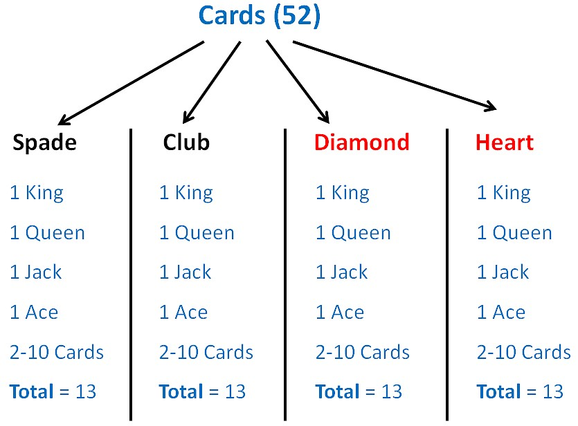

<a align="right" href="https://github.com/KIRANKUMAR7296/Library/blob/main/Interview.md">Back to Questions</a>

# Statistics
<h3><a href='#center'>Measure of Center</a>&nbsp;|&nbsp;<a href='#spread'>Measure of Spread</a></h3>

When we Start anything we Start from Beginning but with a Data Set we Start from `Centre`.

`Sample` is **Representative** of `Population`.

Larger Sample = Greater Accuracy = More Confidence

> Describing **Distributions** using **Numbers**

<h3 name='center'>Measures of Centre | Central Tendency</h3>

1. `Mean` : Arithmetic `Average` of Data Points.
2. `Median` : **Middle** Data Value of an **Ordered** Dataset | Large Data Set : **Median** Position : `( n + 1 ) / 2`
3. `Mode` : Most Frequent | Most Common | Most Occuring **Data Value** | **Data Point**.

<h3 name='spread'>Measures of Spread ( Relationship of Individual Data Point with it's Mean )</h3> 

1. `Range` : `Max` - `Min` ( Largest Data Point - Smallest Data Point ) in the Data Set.
2. `Variance` ( **s**2 ) : Spread Out between Data Points in a Data Set | Variability from the `Mean`.
3. `Standard Deviation` ( `s` ) : How close the **Data Points** in the Dataset are to the **Mean**.
- **Small** Standard Deviation means low **Variability** | Most of the **Data Points** are `Close` to **Mean**.
- **Large** Standard Deviation means high **Variability** | Most of the **Data Points** are `Far` from the **Mean**.
4. `Z Score` : Data Point's Distance in **Standard Deviation** from the `Mean`.  (`z` = ( Data Point - `Mean` ) / `Std` )

### Central Limit Theorem
- As the **Sample Size** `Increases`, the `Distribution` of **Sample Mean** Approaches a **Normal Distribution**.

### Confidence
- While **Sampling**, Different `Samples` can be **Randomly** selected from the Same **Population**.
- Each **Sample** can often produce a Different **Confidence Interval**. 
- Some **Confidence Intervals** include the True **Population Parameter** ( `Centre` and `Spread` ) and others do not.

### Confidence Level
- The `Percentage` of all Possible Samples that can be Expected to Include the True Population Parameter. 
- `95%` **Confidence Level** implies that `95%` of the Confidence Intervals would Include the True **Population Parameter**.

### Confidence Interval
- A `Range` of Value we are sure that our Population `Value` will lies there.

### The **Effect** of **Transforming** Data on **Spread** and **Centre**

- Measures of **Centre** are Affected by every **Mathematical Operations** (+ - * /)
- Measures of **Spread** are only Affected by **Multiplication & Divison** (* and /)

### The **Effect** of **Outliers** on **Spread** and **Centre**

-  A Data Value that is numerically **Distant** from a Dataset.

1. `Mean` : Heavily affected
2. `Median` : **Low** or **No** affect on the `Median`, Median only cares about **Centre**.
3. `Mode` : **No** affect on the **Mode**, Mode only cares about **Most Frequent** Data Value.
4. `Range` : **Heavily** affects the **Range** ( Outlier can be very High ( **Max** ) or Low ( **Min** ) value )
6. `Standard Deviation` : **Heavily** affected because **Mean** is considered while Calculating **Standard Deviation**.

### Empirical Rule 
- Most of the Data Points in a given **Normally Distributed Data Set** fall within `3` **Standard Deviations** of the `Mean`.

### Outlier 
- A **Data Point** that is an `Abnormal` Distance from the other Values in the Data Set.

### Five Number Summary

> Divide the Data into 4 Equal `Quarters`

1. Minimum : **Smallest** value in a Dataset.
2. 1st **Quartile** ( `Q1` ) | 25th **Percentile** : 25% of Data Values are smaller and 75% are larger.
3. 2nd **Quartile** ( `Q2` ) | 50th **Percentile** : **Median** | 50% of Data Values are smaller and 50% are larger the Median.
4. 3rd **Quartile** ( `Q3` ) | 75th **Percentile** : 75% of Data Values are smaller and 25% are larger.
5. Maximum : **Largest** Value in a Dataset.

> **Five Number Summary** can be visually represented using **Boxplot**.
- Horizontal Line on both ends of Boxplots are **Whiskers**.
- Box is called **Interquartile Range** ( `IQR` )
- `IQR` = Q3 - Q1

> Data Value is considered as **Outlier** 
- Data Value **<** Q1 - 1.5 * ( **IQR** ) 
- Data Value **>** Q3 + 1.5 * ( **IQR** ) 

> **Outlier** is represented by dot ( **.** ) in **Boxplot** 

### Percentile : Describe Percentage ( **%** ) of Data Values that Fall **At** or **Below** another **Data Value**. 

1. 25th **Percentile** | 1st **Quartile** 
- 25% of Data Points are **as small** or smaller.
- 75% of Data Points are **as large** or larger.

2. 50th **Percentile** | 2nd **Quartile** | Median
- 50% of Data Points are **as small** or smaller.
- 50% of Data Points are **as large** or larger.

3. 75th **Percentile** | 3rd **Quartile**
- 75% of Data Points are **as small** or smaller.
- 25% of Data Points are **as large** or larger.

> Percentage and Percentile is **Different**

### Correlation

- Measures the `Direction` ( Positive or Negative ) and `Strength` ( `-1` to `1` ) of **Relationship** between two **Quantitative** Variable.
- One Variable can Predict the other Variable.
- Varies between `-1` ( Perfect `Negative` Correlation ) to `1` ( Perfect `Positive` Correlation )

Amount of `R` | Strength of Correlation
:--- | :---
0.0  | No Correlation
0.1 - 0.3 | Little Correlation
0.3 - 0.5 | Medium Correlation
0.5 - 0.7 | High Correlation
0.7 - 1.0 | Very High Correlation

### Test Correlation Coefficient for Significance ( T Test ) 
- **Null** Hypothesis ( `H0` ) : There is **No Linear Relationship**
- **Alternate** Hypothesis ( `H1` ) : There is a **Linear Relationship**
- P Value is Calculated ( if P Value > `0.05` : Then Accept Null Hypothesis else Reject Null Hypothesis )

### Multicollinearity
- Two or More Independent Features **Correlate** Strongly with each other.
- Regression Equation becomes **Unstable** and Create **Confusio** 
- **Remove** One Feature to Prevent from Multicollinearity and make Regression **Stable**.

### Causality
- Relationship between **Cause** and its **Effect**
- One Variable affects other Variable ( Temperature affect Icecream Sale | Sale of Icecream is more in Summer )

### R Squared | R2

- How close each Data point **Fits** to **Regression Line** | **Regression Line** Predicts **Actual Value**.
- Value of R2 lies between `0` and `1`.
- Closer to 1 : Better the Data Points Fit the **Regression Line**.

> Correlation ( `R` ) and ( R2 ) are `Different`.

### Covariance  
- Measures how much two variables vary with each other.

### Confidence Interval ( alpha )
- Gives a **Range** of Values which is likely to contain Population Parameter ( `Prediction` will be True )
- If your **Prediction** Falls within the `Range` of **Confidence Interval** then it is `True` and Represents the **Population**.
- `Confidence Interval` : `95%` : You are **Confident** that `95` out of `100` Times the Estimation will Falls within **Confidence Interval** Range.
- Applications : **Ranking**, **Seating Arrangements** or **Scheduling** ( How many Possible `Outcomes` )

### Probability
- `Ratio` of a **Desired Event** to all **Possible Outcomes**.
- e.g. Flip a Coin : P(H) : 1 / 2 ( Desired Event ( H ) : Head and All Possible Outcomes : ( H and T ) : Head and Tail )

### Sample Space
- Sum of all **Probabilities** will equal `100%`

### Every Possible Outcomes

1. Permutation : Interested in `Order` 
- `n!` : n **Factorial** ( 5! : 5 x 4 x 3 x 2 x 1 = 120 )
-  nPr = `n!` / `(n - r)!` ( `n` : **Total** Number of Objects | `r` : Number of Objects to be **Selected** )
-  e.g. 8 Runners and Select Top 3 : 8P3 = `8!` / `(8-3)!`

2. Combinations : Not Interested in `Order` | Random Combinations
- -  nCr = `n!` / \[`r!` * `(n - r)!`\] 
- `n` : **Total** Number of Objects  
- `r` : Number of Objects to be **Selected** One Time )

<a align="right" href="https://github.com/KIRANKUMAR7296/Library/blob/main/Interview.md">Back to Questions</a>

