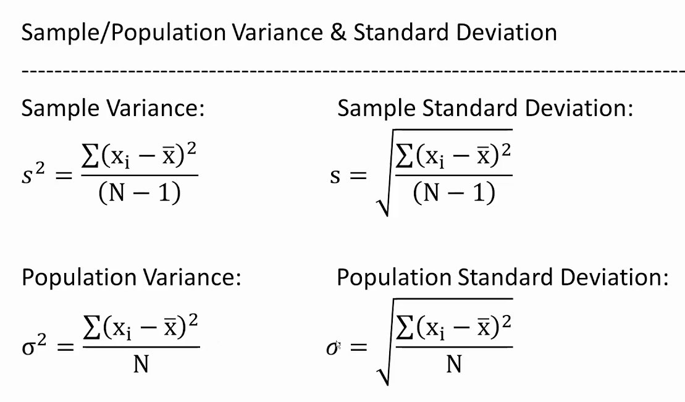
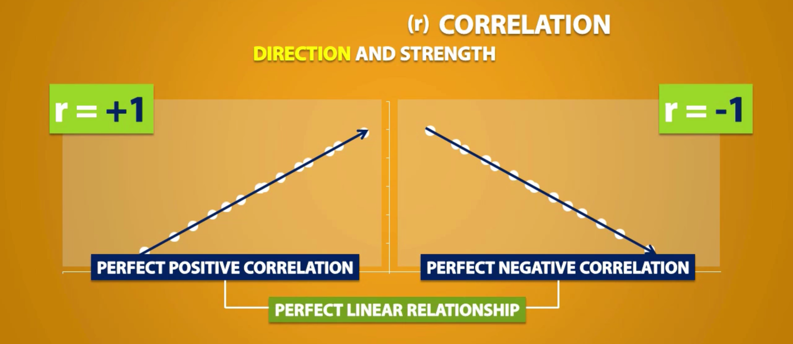
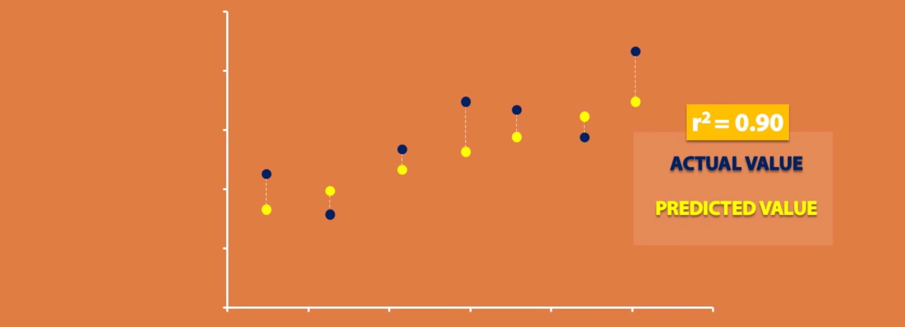
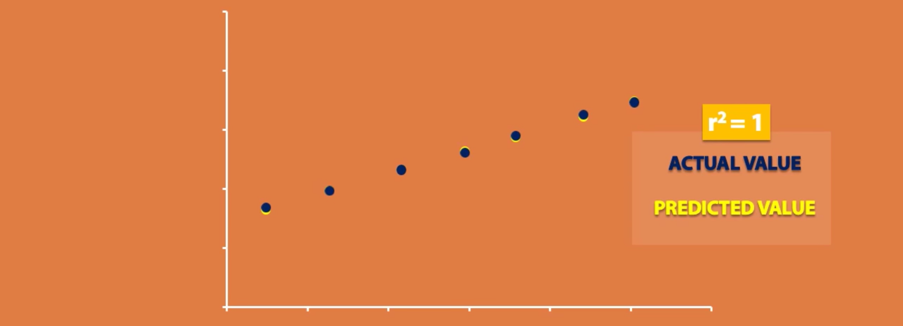
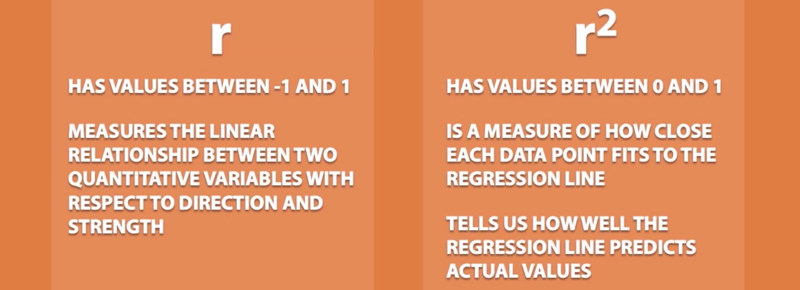

<a align="right" href="https://github.com/KIRANKUMAR7296/Library/blob/main/Interview.md">Back to Questions</a>

# Statistics

- Statistics is all about making sense of data.
- Statistics is the study of how to collect, organize, analyze, and interpret data/information.
- It can be used to make informed decisions about a wide range of topics.

### Some basic concepts of statistics:
1. `Population`: The entire group of people or things that you are interested in studying.
2. `Sample`: A subset of the population that you can use to conclude.
3. `Variable`: A characteristic of the population that you are interested in measuring.
4. `Data`: The information that you collect about the variables of the population.
5. `Descriptive statistics`: Summarize the data and describe the population.
6. `Inferential statistics`: Make inferences about the population from the sample.
7. `Inference`: A conclusion reached based on evidence and reasoning.

**Descriptive statistics give you a summary of your data, and Inferential statistics gives final conclusion for your data**

### Descriptive Statistics:

- Descriptive statistics are used to **summarize/describe** a dataset in a way that makes it easy to understand. 
- It provides us with techniques to understand the features and characteristics of the data (Quick snapshot)
- Provides a quick overview of data, measures `central tendency`, `variability`, and `distribution` of the data.
- You can get a quick idea of what your data is like without getting down into every single data point.

<h3><a href='#center'>Measure of Center</a>&nbsp;|&nbsp;<a href='#spread'>Measure of Spread</a>&nbsp;|&nbsp;<a href='#distribute'>Measure of Distribution</a></h3>

When we start anything we start from the beginning but with a dataset we start from the `centre`

`Sample` is **representative** of `Population`

Larger Sample = Greater Accuracy = More Confidence

<h3 name='center'>Measures of Centre | Central Tendency</h3>

1. `Mean`: `Average` of data points 
2. `Median`: `Middle` data point value of an ordered dataset | Large data set: `Median` position: `( n + 1 ) / 2`
3. `Mode`: Most frequent | Most common | Most occurring data point value.

`Outlier`:  The data point values that are different or far away from all the other data point values.

- `Mean` calculates `average`, therefore it is affected by an `outlier`
- `Median` concentrates only on `middle` value, therefore there is a very `low` to `no` effect by an `outlier`
- `Mode` concentrates only on the `most frequent` values, there is `no` effect by an `outlier`

### **Central Limit Theorem**
- As the sample size increases, the distribution approaches towards normal distribution.
- The larger the sample size, the better the approximation to a normal distribution.
- CLT allows us to use information from samples to make references about populations.

<h3 name='spread'>Measures of Spread | Variability</h3>
  
- Relationship of individual data points with their `mean`

How the `observations` are `spread` or `scattered` on each side of the `centre` ( Mean | Median | Mode )

### 1. **Range**

- `Range`: `Max` - `Min`, the difference between the lowest and highest data point values in the dataset.
- Very high data point values can mislead the range (e.g. {8, 11, 5, 9, 7, 6, 3616) Outlier
- Here the lowest data point value is `5` and the highest data point value is `3616`

### 2. Variance (s 2)
- An average of the squared distances from the **mean**.
- Variability of the data point values from its mean.

### 3. Standard Deviation (s: Square Root of Variance)
- Distance of the **data points** from its **mean** in the **data set**. The square root of the **variance**.
- `Small` std means `low` **variability** | Most of the **data points** are `close` to **mean** | `Narrow` distribution
- `Large` std means `high` **variability** | Most of the **data points** are `far` from the **mean** | `Wider` distribution
- Standard deviation calculates `mean`, so it is affected by an `outlier`

**Variance** | **Standard Deviation**
:--- | :---
Squared deviation from mean | Square root of variance
Squared units | Same units as the original data
More sensitive to outliers | Less sensitive to outliers

### **Coefficient of variation (%)** 
- Measures standard deviation relative to the mean.
- **Coefficient of Variation (%) = (Standard Deviation / Mean) * 100**
- Measures the dispersion of data points around the mean.
- Used to compare the standard deviation of variables with significantly different means.

### Z Score
- `z = (x - mean(x)) / std(x)`
- `x`: Data Points.

### Inferential Statistics

- Allows you to conclude on a population by analyzing the sample.
- Making inferences from the samples and concluding a population.
- Examples: Marketing campaigns, clinical drug trials, opinion polls, etc.

### Hypothesis Testing:
- This is like guessing the population based on your sample.
- Null Hypothesis (H₀): You assume there's no significant difference between your sample and the population.
- Alternative Hypothesis (H₁): This is the actual guess about the population. There might be a difference!

### Confidence
- While sampling, different samples can be **randomly** selected from the same **population**.
- Each sample can often produce a different confidence interval.
- Some confidence intervals may include the true population parameters.

### Confidence Level (Percentage)
- Measure the possibility that all samples will represent the true population if the same method is repeated multiple times. 
- `95%` **confidence level** implies that `95%` of times the sample will represent the true `population parameters`
- Population parameters: Mean, median, mode, range, variance, and standard deviation of the actual population.

### Confidence Intervals (Range of upper bound and lower bound)
- A `range` of values where we believe the true population `values` will lie within that range.
- Population `parameters`: `mean`, `median`, `range`, `variance` and `standard deviation`. 
- If **prediction** falls within the interval range then it is `true` and represents the **population**.
- If the `sample` doesn't fit a distribution, use the `central limit theorem` to make estimates about `population` parameters.

### The **Effect** of **Transforming** Data on **Spread** and **Centre**

- Measures of `centre` are affected by every **mathematical operations** ( `+` `-` `*` `/` )
- Measures of `spread` are affected only by **multiplication & divison** ( `*` and `/` )

<h3 name='distribute'>Measures of Distribution</h3>

- Describe how the data is spread out or distributed across different values.
- Histograms help us to visualize the frequency distribution of data.
- Scatter plots help us to visualize the distribution of data.

### `Empirical Rule`
- `68 %` of the data points in a given **normally distributed data set** fall within `1` **standard deviations**.
- `95 %` of the data points in a given **normally distributed data set** fall within `2` **standard deviations**.
- `99.7 %` of the data points in a given **normally distributed data set** fall within `3` **standard deviations**.

### Five Number Summary

> Divide the Data into 4 Equal `Quarters`

1. `Minimum`: Smallest data point value in a dataset.
2. 1st **Quartile** ( `Q1` ) | 25th **Percentile**: 25% of data point values are smaller and 75% are larger.
3. 2nd **Quartile** ( `Q2` ) | 50th **Percentile**: **Median** | 50% of data point values are smaller and 50% are larger.
4. 3rd **Quartile** ( `Q3` ) | 75th **Percentile**: 75% of data point values are smaller and 25% are larger.
5. `Maximum`: Largest data point value in a dataset.

> **Five Number Summary** can be visually represented using `Boxplot`
- Horizontal lines on both the ends of boxplot are `Whiskers`
- Box is called `Interquartile Range` ( `IQR` )
- `IQR` = `Q3` - `Q1`

> Data point value is considered as `Outlier` if : 
- Data point value **<** `Q1` - `1.5` * `IQR`
- Data point value **>** `Q3` + `1.5` * `IQR`
- `Outlier` is represented by a dot ( `.` ) in `Boxplot`

### Percentile 

Describe the percentage `%` of data point value that falls `at` or `below` another data point value. 

1. 25th **Percentile** | 1st **Quartile** 
- 25% of data point values are **as small** or smaller.
- 75% of data point values are **as large** or larger.

2. 50th **Percentile** | 2nd **Quartile** | Median
- 50% of data point values are **as small** or smaller.
- 50% of data point values are **as large** or larger.

3. 75th **Percentile** | 3rd **Quartile**
- 75% of data point values are **as small** or smaller.
- 25% of data point values are **as large** or larger.

`Percentage` and `Percentile` are **different**.

### **Correlation (Direction & Strength)**

- Shows the extent (strength) to which two variables are related to each other.
- Measures the **direction** and **strength** of relationship between the features/variable.
- **Direction:** Positive (+1) or Negative (-1)
- **Strength:** No, Little, Medium, High, Very High.
- One variable can `predict` the other variable.
- Correlation Coefficient: `-1` ( Perfect `Negative` Correlation )
- Correlation Coefficient: `1` ( Perfect `Positive` Correlation )

**Correlation Coefficient** `r` | **Strength of Correlation**
:--- | :---
0.0  | No Correlation
0.1 - 0.3 | Little Correlation
0.3 - 0.5 | Medium Correlation
0.5 - 0.7 | High Correlation
0.7 - 1.0 | Very High Correlation

`Correlation` is not equal to `causation`

### Test Correlation Coefficient for Significance ( T-Test ) 
- **Null** Hypothesis ( `H0` ) : There is **No Linear Relationship**
- **Alternate** Hypothesis ( `H1` ) : There is a **Linear Relationship**
- P-Value is Calculated ( if P Value > `0.05`: Then Accept Null Hypothesis else Reject Null Hypothesis )

### **Multicollinearity**
- Two or more independent features **correlate** strongly with each other.
- It create a **confusing effect**, regression equation becomes **unstable** and results **unreliable estimates**.
- Choose an independent variable (Drop one feature) or combine variables (Create a new feature)

### Causality
- Causality is all about understanding the relationship between the cause and its effect.
- One variable affects other variables (Temperature affects ice creams/cold-drink sales)
- What causes what, we can predict what can happen next and make better decisions.

### R Squared | R2

- How close each data point **fits** to **regression line**. 
- How well the **Regression line** predicts almost **actual value**.
- Value of R2 lies between `0` and `1`.
- Closer to `1`: Better the data points fit the **Regression line**.

Correlation `R` and Coefficient of Determination `R` 2 are `Different`.

### **Covariance (Direction)**
- Covariance is a measure of how two variables change together.
- Helps us understand the relationship between two sets of data points.
- `Positive Covariance`: Two variables tend to move in the `same` direction. 
- `Negative Covariance`: Two variables tend to move in `opposite` directions.

### Sampling Facts: 
- **A sample is never a perfect representation of the population.**
- **Different samples of the same population will give different mean.**
- Sometimes it can be due to the sampling error, we will get variations due to the error.

### **P-Value**

- Imagine you have a coin (Head/Tails)
- The normal scenario: If you flip the coin, fairly it will end up in random heads or tails, 5 Heads and 5 Tails or any combination.
- But it ends up in 10 Heads, now you suspect it might be biased towards Heads.

Here's how `p-value` can help you test that suspicion:
1. **Null Hypothesis (H0):** The coin is fair (One side is the head and another side is the tail)
2. **Alternate Hypothesis (Ha):** The coin is biased (It will fall on either head
3. **Observed Data:** You flip the coin, say, 10 times. Surprisingly, you get Heads every single time!
4. **Test Statistic:** This would be the number of heads observed, which in this case is 10 out of 10 flips.
- P-value is the probability of getting a result as extreme as 10 heads in 10 flips, assuming the coin is fair (H0).
- In a fair case, it'll not be always possible to get 10 Heads every time.
- The p-value tells you how often you'd expect to see 10 heads in a row! in those hypothetical repetitions.
- We can say that there is only less than 5% or 1% chance it may happen.
- If p-value > 0.05 i.e. Here it's a normal scenario (Fair coin, NULL Hypothesis Accepted)
- If p-value < 0.05 i.e Very rare scenario of getting H only (The coin is biased)
