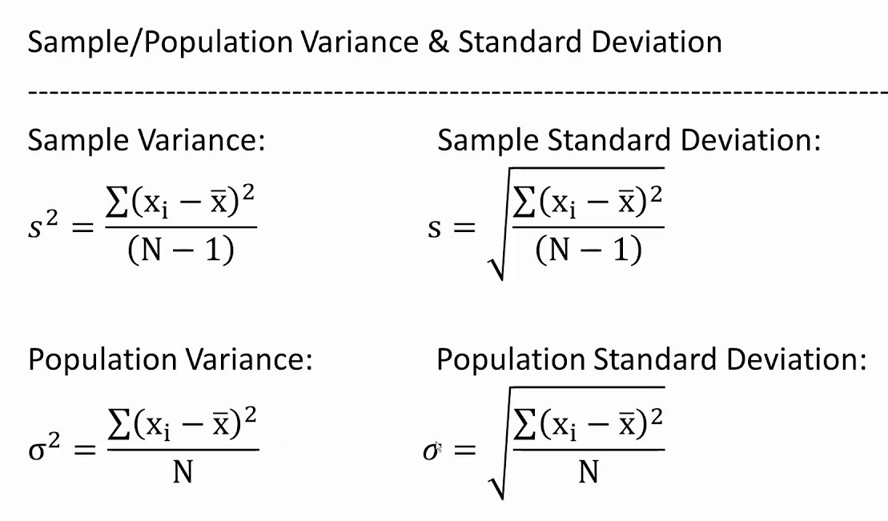
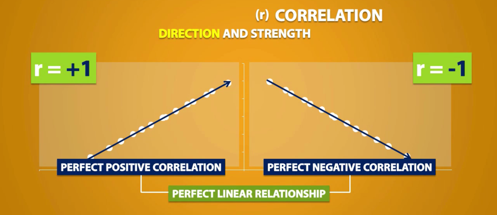
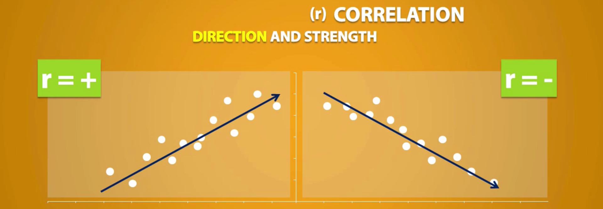
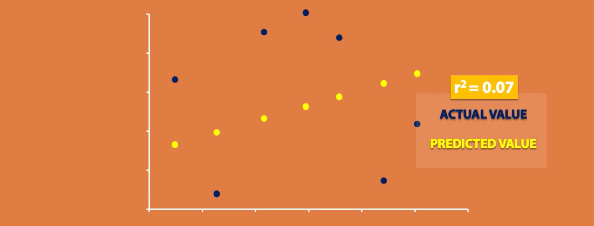
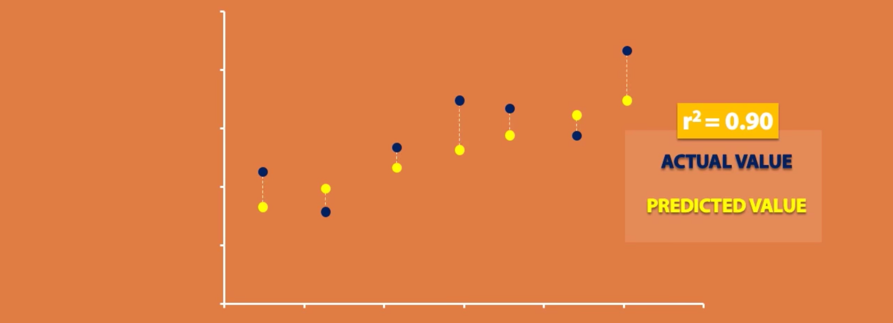
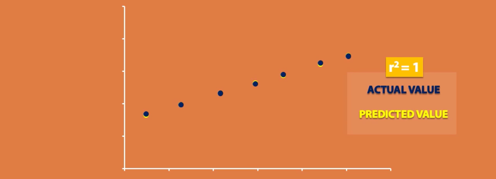
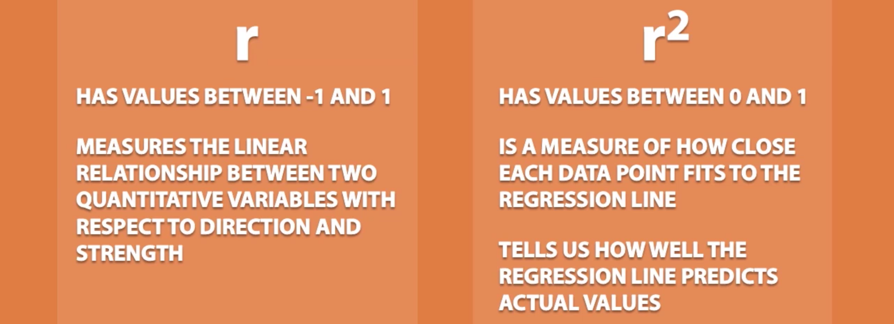

<p align='right'><a align="right" href="https://github.com/KIRANKUMAR7296/Library/blob/main/Interview.md">Back to Questions</a></p>

### 📊 Statistics: The Science of Data
```
Definition: Statistics is the science of collecting, organizing, analyzing, interpreting, and presenting data.
Purpose: Helps us to turn raw data into useful information and draw meaningful insights from the data.
```

### 🎯 Why Do We Need Statistics?
```
Statistics helps us:
📥 Collect data
📋 Organize data
📊 Analyze data
🔍 Discover patterns and trends
💡 Make better decisions
```

### 🌎 Real-Life Examples
```
🏥 Healthcare
- Track disease outbreaks
- Measure treatment effectiveness

📈 Business
- Analyze sales performance
- Understand customer behavior

🏏 Sports
- Calculate batting averages
- Compare player performance

🤖 Machine Learning
- Understand data distributions
- Evaluate model performance
- Make predictions from data
```

### 🔄 Statistics Workflow
```
1️⃣ Collect Data 📥
Example: Student marks, Sales records, Survey responses, etc.

2️⃣ Organize Data 📋
Arrange data into tables, charts, or categories.

3️⃣ Analyze Data 📊
Calculate: Mean, Median, Mode, Variance, Correlation

4️⃣ Interpret Results 🔍

5️⃣ Present Findings 📈
Use: Graphs, Charts, Reports, Dashboards, etc.
```

### 📊 Fundamentals of Statistics
Statistics is all about understanding data and making decisions from it 🚀

```
1️⃣ Data 📋
Data is information collected from observations, experiments, surveys, or research.

Example:
Student marks: 75, 80, 90, 65, 85
These numbers are data.
👉🏻 Data is the raw material used for analysis.

2️⃣ Population 🌎
A population is the entire group that we want to study.

Example:
Suppose we want to study the average salary of all employees in a company.
Total Employees = 10,000
👉🏻 All 10,000 employees represent the Population.

3️⃣ Sample 🎯
A sample is a smaller subset of the population used for analysis.

Example:
Instead of surveying all 10,000 employees, we survey: 500 employees
👉🏻 These 500 employees form the Sample.

Why use a Sample?
✅ Saves time
✅ Saves money
✅ Easier to analyze

4️⃣ Descriptive Statistics 📊
Descriptive Statistics summarizes and describes data.
It answers: 👉🏻 "What does the data look like?"

Examples
- Mean
- Median
- Mode
- Range
- Variance
- Standard Deviation

Descriptive Statistics can tell us:
- Average marks = 80
- Highest marks = 90
- Lowest marks = 70

5️⃣ Measures of Central Tendency 🎯
These measures tell us the center of the data.

1. Mean (Average)
Example:
Marks: 70, 80, 90
👉🏻 Average marks = 80

2. Median: The middle value after arranging data in order.
Example: 10, 20, 30, 40, 50
👉🏻 Middle value, Median = 30

3. Mode: The value that appears most frequently.
Example: 10, 20, 20, 30, 40
👉🏻 Most common value, Mode = 20

6️⃣ Measures of Dispersion 📏
These measures tell us how spread out the data is.

1. Range: Maximum - Minimum
Example: 10, 20, 30, 40, 50
Range: 50 - 10 = 40

2. Variance: Measures how far data points are from the mean.
👉🏻 Higher Variance = More spread
👉🏻 Lower Variance = Less spread

3. Standard Deviation: Square root of Variance.
👉🏻 Shows the average distance of data points from the mean.
👉🏻 Low Standard Deviation → Data is clustered together 📍
👉🏻 High Standard Deviation → Data is widely spread 📍📍📍

7️⃣ Inferential Statistics 🔍
Inferential Statistics uses sample data to make conclusions about the entire population.
It answers: 👉🏻 "What can we conclude about the whole population?"

Example:
Population = 10,000 employees
Sample = 500 employees
Average salary of sample = ₹10 Lakh

Using Inferential Statistics, we estimate:
👉🏻 Average salary of all 10,000 employees is around ₹10 Lakh.

8️⃣ Inference 🧠
An inference is a conclusion drawn from evidence and reasoning.

Example: Sample survey shows:
- 80% customers like a product

Inference: 👉🏻 Most customers in the population probably like the product.

🧠 Easy Analogy
Imagine a movie review website 🎬

Descriptive Statistics Tells you:
- ⭐ Average rating = 4.5
- 👥 10,000 reviews
👉🏻 Summary of existing data

Inferential Statistics Tells you:
- 🎯 Future viewers will likely rate it around 4.5 stars
👉🏻 Prediction or conclusion based on data

🚀 In One Line
Descriptive Statistics summarizes and describes data 📊
Inferential Statistics uses sample data to draw conclusions about the entire population ✨
```

### 📊 Descriptive vs Inferential Statistics

| Feature | Descriptive Statistics | Inferential Statistics |
|----------|----------------------|----------------------|
| Purpose | Summarize data | Draw conclusions |
| Uses | Mean, Median, Mode, Variance | Hypothesis Testing, Confidence Intervals |
| Focus | Existing data | Population estimation |
| Question | "What happened?" | "What can we conclude?" |

### 📊 Dataset:  
- A collection of data used for analysis, research, or building machine learning models.
- A structured collection of related data that we use to learn, analyze, and make predictions.
- A dataset can be of different data types such as numerical, categorical, text, image, voice, and video data.

🏠 Example
Imagine a school maintains student records:

Student ID |	Name |	Age |	Marks
:--- |:--- |:--- | :---
1 |	Rahul |	15 |	85
2 |	Priya |	16 |	92
3 |	Amit |	15 |	78

This table is a dataset.
```
📋 Rows = Records / Observations / Samples
📊 Columns = Features / Variables / Attributes
```

```
🎯 Why is a Dataset Important?

A dataset is the foundation of:
📊 Data Analysis
🤖 Machine Learning
📈 Business Intelligence
🔍 Research and Statistics

Without data, models cannot learn anything.
```

### 📂 Types of Datasets
```
1️⃣ Numerical Data 🔢 Contains numbers.

Example:
Age	Salary
25	₹50,000
30	₹70,000

Used for: Regression, Statistical Analysis, etc.

2️⃣ Categorical Data 🏷️ Contains categories or labels.

Example:
Gender	Department
Male	  IT
Female	HR

Used for: Classification, Segmentation, etc.

3️⃣ Text Data 📝 Contains words, sentences, or documents.

Examples:
📧 Emails
💬 Reviews
✅ Chat Messages
📱 Social Media
🖼️ Posts

Used for: NLP, Sentiment Analysis, Chatbots, etc.

4️⃣ Image Data 🖼️ Contains pictures.

Examples:
Face Images
Medical X-rays
Product Photos

Used for: Computer Vision, Object Detection, Face Recognition, etc.

5️⃣ Audio/Voice Data 🎙️ Contains sound recordings.

Examples:
Speech Recordings
Voice Commands
Podcasts

Used for: Speech Recognition, Voice Assistants, etc.

6️⃣ Video Data 🎥 Contains moving images.

Examples:
CCTV Footage
YouTube Videos
Self-driving Car Videos

Used for: Video Analytics, Activity Recognition, Surveillance Systems, etc.
```

## Data Wrangling / Preprocessing:
- **Definition:** Converting raw data into a clean, structured format ready for analysis.

### Data Wrangling Processes:
- **Data Importing:** Bringing data from external sources into your working environment.
- **Data Cleaning:** Removing errors, duplicates, and inconsistencies from data.
- **Data Structuring:** Organizing data into a standardized, usable format.
- **Data Parsing:** Breaking down complex data into simpler, explainable components.
- **Data Encoding:** Converting categorical or text data into numeric form for analysis.
- **Data Rescaling:** Adjusting data values range to a common scale (e.g., normalization).
- **Handling Dates and Times:** Formatting and standardizing date/time fields for consistency.
- **Managing Missing Values:** Filling, removing, or imputing missing data points.
- **Handling Outliers:** Detecting and treating extreme values that can skew analysis.

## Data Visualization
- **Definition:** The process of visually representing data to analyze relationships, distributions, and detect outliers.

### Purpose:
- Understand patterns and trends
- Identify correlations and anomalies
- Aid in decision-making and storytelling
- **Role in ML:** Used for preprocessing, feature selection, model building, testing, and evaluation.

### Common Techniques (Descriptive Analytics):
- **Scatter Plot:** Shows relationships between two variables
- **Line Graph:** Displays trends over time
- **Bar Plot:** Compares categorical data
- **Histogram:** Shows data distribution
- **Density Plot:** Smooth representation of data distribution
- **Box Plot:** Highlights spread and outliers
- **Pair Plot:** Visualizes relationships among multiple variables
- **Heat Map:** Represents data intensity using color  

## Data Partitioning
- **Definition:** Splitting a dataset into subsets for training, validation, and testing in ML.

### Purpose:
- **Training Set:** Used to train the model.
- **Validation Set:** Used to tune hyperparameters and improve accuracy.
- **Testing Set:** Acts as unseen data to estimate generalization error.
- **Generalization Error:** The expected error when the model is applied to real-world data after deployment.

## Descriptive Statistics
- **Definition:** Techniques to summarize and describe a dataset using measures and aggregations.
- Purpose: Provides a quick snapshot of data characteristics like central tendency, variability, and distribution.

### Central Tendency: 
- **Definition:** A measure that identifies the center or typical value of a dataset (Mean, Median, and Mode).

### Variability or Dispersion: 
- **Definition:** Indicates how spread out or dispersed the data values are around the central point (Range, Variance, and Standard Deviation).

### Distribution:
- **Definition:** Describes how data values are arranged or spread across possible values (Normal distribution, and Skewed distribution).

<h3><a href='#center'>Measure of Center</a>&nbsp;|&nbsp;<a href='#spread'>Measure of Spread</a>&nbsp;|&nbsp;<a href='#distribute'>Measure of Distribution</a></h3>

- Sample is a **representative** of the population
- Larger Sample = Greater Accuracy = More Confidence

<h2 name='center'>Measures of Centre | Central Tendency</h2>

1. **Mean:** Average of the data points 
2. **Median:** Middle data point value of an ordered dataset | Large data set: Median position: `(n + 1) / 2`
3. **Mode:** Most frequent | Most common | Most occurring data point value.

## Outlier and Its Effect
- **Outlier:** A data point that significantly differs from other observations in a dataset.

### Impact on Measures:
- **Mean:** Highly affected because it considers all the values in the calculation of average.
- **Median:** Minimal effect since it focuses only on the middle value.
- **Mode:** No effect as it depends on the most frequent value.

## Central Limit Theorem (CLT)
- **Definition:** As sample size **n** increases, the distribution of the sample mean approaches a **normal distribution**, regardless of the population distribution.
- **Condition:** Typically holds when **n > 30**.
- **Importance:** Enables using sample statistics to make inferences about population parameters.

## Population Parameter vs Sample Statistic

### Population Parameter:
- A numerical value that describes a characteristic of the entire population.
- Example: Population mean (μ), population variance (σ²).

### Sample Statistic:
- A numerical value that describes a characteristic of a sample drawn from the population.
- Example: Sample mean ($\bar{x}$), sample variance (s²).

## Z-Test
- **Definition:** A statistical test used to determine if the mean of a sample is significantly different from a known population mean.

### Assumptions:
- Data is normally distributed
- Sample size n > 30
- Population variance is known

### Types:
- **One-Sample Z-Test:** Compares a sample mean to a known population mean.
- **Two-Sample Z-Test:** Compares means of two independent samples.

## T-Test
- **Definition:** A statistical test used to determine whether the means of two groups are significantly different from each other.

### Assumptions:
- Sample size is small (n < 30)
- Population variance is unknown

### Types:
- **One-Sample T-Test:** Compares a sample mean to a known population mean.
- **Two-Sample T-Test:** Compares means of two independent samples.
- **Paired T-Test:** Compares means from the same group at different times (before/after).

Aspect | Z-Test | T-Test
:--- | :--- | :---
Purpose | Tests if sample mean differs from population mean | Tests if means differ (sample vs population or between samples)
Sample Size | Large (n > 30) | Small (n < 30)
Population Variance | Known | Unknown
Distribution | Assumes normal distribution | Approximates normal distribution (via t-distribution)
Types | One-sample, Two-sample | One-sample, Two-sample, Paired

<h2 name='spread'>Measures of Spread | Variability</h2>
  
- Measures the relationship of individual data points with their mean: Indicates how far each value deviates from the average.
- Spread of data around the center (Mean | Median | Mode): Shows how data points are distributed on both sides of the central tendency.

## Range
- **Definition:** The difference between the maximum and minimum values in a dataset.
- Range = Max − Min
- **Limitation:** Highly sensitive to outliers.
- **Example:** For {8, 11, 5, 9, 7, 6, 3616}, here Min = 5 and Max = 3616
- Range = 3616 − 5 = 3611 (Misleading due to outlier)

## Variance (s²)
- **Definition:** Measures how far data points deviate from the mean by calculating the average of squared differences.
- **Purpose:** Indicates the degree of spread in the dataset. Note: Squaring emphasizes larger deviations.

## Standard Deviation (s)
- **Definition:** The square root of variance, measures how far data points are from the mean.

### Interpretation:
- **Small SD:** Low variability | Data points close to mean | Narrow distribution.
- **Large SD:** High variability | Data points far from mean | Wide distribution.
- **Sensitivity:** Affected by outliers because it uses the mean in its calculation.

**Variance** | **Standard Deviation**
:--- | :---
Squared deviation from mean | Square root of variance
Squared units | Same units as the original data
More sensitive to outliers | Less sensitive to outliers

## Coefficient of Variation (%)
- **Definition:** Expresses standard deviation as a percentage of the mean.
- **Coefficient of Variation (%) = (Standard Deviation / Mean) * 100**
- **Propose:** Measures relative dispersion of data points around the mean.
- **Use Case:** Useful for comparing variability across datasets or variables with different scales or means.



## Z Score
- z = (x - mean(x)) / std(x)
- x: Data Points.

## Inferential Statistics
- **Definition:** Drawing conclusions about a population based on data from a sample.
- **Purpose:** Helps make predictions, test hypotheses, and generalize findings.
- **Examples:** Marketing campaigns, clinical drug trials, opinion polls.

## Hypothesis Testing
- **Definition:** A statistical method to make inferences about a population based on sample data.

### Key Components:
- **Null Hypothesis (H₀):** Assumes no significant difference or effect exists.
- **Alternative Hypothesis (H₁):** Suggests a significant difference or effect exists.
- **Z-Score:** Indicates how many standard deviations the sample mean is from the population mean.

## Confidence
- **Definition:** Represents the degree of certainty in an estimate derived from sample data.

### Confidence Interval: 
- A range of values, calculated from sample data, that is likely to contain the population parameter with a specified probability (e.g., 95%).
- Different random samples from the same population produce different confidence intervals.
- Some intervals will include the true population parameter, others may not.

### Confidence Level (%):
- Indicates the probability that repeated sampling using the same method will produce intervals containing the true population parameter.
- **Example:** A 95% confidence level means that if we take many samples and compute confidence intervals, about 95% of those intervals will include the true population parameter.
- **Population Parameters:** Metrics like mean, median, mode, range, variance, and standard deviation for the entire population.

### The **Effect** of **Transforming** Data on **Spread** and **Centre**

- Measures of centre are affected by every **mathematical operations** ('+', '-', '*', and '/')
- Measures of spread are affected only by **multiplication & divison** ('*' and '/')

<h2 name='distribute'>Measures of Distribution</h2>

- **Data Distribution:** Describe how data values are spread across the range of possible values.
- **Histograms:** Visualize the frequency distribution of data.
- **Scatter Plot:** Displays how data points are distributed and reveals relationships between variables.

## Empirical Rule (68 - 95 - 99.7 Rule)
- Applies to normally distributed data.
- **68%** of data falls within ±1 standard deviation of the mean.
- **95%** of data falls within ±2 standard deviations of the mean.
- **99.7%** of data falls within ±3 standard deviations of the mean.

## Five Number Summary
- **Definition:** A descriptive statistic that divides a dataset into four equal parts using five key values.

### Components:
- **Minimum:** Smallest data point value in a dataset.
- **Q1 (1st Quartile | 25th Percentile):** 25% of values are smaller, 75% are larger.
- **Q2 (2nd Quartile | 50th Percentile):** Median, splits data into two equal halves.
- **Q3 (3rd Quartile | 75th Percentile):** 75% of values are smaller, 25% are larger.
- **Maximum:** Largest data point value in a dataset.

### Visual Representation:
- **Five Number Summary** can be visually represented using Boxplot.
- **Box:** Interquartile Range (IQR) = Q3 − Q1
- **Whiskers:** Horizontal lines extended on both the ends of box which presents maximum and minimum values are Whiskers.

### Outliers:
- Data point value is considered as an outlier if: 
- Value **<** Q1 - 1.5 * IQR or Value **>** Q3 + 1.5 * IQR
- Outlier is represented as a dot (.) in a Boxplot.

## Correlation (Direction & Strength)
- **Definition:** Measures the relationship between two variables in terms of direction and strength.

### Direction:
- **Positive (+1):** Both variables increase together.
- **Negative (-1):** One variable increases while the other decreases.

### Strength:
- No, Weak, Moderate, Strong, Very Strong (based on correlation coefficient magnitude).

### Correlation Coefficient (r):
- **r = +1:** Perfect positive correlation.
- **r = -1:** Perfect negative correlation.
- **r ≈ 0:** No correlation.

### Interpretation: 
- Higher absolute value of r indicates stronger relationship, correlation does not imply causation.

**Correlation Coefficient** (r) | **Strength of Correlation**
:--- | :---
0.0  | No Correlation
0.1 - 0.3 | Little Correlation
0.3 - 0.5 | Medium Correlation
0.5 - 0.7 | High Correlation
0.7 - 1.0 | Very High Correlation






## Correlation Coefficient Significance (T-Test)
- **Purpose:** Tests whether the observed correlation between two variables is statistically significant.

### Hypotheses:
- **Null Hypothesis (H₀):** No linear relationship exists (correlation = 0).
- **Alternative Hypothesis (H₁):** A linear relationship exists (correlation ≠ 0).

### Test Statistic:
- Uses a t-test based on the correlation coefficient and sample size.

### Decision Rule:
- Calculate p-value.
- If p-value > 0.05, accept H₀ (no significant correlation).
- If p-value ≤ 0.05, reject H₀ (significant correlation).

## Multicollinearity
- Occurs when two or more independent variables are highly correlated.
- Causes unstable regression coefficients and unreliable estimates.

### Detection Methods:
- **Correlation Matrix:** Check pairwise correlations between features.
- **Variance Inflation Factor (VIF):** VIF > 10 often indicates multicollinearity.

### Solutions:
- Drop one of the correlated variables.
- Combine correlated variables into a single feature (e.g., PCA).

## Causality
- Focuses on the cause-and-effect relationship between variables.
- One variable influences another (e.g., temperature affects ice cream sales).
- Helps answer “What causes what?” to predict outcomes and make better decisions.
- **Example:** Higher temperature → Increased cold drink sales.

## R Squared | R<sup>2</sup> | Coefficient of Determination
- Measures how well the regression line fits the data. How well the **Regression line** predicts almost **actual value**.
- Indicates how much of the variance in the dependent variable is explained by the model.

### Range: 0 to 1
- **Closer to 1:** Better fit, model explains most of the variance.
- **Closer to 0:** Poor fit, model explains little variance.
- Example: R² = 0.85 | 85% of the variation in the target variable is explained by the independent variables.









## Covariance (Direction)
- Definition: Measures how two variables change together.
- Purpose: Understand the directional relationship between two datasets.

### Types:
- **Positive Covariance:** Variables move in the same direction.
- **Negative Covariance:** Variables move in opposite directions.

### Example:
- Height & Weight → Positive covariance (both increase together).
- Price & Demand → Negative covariance (price ↑, demand ↓).

## Sampling Facts: 
- A sample is never a perfect representation of the population.
- Different samples from the same population can produce different means.
- Variations often occur due to sampling error.
- Example: If you take two random samples of 100 people from a city, their average income may differ slightly because of sampling variability.

### 📊 What is a P-Value?
```
The probability of observing results as extreme as the ones we obtained, assuming the Null Hypothesis (H₀) is true.
👉🏻 In simple words:
P-value tells us whether the observed result is likely due to chance or whether something unusual is happening.
```

### 🎯 Why Do We Use P-Value?
```
The p-value helps us decide whether to ✅ Reject the Null Hypothesis (H₀) OR ✅ Fail to Reject the Null Hypothesis (H₀)
In other words:
👉🏻 Is the result statistically significant or just random luck?
```

### 📊 Interpreting P-Value

P-Value |	Interpretation | Decision
:--- | :--- | :---
p ≤ 0.05 |	Strong evidence against H₀ |	Reject H₀
p ≤ 0.01 |	Very strong evidence against H₀ |	Reject H₀
p > 0.05 |	Weak evidence against H₀ |	Fail to Reject H₀

### 🪙 Coin Flip Scenario:
```
Imagine you have a coin 🪙

Here's how p-value can help you test the suspicion:
H₀ (Null Hypothesis): 🪙 The coin is fair (One side is the head and another side is the tail)
Hₐ (Alternative Hypothesis): 🪙 The coin is biased. (It will fall on either head)

🔍 Observed Data: You flip the coin, say, 10 times. Surprisingly, you get Heads every single time!
🧪 Test Statistic: 👉🏻 10 Heads out of 10 flips! This looks suspicious 🤔

In a fair case, It is extremely unlikely to get 10 Heads in a row by chance.
The p-value tells you how often you'd expect to see 10 heads in a row!
We can say that there is only less than 5% or 1% chance it may happen.

If p ≤ 0.05 🚨 Rare event ❌ Reject the Null Hypothesis (H₀) 🪙 Coin is biased.
If p > 0.05 ⭐ Normal scenario ✅ Fail to reject NULL Hypothesis (H₀) 🪙 Coin is fair.
```

### 📊 Types of Statistical Tests
```
Statistical tests help us make decisions or draw conclusions about a population using a sample of data.
👉🏻 In simple words:
Statistical tests tell us whether the observed differences or relationships in data are real or happened by chance.
```

### 📂 Two Main Types of Statistical Tests
```
1️⃣ Parametric Tests 📈
Parametric tests assume:
✅ Data follows a Normal Distribution (Bell Curve)
✅ Population parameters can be estimated
These tests are generally more powerful when assumptions are met.
```
```
🎯 T-Test
A T-Test compares the means (averages) of groups.
👉🏻 Used when you want to know if two averages are significantly different.

A. One-Sample T-Test
Compare a sample mean with a known population mean.

Example:
A company claims:
💰 Average Salary = ₹50,000
You collect a sample and test whether the actual average salary differs from ₹50,000.

B. Independent Samples T-Test
Compare the means of two independent groups.

Example:
Compare exam scores of:
👦 Boys
👧 Girls

Question: 👉🏻 Do boys and girls have different average scores?

C. Paired Samples T-Test
Compare two related measurements.

Example:
Weight before and after a diet program.

Person Before After 
A      80 kg  75 kg

Question: 👉🏻 Did the diet significantly reduce weight?
```
```
🎯 ANOVA (Analysis of Variance)
ANOVA compares the means of more than two groups.
👉🏻 Think of it as an extension of the T-Test.

A. One-Way ANOVA
Compare multiple groups using one factor.

Example:
Compare average salaries of:
- IT Department
- HR Department
- Finance Department

Question: 👉🏻 Is there a significant difference between department salaries?

B. Two-Way ANOVA
Compare groups using two factors.

Example:
Compare salaries based on:
- Department
- Gender

Question: 👉🏻 Does salary depend on department, gender, or both?
```
```
🎯 Z-Test
A Z-Test compares means when the population standard deviation is known.

Example:
A factory claims: 💡 Average bulb life = 1000 hours

You test whether the actual average differs from 1000 hours.
```

```
2️⃣ Non-Parametric Tests 📉
✅ Do NOT assume normal distribution
✅ Work well with skewed data
✅ Useful for small datasets

🎯 Chi-Square Test
Chi-Square is used for categorical data.
👉🏻` It checks whether observed results differ significantly from expected results.

A. Chi-Square Goodness-of-Fit Test
Compare observed frequencies with expected frequencies.

Example:
A dice should produce:
🎲 Each number (1–6) equally often.

Question: 👉🏻 Is the dice fair?

B. Chi-Square Test of Independence
Check whether two categorical variables are related.

Example:
Survey Data:
Gender Likes Product
Male   Yes 
Female No

Question: 👉🏻 Is product preference related to gender?
```
